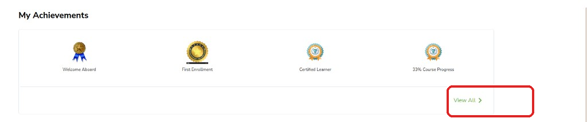
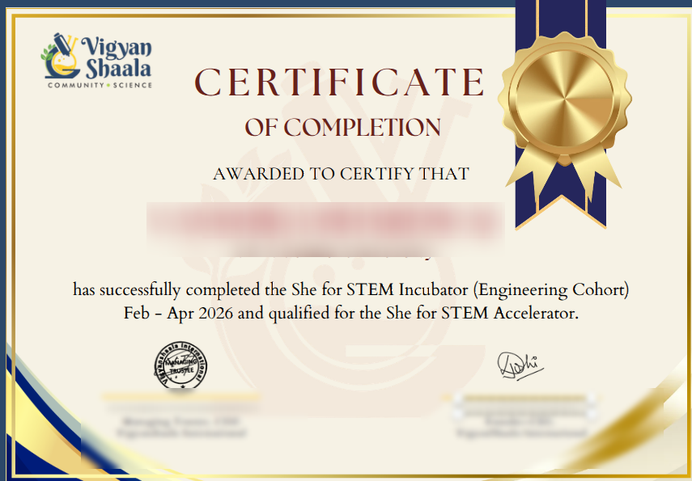

# Achievements & Certificates

Badges appear automatically as you learn — you do not apply for most of them.

## View your achievements {: #achievements }

- On [My Dashboard](my-dashboard.md#dashboard-achievements), click **View All >**.
- Or open [the achievements page](https://apps.mycommunity.vigyanshaala.com/learner-dashboard/achievements){ target="_blank" }.

You see earned badges, badges in progress, certificate count, and completed programs.

---

## How badges are earned {: #badge-triggers }

| When this happens | Badge |
|-------------------|-------|
| Create an account | Welcome |
| Join a program | First enrollment |
| Reach progress milestones | Course progress |
| Finish a program | Course completion |
| Rank high on leaderboard | Top performer |
| Attend a live session | Attendance |

---

## Finish a program and get your certificate {: #complete-course }

- Complete required videos, quizzes, and assignments. Check the **Progress** tab.
- When done, the program moves to **Graduated** on your Dashboard.
- Click **View Certificate** on the Graduated tab, or find it under **My Certificates** on [Profile](profile-and-support.md#profile).

