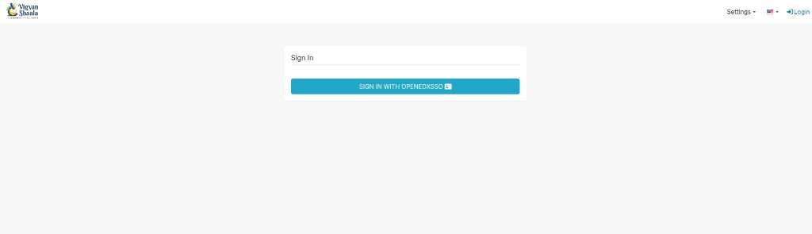
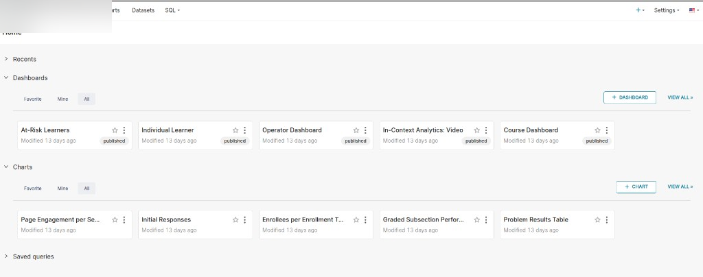
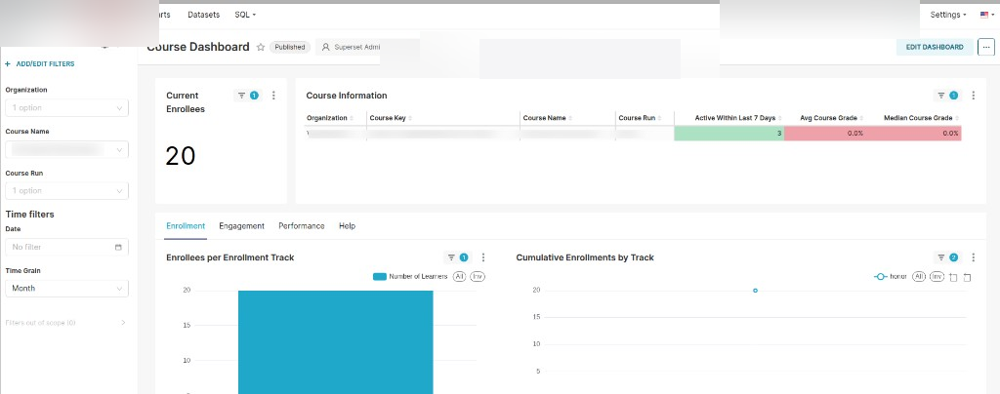
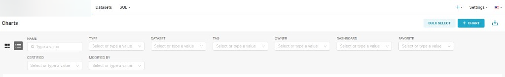
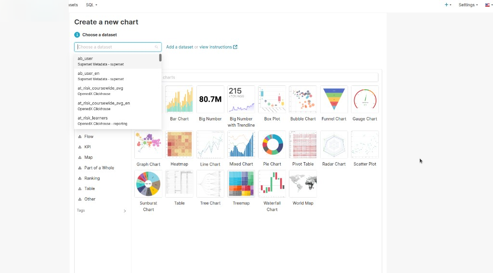
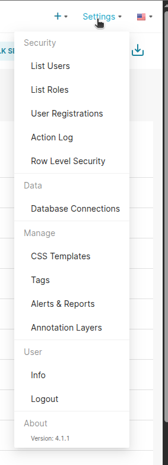
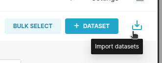
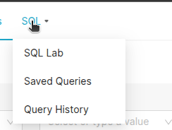

---
hide:
  - navigation
  - toc
---

# Analytics

**Analytics** is where you read dashboards and charts for courses and learners: who enrolled, who is active, how people use pages, problems, and videos, and who may need help. Open it from Control Hub **NAVIGATION**. It opens in a **new tab**. Sign in with the **same account** you use on this site.

A **dashboard** is a page of charts together. A **chart** is one view (bar, line, table). A **dataset** is the table of numbers behind a chart.

## Open Analytics {: #open }

open analytics sign in navigation dashboards charts same account teal button

In Control Hub, under **NAVIGATION**, click **Analytics**.

You see **Sign In**. Click the teal button. Use the same admin account as Control Hub. You do not create a second password here.

---

## Analytics dashboards and types {: #dashboards }

analytics dashboards and types home course dashboard at-risk learners individual learner operator dashboard course comparison in-context analytics video instructor reports

After sign-in you land on **Home**. The top links are **Dashboards**, **Charts**, **Datasets**, and **SQL**. On the right: **+**, **Settings**, and language.

**Recents** and **Saved queries** fold open if you need them.

**Dashboards** has **Favorite**, **Mine**, and **All**. Click **+ DASHBOARD** to start a new one, or **VIEW ALL >** for the full list. Use the star to favourite a card. **published** means others with access can open it.

**Charts** on the same page works the same way, with **+ CHART** and **VIEW ALL >**.

Numbers can lag. On a dashboard, open the **...** menu (top right) and choose **Refresh dashboard** for the latest data. You can also set an auto-refresh for this session.

Clicking a bar or row on one chart can filter the other charts on the same page. Click again, or clear the filter, to return to the full view.

You can also open **Course Dashboard**, **At-Risk Learners Dashboard**, and **Individual Learner Dashboard** for the course you are in from Instructor Dashboard **[Reports](instructor-guide.md#reports)**.

You only see courses you have access to. A course team member sees staff courses. A site admin sees more.

### Course Dashboard {: #course-dashboard }

One course: enrolments, activity, and grades. Open **Dashboards** → **Course Dashboard**, or use Instructor **[Reports](instructor-guide.md#reports)** for the course you have open.

**Filters** on the left apply to the whole page. Set them first:

- **Organization** — which organisation’s courses
- **Course Name** — which course
- **Course Run** — which run of that course
- **Date** — a date range, or **No filter** for all time
- **Time Grain** — **Day**, **Week**, or **Month** on time charts

**+ ADD/EDIT FILTERS** changes which filters appear.

**Current Enrollees** is how many people are in the course right now.

The **Course Information** table is a snapshot of that run:

- **Active Within Last 7 Days** — people who did something in the last week
- **Avg Course Grade** — the average grade
- **Median Course Grade** — the middle grade (less skewed by very high or low scores)

Tabs under that:

- **Enrollment** — how enrolments grew, and by enrollment track (for example honor vs verified).
- **Engagement** — three views:
  - **Pages** — which sections and subsections people opened.
  - **Problems** — attempts, correct vs incorrect, and **correct on first attempt**. Very high often means easy or clear; very low often means hard or unclear. Open the problem in Studio or use [In-Context Analytics](#in-context).
  - **Videos** — started, completed, and which parts were watched or replayed.
- **Performance** — how many people are passing and how grades are spread.
- **Help** — extra guidance for this dashboard.

Click a bar or row to filter the other charts on the page. Click again, or clear the filter, to return to the full view.

### At-Risk Learners Dashboard {: #at-risk-learners }

People who may drop the course. Open **Dashboards** → **At-Risk Learners Dashboard**, or the same board from Instructor **[Reports](instructor-guide.md#reports)**.

A learner appears here only if **all** of these are true:

- they are enrolled
- they did more than open the course home page
- they have not passed yet
- they have not visited for **seven or more days**

If nobody matches, the report is empty. That can be good news.

Tabs:

- **Overview** — list with **last visit** (and name, username, email when your site shows them). Use **last visit** as an early warning. Click one person to filter the other tabs to them.
- **Enrollment** — enrollment track and when people joined.
- **Engagement** — how this at-risk group used pages, problems, and videos. Use this to see what content they struggled with.
- **Performance** — grades and pass rate for this group.
- **Help** — extra guidance for this dashboard.

Reach out to people on **Overview** before they fall further behind.

### Individual Learner Dashboard {: #individual-learner-dashboard }

One person in one course. Open **Dashboards** → **Individual Learner Dashboard**.

Filter by **Name**, **Username**, or **Email** when those fields are shown. If name, username, and email are blank, the site is set not to show personal details here. You can still use the other numbers.

**Learner Summary** is a table for the people you filtered:

- **Username**, **Name**, **Email** — when your site shows them
- Enrollment date, last visit, pass/fail, and course grade

Below that, tabs mirror **Course Dashboard** for the learner(s) you picked:

- **Pages** — which sections and subsections they used
- **Problems** — their attempts and results
- **Videos** — what they watched
- **Help** — extra guidance

Click one learner in a chart to cross-filter the rest of the page to that person.

### Operator Dashboard {: #operator-dashboard }

Site-wide totals, not one course. Open **Dashboards** → **Operator Dashboard**. Site admins use this most.

Typical numbers:

- **Active Learners** — people active on the site recently
- **Active Courses** — courses with recent activity
- **Enrolment totals** — how many people enrolled across courses

Use **Course Dashboard** when you care about a single course. Use [Course Comparison](#course-comparison-dashboard) to compare many courses.

**Course Comparison Dashboard** and **In-Context Analytics** are covered below.

---

## Course Comparison Dashboard {: #course-comparison-dashboard }

course comparison dashboard course metrics run metrics enrollment counts learner performance video engagement tags compare courses

Use this when you need high-level numbers across many courses — popularity, who is active, who may drop, problem difficulty, and video watching — without opening each **Course Dashboard** one by one.

Open it from Analytics **Home** → **Dashboards**, or from Instructor **[Reports](instructor-guide.md#reports)** → **View dashboards**, then open **Course Comparison Dashboard**. You only see courses you can access. A full site admin sees more than a course team member.

**Filters** on the left narrow which courses appear (organisation, course, run, tags when your site uses course tags).

Two tabs:

- **Course Metrics** — one row per course, with all runs of that course rolled together.
- **Run Metrics** — one row per course run. Use this to compare the same course taught more than once.

On both tabs you typically see:

- **Course Info** — name, organisation, current enrollees, active in the last seven days, tags, and a link into that course’s **Course Dashboard**.
- **Enrollment Counts** — how many people enrolled, including by enrollment track when your site uses tracks (for example verified vs honor).
- **Learner Performance Breakdown** — active, passed, and at-risk counts. At-risk uses the same rule as **At-Risk Learners** (enrolled, did more than open the home page, not passed yet, no visit for seven or more days). By default the chart shows the top courses by enrolment among your filters.
- **Learner Performance** — grade and problem metrics, including average **correct on first attempt** across problems. Very high can mean problems are too easy; very low can mean they are too hard or unclear. Drill into that course’s **Course Dashboard** → **Engagement** → **Problems** for detail.
- **Video Engagement** — how much of each course’s video people watch and re-watch. High re-watch can mean a video is unclear. Average video length helps explain a low “seconds watched” rate.

Click a course or run on one chart to filter the others (cross-filter). Click again, or clear the filter, to return to the full view.

---

## In-Context Analytics in Studio {: #in-context }

in-context analytics studio analytics button sidebar course outline graded subsection performance problem results initial responses video unique repeat views

Use this when you are editing a course and want numbers next to the block you are looking at. It is the same Analytics data, shown in Studio.

Open the course in **Studio**. On the **Course outline** or a **Unit** page, click **Analytics** at the top. A sidebar opens. Click **Analytics** again (or close) to hide it.

What you see depends on what you select:

**Course outline (whole course)**

- **Subsection Engagement** — how many people tried at least one problem in each graded subsection, and the average score for those people.
- **Problem Engagement** — attempts per problem, and **correct on first attempt**. High = manageable; low = hard or unclear.
- **Video Engagement** — unique and repeat views per video.

**Graded subsection**

- Score ranges and the average score for people who tried at least one problem in that subsection.
- Correct vs incorrect counts for each problem in the subsection.

**Problem**

- **Problem Results** — % correct on all attempts, and % correct on the first attempt.
- **Initial Responses** — how people answered the first time (useful when many get it wrong).

**Video**

- Unique vs repeat views along the video timeline. Spikes in repeat views often mean that part is unclear.

On a **Unit** page, click a problem or video in the sidebar list to jump to that block and refresh the charts for it.

Pair this with **Course Dashboard** → **Engagement** when you need the full course, or with [Course Comparison](#course-comparison-dashboard) when you compare several courses.

---

## Datasets {: #datasets }

datasets analytics tables behind charts enrollment at-risk learner data

Click **Datasets** at the top. Each **dataset** is the table of numbers behind one or more charts (enrolments, at-risk learners, problem attempts, and so on).

Use **BULK SELECT**, **+ DATASET**, or the import icon on the right. To add from a file, see [Import datasets](#import-dataset).

Before you [create a chart](#create-chart), pick the dataset that matches what you want to show. Dashboard boards already use the right datasets — you only need this when you build a custom chart.

---

## Analytics charts and chart types {: #charts }

analytics charts and chart types create a new chart choose a dataset choose a chart type bar line pie table

Click **Charts** at the top. This list is every chart, including ones that sit on a dashboard.

**BULK SELECT** lets you pick several charts at once. **+ CHART** starts a new chart. The download icon exports the list.

Filters narrow the list. You do not need every filter every time:

- **NAME** — type part of the chart name
- **TYPE** — bar, line, table, and other views
- **DATASET** — which data the chart uses
- **TAG** — labels you added
- **OWNER** — who created it
- **DASHBOARD** — which dashboard it sits on
- **FAVORITE** — starred charts
- **CERTIFIED** — marked as official
- **MODIFIED BY** — who last changed it

Switch grid view or list view with the icons on the left.

## Create a new chart {: #create-chart }

create a new chart choose a dataset choose a chart type bar line pie table kpi map

Click **+ CHART** or **Charts** → **+ CHART**. The page is **Create a new chart**.

**Step 1: Choose a dataset** — pick the data to chart. Use the search box. Names describe the table (enrolments, at-risk, and so on). **Add a dataset** is next to it if you need new data.

**Choose a chart type** — pick a view (bar, line, pie, table, and others). Categories on the left (for example **KPI**, **Table**, **Map**) shorten the gallery.

Then set the numbers and save. The new chart appears under **Charts**. You can add it to a dashboard later.

---

## Settings and data {: #settings }

settings and data import a dataset sql lab saved queries query history list users list roles database connections tags alerts reports logout

Click **Settings** at the top right.

Use this menu if you manage the Analytics site itself. Most day-to-day work stays on **Dashboards** and **Charts**.

- **Security** — people who can sign in, their roles, and a log of actions
- **Data** — **Database Connections**
- **Manage** — look and labels: **CSS Templates**, **Tags**, **Alerts & Reports**, **Annotation Layers**
- **User** — **Info** for your account, or **Logout**

### Import datasets {: #import-dataset }

import datasets upload dataset file add dataset

Open **Datasets**. On the right: **BULK SELECT**, **+ DATASET**, and the import icon.

Hover the tray icon to see **Import datasets**. Use that to bring in a saved dataset file. Use **+ DATASET** to add one from a connection you already have. Charts read from datasets, so import or add a dataset before you build a new chart from it.

### SQL Lab {: #sql }

sql lab saved queries query history custom query

Click **SQL** in the top bar.

- **SQL Lab** — write a query against your data
- **Saved Queries** — queries you kept
- **Query History** — what ran recently

Use this when a dashboard does not already show the cut you need. For most checks, start with **Dashboards** instead.
