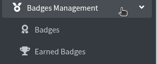
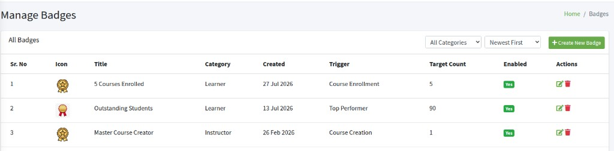
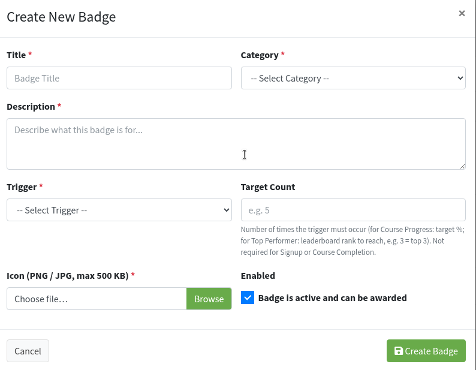
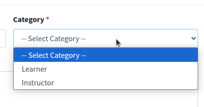
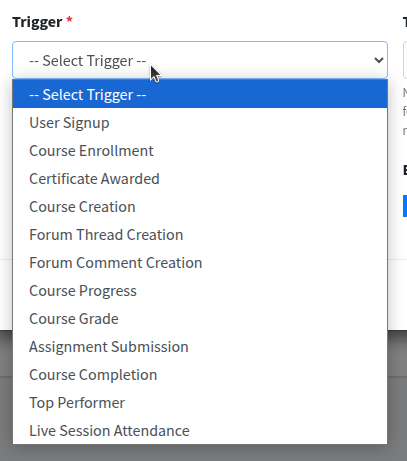
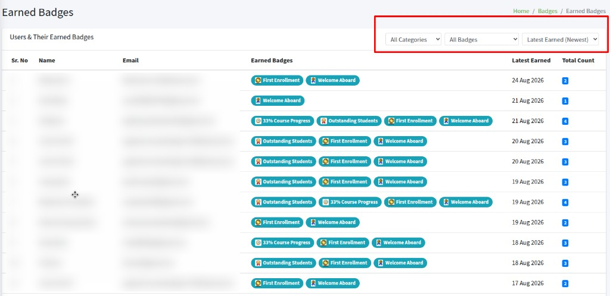
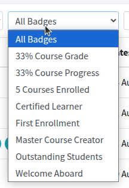

---
hide:
  - navigation
  - toc
---

# Badges Management

**Badges Management** is in the left sidebar. Use **Badges** to create the badges users can earn. Use **Earned Badges** to see who already has them.

## Badges Management menu {: #menu }

badges management badges earned badges

Click **Badges Management**. You see:

- **Badges** — create, edit, and delete badge rules
- **Earned Badges** — who earned which badge, and when

---

## Manage Badges {: #overview }

manage badges all badges create new badge all categories newest first

Click **Badges**. The page title is **Manage Badges**. Breadcrumb: **Home / Badges**. The list heading is **All Badges**.

If the list is empty: **No badges found. Create one to get started.**

**Filters** (they apply as soon as you change them):

- **All Categories** — show every badge, or only **Learner** or only **Instructor**
- **Newest First** — newest badges at the top. **Oldest First** puts the oldest first

**+ Create New Badge** opens the form.

Each row is one badge: icon, title, category, created date, trigger, target count, enabled (**Yes** / **No**).

Pencil icon — **Edit Badge**. Trash icon — **Delete Badge**.

---

## Create New Badge {: #create-badge }

create new badge title category description trigger target count icon enabled

Click **+ Create New Badge**. The box is **Create New Badge**.

**Title \*** — name shown to users. Placeholder: **Badge Title**.

**Category \*** — who this badge is for. **Learner** or **Instructor**. Placeholder: **-- Select Category --**.

**Description \*** — short text about the badge. Placeholder: **Describe what this badge is for...** Users can see this when they hover a badge on **Earned Badges**.

**Trigger \*** — the action that awards the badge. Placeholder: **-- Select Trigger --**.

- **User Signup** — account created
- **Course Enrollment** — joined a course
- **Certificate Awarded** — certificate issued
- **Course Creation** — a course was created (Instructor)
- **Forum Thread Creation** — started a discussion thread
- **Forum Comment Creation** — posted a comment
- **Course Progress** — reached a % of the course
- **Course Grade** — reached a grade %
- **Assignment Submission** — submitted an assignment
- **Course Completion** — finished a course
- **Top Performer** — reached a leaderboard rank
- **Live Session Attendance** — attended a live session

**Target Count** — how many times the trigger must happen. Placeholder: **e.g. 5**.

- **Course Enrollment** with **5** → badge after 5 enrollments
- **Course Progress** → the % to reach (for example 33)
- **Course Grade** → the grade % to reach
- **Top Performer** → rank to reach (for example **3** = top 3)
- **User Signup** and **Course Completion** — leave empty (the field hides)

**Icon (PNG / JPG, max 500 KB) \*** — click **Browse** and pick the picture. Max 500 KB.

**Enabled** — **Badge is active and can be awarded**. Leave checked so users can earn it. Uncheck to stop new awards without deleting the badge.

Click **Create Badge**. **Cancel** or **x** closes without saving.

---

## Edit and delete a badge {: #edit-delete-badge }

edit badge save changes delete badge yes delete it

Pencil icon — **Edit Badge**. Same fields as create. **Replace Icon (PNG / JPG, max 500 KB)** — leave empty to keep the current picture. Click **Save Changes**.

Trash icon — **Delete Badge**. The box asks **Are you sure you want to delete (title)?** and **This will also remove all earned records for this badge and cannot be undone.** Click **Yes, Delete it**, or **Cancel**.

---

## Earned Badges {: #earned-badges }

earned badges users all badges latest earned total count

Click **Earned Badges**. The page title is **Earned Badges**. Breadcrumb: **Home / Badges / Earned Badges**. The list heading is **Users & Their Earned Badges**.

This page is a view only. You cannot award or remove a badge here. Change the badge rule under **Badges**.

**Filters:**

- **All Categories** — **Learner** or **Instructor**
- **All Badges** — one badge title, to see only users who earned that badge

- **Latest Earned (Newest)** — users whose latest badge is most recent. **Latest Earned (Oldest)** reverses that

Each row: **Name**, **Email**, **Earned Badges** (chips with icon and title), **Latest Earned** (date), **Total Count**.

Hover a chip to read the badge description.

If the list is empty: **No users have earned any badges yet.**
