---
hide:
  - navigation
  - toc
---

# Certificate Manage

**Certificate Manage** is where you create certificate templates. Then assign a template to a course in **Course Management**. Learners who complete that course get the certificate with their name, the course name, and the rest of the details.

## Certificate Manage overview {: #overview }

certificate manage templates new template

Click **Certificate Manage** in the sidebar. The page title is **Certificate Manage**. Breadcrumb: **Home / Certificate Manage**.

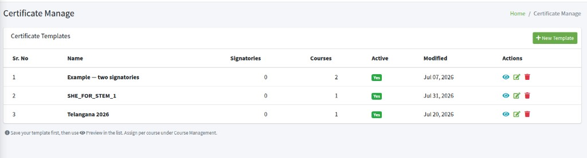

The list is **Certificate Templates**. Click **New Template** to make a new one.

Save the template first, then use the eye icon **Preview** in the list. Assign it per course under **Course Management**.

---

## New Template {: #new-template }

new certificate template name active html css images

Click **New Template**. The box is **New Certificate Template**.

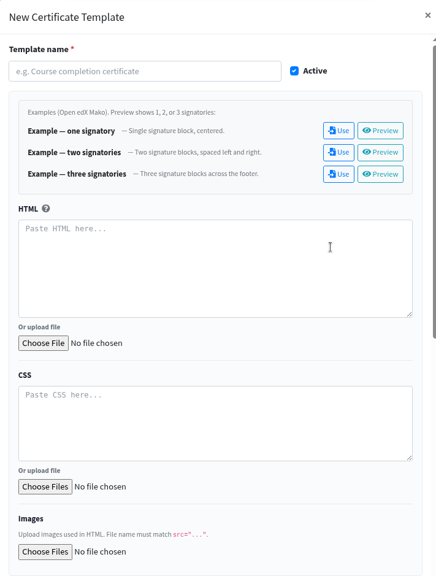

Type a **Template name**. This name is required, and two templates cannot share the same name. Keep **Active** checked so the template appears in **Course Management** → **Certificate template**.

Paste **HTML** and **CSS**, or use **Or upload file**. You need HTML and/or CSS before **Save** will work. Under **Images**, upload pictures used in the HTML. The file name must match `src="..."`. If a name is marked **missing**, upload that file.

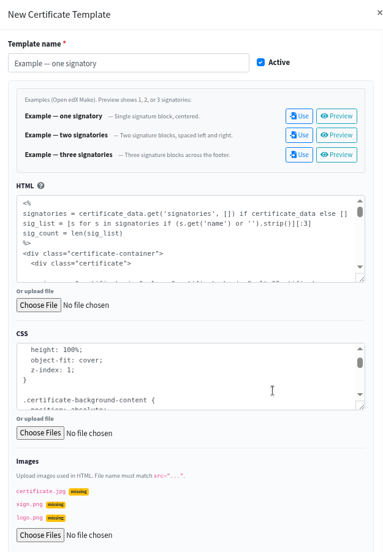

Click **Save**. **Cancel** or **x** closes without saving.

If names in **Images** do not match the HTML, those pictures will not show on the certificate.

---

## Examples — Use and Preview {: #examples }

example one two three signatories use preview

Under **Examples (Open edX Mako). Preview shows 1, 2, or 3 signatories:**

- **Example — one signatory** — single signature block, centered
- **Example — two signatories** — two signature blocks, spaced left and right
- **Example — three signatories** — three signature blocks across the footer

On the right of each row: **Use** and **Preview**.

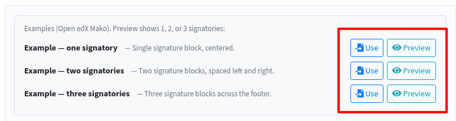

Click **Preview** to see how that example looks.

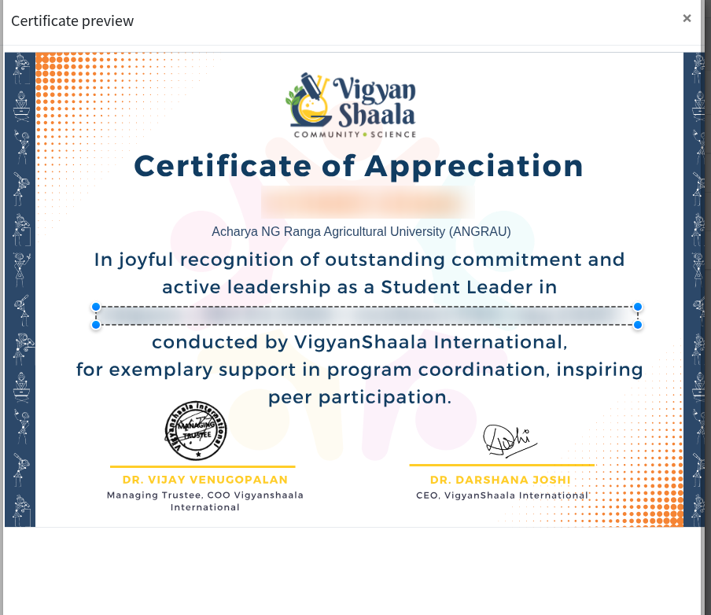

Click **Use** if you want that layout (one, two, or three signatories). **HTML**, **CSS**, and **Images** fill in automatically. Then click **Save** — **Use** only fills the form; it does not save by itself.

**Preview** on an example works before you save. **Preview** in the list (eye icon) works only after **Save**.

---

## Certificate details {: #certificate-details }

certificate details signatories add signatory maximum 3

Further down the same box, **Certificate details** says **Open edX certificate settings (same as Studio).**

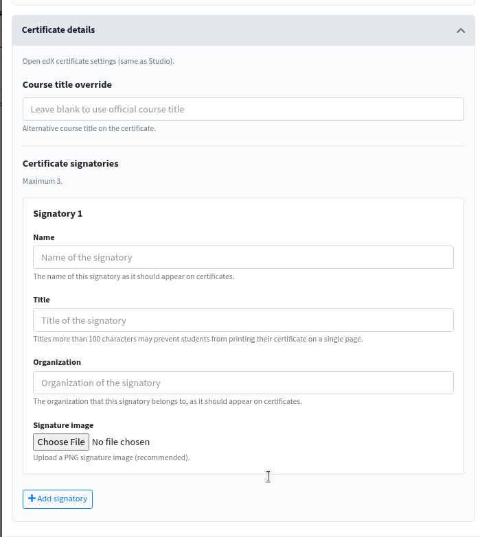

**Course title override** — leave blank to use the official course title. This is the course name learners see on the certificate.

**Certificate signatories** — **Maximum 3.** Click **+ Add signatory** to add **Signatory 1**, then 2, then 3.

For each signatory:

- **Name**
- **Title** — titles more than 100 characters may prevent learners from printing the certificate on a single page
- **Organization**
- **Signature Image** — **Choose File** (PNG recommended)

You cannot add a fourth signatory. After **Save**, courses that already use this template pick up the new signatories.

---

## Actions {: #actions }

preview edit delete certificate template eye pencil trash

In the list **Actions**:

**Eye icon** — **Preview**. See how the saved template looks.

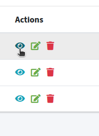

**Pencil icon** — **Edit**. Opens **Edit Certificate Template**. Change the template, then **Save**.

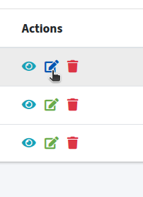

**Trash icon** — **Delete**. The box is **Delete template?** Click **Delete**, or **Cancel**.

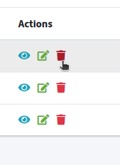

You cannot delete a template that is still assigned to a course. First open **Update Course Configuration** for those courses, set **Certificate template** to **Open edX Default Certificate**, **Save**, then delete the template.

---

## Assign a certificate to a course {: #assign-to-course }

update course configuration certificate template save

After the template is saved, open **Course Management** → **Courses**. In **Actions**, click the gear icon.

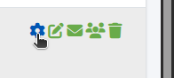

The box is **Update Course Configuration**. At the bottom, **Certificate template**. Choose the template name, then click **Save**.

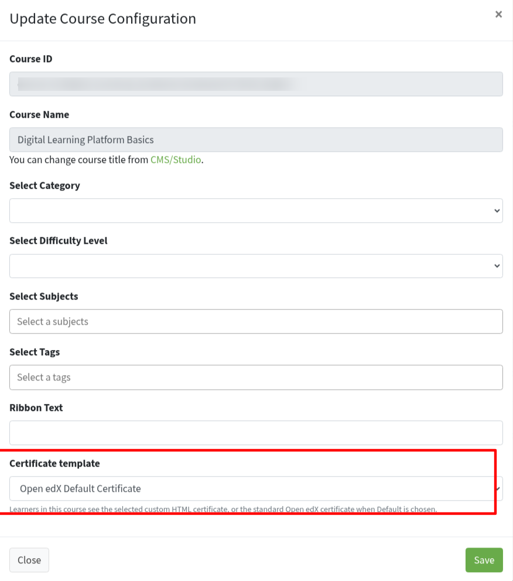

That course now uses this certificate. Learners who complete the course get it with their name, the course name (or your **Course title override**), and the signatories.

If you leave **Open edX Default Certificate**, they get the standard Open edX certificate instead.

Only **Active** templates appear in this list. If you uncheck **Active**, or the template has no HTML, the course falls back to the default certificate.

After you **Save** a template you already assigned, those courses update automatically. You do not need to assign it again unless you want a different template.
