---
hide:
  - navigation
  - toc
---

# Cohort Manage Form

**Cohort Manage Form** is in the left sidebar. The page title is **Cohort Management Form**. Breadcrumb: **Home / Templates**.

Here you can:

- Create a registration form and link it to one course
- Choose the questions, who can register, and which questions appear
- Copy the registration link (or put it in a QR code) so learners can apply
- See who submitted, who started but did not finish, and send them a resume email
- Edit, duplicate, or delete a form

---

## Cohort Management Form overview {: #overview }

cohort manage form templates submissions in-progress total templates add template

Click **Cohort Manage Form**. The line under the title says **Manage registration forms and view submissions.**

Cards (click a card to open that tab):

- **Total Templates** — how many forms you have
- **Total Submissions** — completed registrations (account created)
- **In-Progress Registrations** — people who passed eligibility but have not activated an account yet

Tabs: **Templates**, **Submissions**, **In-Progress**.

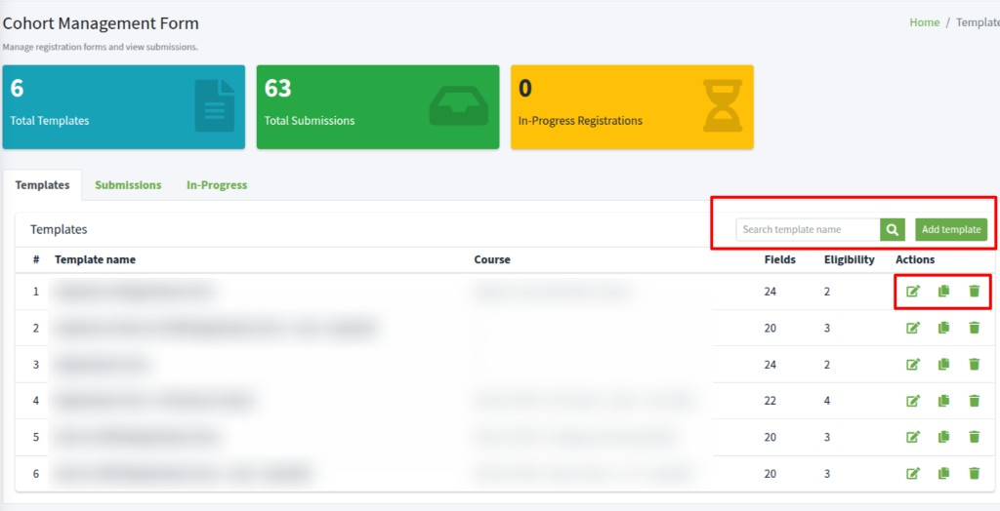

On **Templates**:

- **Search template name**, then click the search button
- **Add template** — new form
- Table: **Template name**, **Course**, **Fields** (extra questions), **Eligibility** (rules), **Actions**

If the list is empty: **No templates yet. Click Add template.**

---

## Add template {: #add-template }

add template template name description active save cancel unique

Click **Add template**. The box is **Add template**.

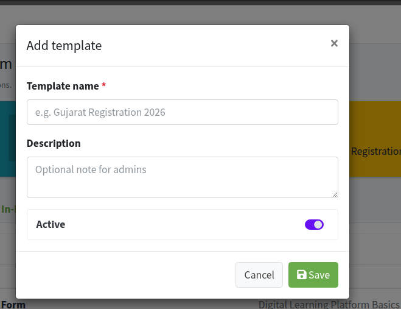

1. **Template name \*** — required. Must be unique. Placeholder: **e.g. Gujarat Registration 2026**. If the name is already used, you see **A template with this label already exists**.
2. **Description** — short optional note on this box. The longer text learners see is set later in **Form settings**.
3. **Active** — leave on so learners can open the form. Turn it off if the form is not ready yet.

Click **Save**. **Cancel** or **x** closes without saving.

After **Save**, you go straight to the template page. A registration link is created at that moment. Next: **Form settings**, **Course assignment**, **Thank you message**, fields, and eligibility.

---

## Form settings {: #form-settings }

form settings template name description eligibility note name full name email email address active save

After **Add template**, or after the pencil icon **Edit template**, you see **Form settings**.

**Template name \*** is what learners see as the form title. Changing it does not change the registration link.

**Description** is rich text on the registration form (bold, lists, links) — for example **About Us** and program details.

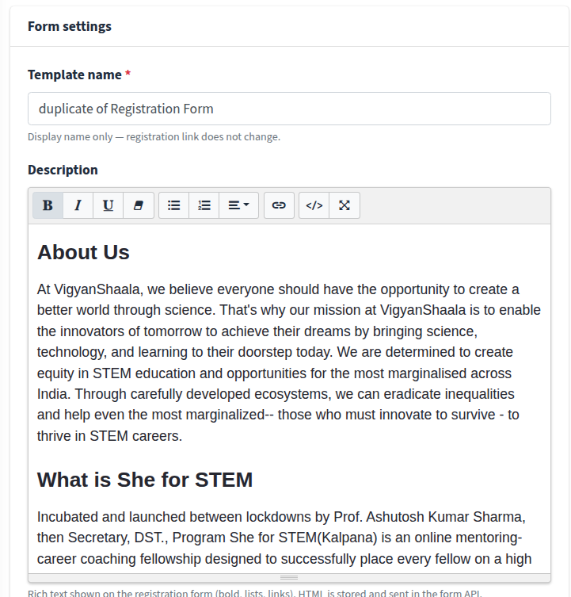

Further down the same card:

**Eligibility Note** — short line under the title on the learner form (who the program is for). This is not the same as **Eligibility rules** (those block or show questions).

**Name** — label for the required name field. Default **Full name**. Type **Full Name** if you want that wording. You cannot remove this field.

**Email** — label for the required email field. Default **Email address**. Type **Email Address** if you want that wording. The same email is used when they continue with Google or email. You cannot remove this field.

**Active** — uncheck to stop new registrations. Learners who open the link then see that the form is not available.

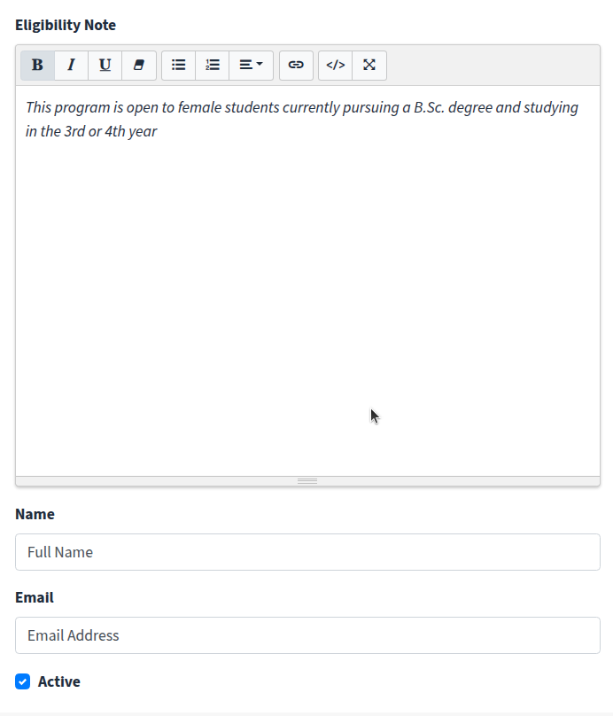

Click **Save** on **Form settings**. Each other card (**Thank you message**, **Course assignment**) has its own **Save**.

---

## Thank you message {: #thank-you }

thank you message after submit google email save

On the right, **Thank you message** is what applicants see right after they submit the form — before they sign up with Google or email. You can use bold text, bullet points, and links.

If you leave this blank, they see: **Congratulations! Your registration form has been submitted. Please continue with Google or email to create your account.**

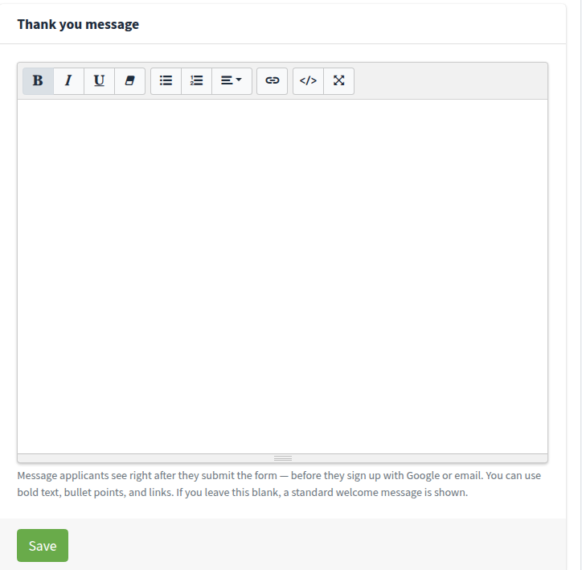

Click **Save** on this card.

---

## Registration link {: #registration-link }

registration link copy link slug qr code share learners

**Registration link** is created when you save the template. This link is fixed when the template is created. Renaming does not change it.

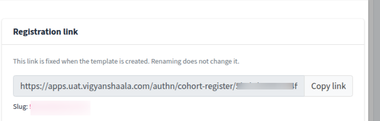

Click **Copy link**. You should see **Link copied successfully**. Share that URL with learners, or put the same URL in a QR code. They open the link or scan the QR to fill the form.

**Slug** is the last part of the URL. It stays the same if you rename the template. Duplicate creates a **new** link (new slug).

The form works for learners only when all of these are true:

- Template is **Active**
- A course is linked
- You added at least one extra field with **Category order** set

---

## Course assignment {: #course-assignment }

course assignment course linked to this template save

**Course linked to this template \*** — choose the course this form enrolls people into. Each course can be linked to only one template. Courses already used by another template cannot be selected (the list marks them **already used by:**).

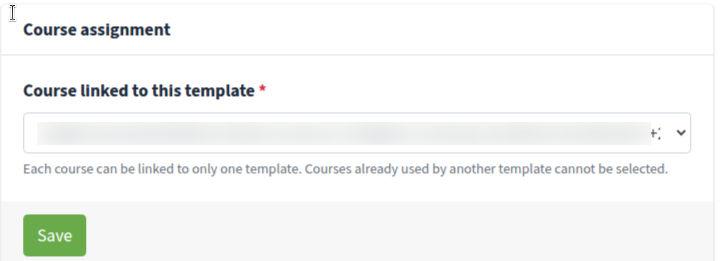

Click **Save**. If you skip this, learners cannot finish registration. After a **Duplicate template**, you must pick a different course here.

---

## Form fields {: #form-fields }

form fields add field field key label type category eligibility guide

**Form fields** are the extra questions. **Name** and **Email** are already on every form — do not add `full_name` or `email` as extra fields.

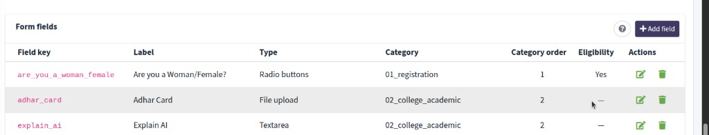

- **+ Add field** — new question
- Question-mark icon — **Form Field Configuration Guide** (types, validation, eligibility)
- Pencil icon — **Edit field**
- Trash icon — **Delete field**

**Eligibility** in the table is **Yes** if the field is used in a rule, or **—** if not.

**Delete field?** asks **Remove this field from the form template?** Click **Delete**. If rules use this field, the warning says those rules will be deleted too. Then the button is **Delete anyway**.

If people have already submitted, turn **Active** off on the field instead of deleting it. That hides it on new forms and keeps old answers.

Do not change **Field key** after people have submitted — new answers will not match the old ones.

---

## Add field {: #add-field }

add field label field key category order type options file upload eligibility required active save field

Click **+ Add field**. The editor is **Add field**.

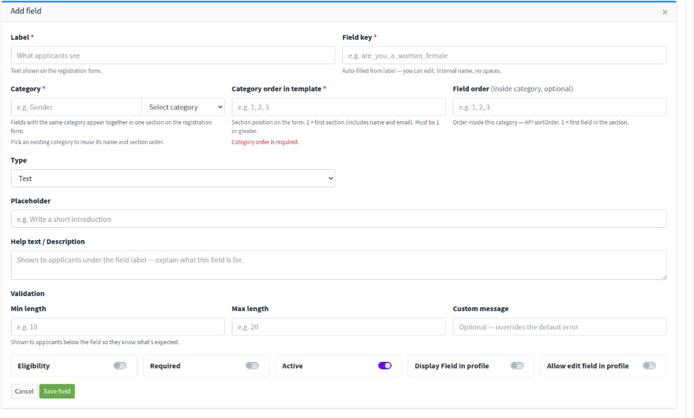

**Label \*** — text shown on the registration form.

**Field key \*** — auto-filled from the label. Internal name, no spaces. Unique on this template.

**Category \*** — fields with the same category appear as one step on the form (for example Registration Form, then College & Academic Information). Pick an existing category to reuse its name and section order.

**Category order in template \*** — which step comes first. **1** = first section (includes name and email). Must be 1 or greater. Empty shows **Category order is required.**

**Field order (inside category, optional)** — order inside that step.

**Type**

- **Text** — one line
- **Textarea** — several lines
- **Email** — email format
- **Number** — digits only
- **Date**
- **Dropdown** — pick one from a list
- **Radio buttons** — pick one, all options visible
- **multi-select** — pick more than one
- **File upload** — file or image

For **Dropdown**, **Radio buttons**, or **multi-select**, add **Options** with **Add option**, or use **Master table** (for example State). **Add Other** lets the learner type a value that is not in the list. **Maximum selections** is for **multi-select**.

For **File upload**, set **Allowed file types** (for example `.pdf,.jpg,.png`) and **Max file size (MB)** (empty = 10 MB).

**Placeholder** — text inside the box before they type. **Help text / Description** — under the label.

**Min length**, **Max length**, **Custom message** — for Text, Textarea, and Number. Number uses digit count (for example a 6-digit pin code).

Toggles:

- **Eligibility** — this field can be used in a rule. When on, you can set **one** **Eligibility condition** here (**Rule type**, **Operator**, **Expected value**, **Ineligible message \***). More rules for the same field go under **Eligibility rules**.
- **Required** — learner must answer before **Next** / submit
- **Active** — leave on to show the field
- **Display Field in profile** — answer appears on the learner’s **Profile**
- **Allow edit field in profile** — they can change it later on **Profile**

Click **Save field**. **Cancel** or **x** closes without saving.

---

## Eligibility rules {: #eligibility-rules }

eligibility rules add eligibility form access show fields

**Eligibility rules** decide who can register, and which extra questions appear. They are not the same as **Eligibility Note** (that is only text on the form).

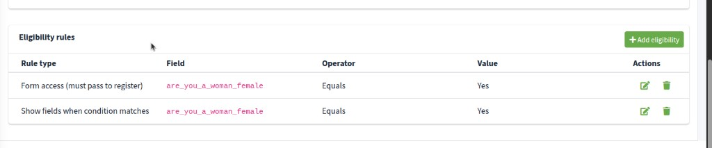

Click **+ Add eligibility**. Pencil icon — edit. Trash icon — **Delete eligibility**. The box asks **Remove this eligibility condition?** Click **Delete**.

---

## Add eligibility {: #add-eligibility }

add eligibility field rule type operator expected value target field keys save eligibility equals

Click **+ Add eligibility**. The editor is **Add eligibility**.

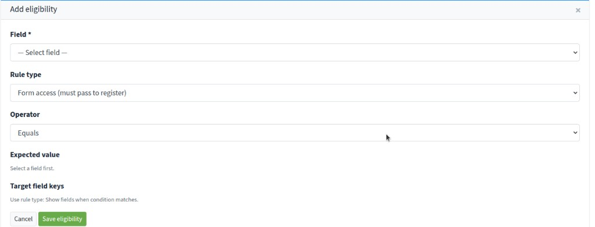

1. **Field \*** — the question the rule checks (placeholder **— Select field —**). Turn **Eligibility** on for that field first if it is not in the list.
2. **Rule type**
   - **Form access (must pass to register)** — if they fail, they cannot continue. Example: **Are you a Woman/Female?** **Equals** **Yes**.
   - **Show fields when condition matches** — extra questions appear only when this matches (for example show document uploads only for one answer).
3. **Operator** — **Equals**, **Not equals**, **In list**, **Not in list**, **Greater than or equal**, **Less than or equal**, **Greater than**, **Less than**.
4. **Expected value** — select a field first, then tick answers. Tick **All** for any answer, or pick specific values. Several ticks mean any of those values.

For **Show fields when condition matches**, **Target field keys** lists which questions to show. Tick **All** or pick one or more fields.

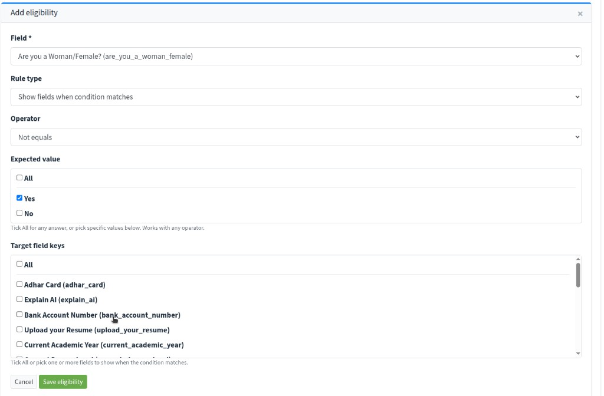

You cannot save two identical **Form access** rules on the same field.

Click **Save eligibility**. **Cancel** or **x** closes without saving.

---

## Edit, duplicate, and delete a template {: #template-actions }

edit template duplicate template delete template back to templates

On **Templates**, hover an icon to see its name:

1. Pencil icon — **Edit template**. Opens **Form settings**, the registration link, fields, and rules. **Back to templates** (or the **Templates** breadcrumb) returns to the list. The page title becomes the template name.
2. Copy icon — **Duplicate template**. The new name is **duplicate of (template name)**. Description, Eligibility Note, Thank you message, Name/Email labels, fields, and rules copy. The registration link is **new**. Course is **not** copied — you must choose a course that is not already used.
3. Trash icon — **Delete template**.

**Delete template?** says **This will permanently delete the form template, fields, rules, registration link, and course assignment.** Click **Delete**, or **Cancel**. The old link and QR stop working. You cannot undo this.

---

## Submissions {: #submissions }

submissions cohort forms no of submissions view submissions export to excel previous response

Click **Submissions** (or the **Total Submissions** card). The list is **Cohort Forms**.

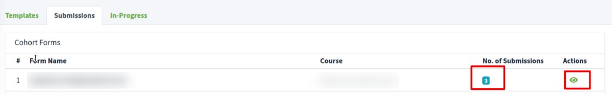

**No. of Submissions** is the count for that form. Eye icon — **View submissions**.

On that page:

- Columns: **Name**, **Email**, **Submitted**, **Status**, **Actions**
- Eye icon — **View submitted data**. The box is **Submission Detail**: **Field**, **Answer**, and **Previous Response** (from another form, if they applied before). Yellow means the answer changed.
- **Export to Excel** — CSV with **Name**, **Email**, **Submitted**, **Status**, **Eligible**, then each question
- **Back to forms** — this list

---

## In-Progress {: #in-progress }

in-progress registrations send resume link delete selected drafts

Click **In-Progress** (or the **In-Progress Registrations** card). The list is **Cohort Forms**.

Applicants who submitted the form and passed eligibility, but have not yet finished creating and activating their account. Their answers are saved — send them a one-click link to pick up where they left off.

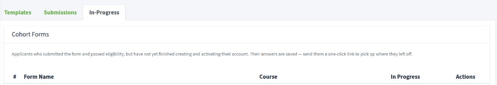

Eye icon — **View in-progress registrations**. You see **Name**, **Email**, **Started**, **Last updated**.

- Paper-plane icon — **Send resume link**. They get an email with a one-click link.
- Trash icon — **Delete**. **Delete this in-progress registration?** The saved draft is removed. They must fill the form again if they return.
- Tick rows (or **Select all**), then **Send resume link** or **Delete selected**. **Send resume link?** asks to email the selected people. **Delete selected drafts?** removes those drafts.

---

## What learners see {: #learner-form }

registration form qr code link full name email address submit next steps

When a learner opens your **Copy link** URL, or scans a QR code made from that URL, they see the registration form.

The title is the **Template name**. The **Eligibility Note** is under it. **Description** is the longer about text. **Name** and **Email** use the labels you set (for example **Full Name** and **Email Address**). Extra fields appear in steps from **Category** and **Category order**. They click **Next** between steps.

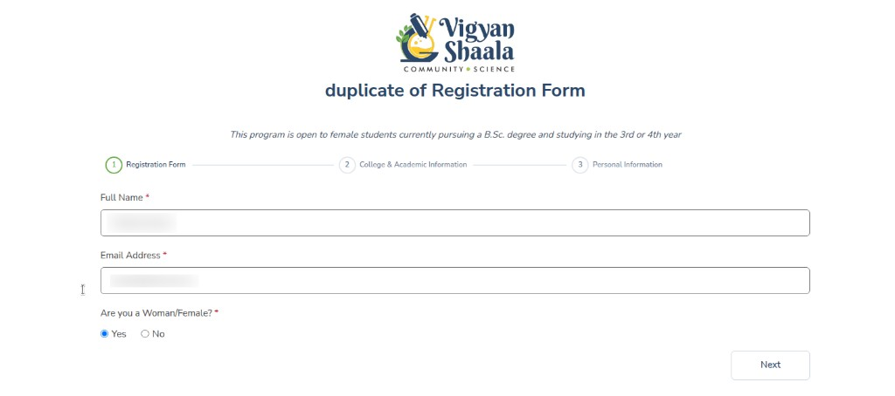

If they fail a **Form access** rule, they cannot continue (they see the **Ineligible message**). After a successful submit they see the **Thank you message**, then sign up with Google or email. When the account is activated they are enrolled in the linked course.

If they stop after submit, they appear under **In-Progress**. Send **Send resume link** so they can finish.
