---
hide:
  - navigation
  - toc
---

# Course Management

**Course Management** is in the left sidebar. Open it to see **Categories**, **Subjects**, **Difficulty Levels**, **Tags**, and **Courses**. New courses are created in **Studio**. Here you set names, search courses, and manage each course.

## Course Management overview {: #overview }

course management categories subjects difficulty levels tags courses

Click **Course Management** in the sidebar. You see:

- **Categories**
- **Subjects**
- **Difficulty Levels**
- **Tags**
- **Courses**

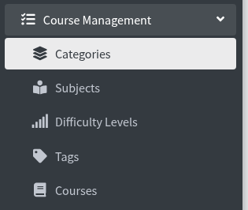

---

## Manage Categories {: #categories }

manage categories create new category image png jpg webp

Click **Categories**. The page title is **Manage Categories**. Breadcrumb: **Home / Categories**.

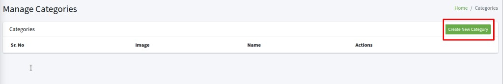

Click **Create New Category**.

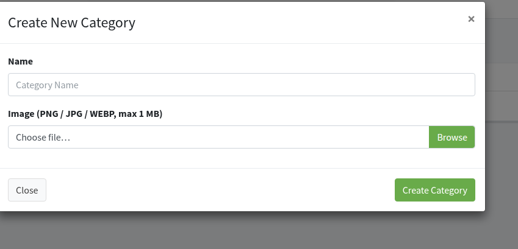

1. Type a **Name** (placeholder **Category Name**).
2. Under **Image (PNG / JPG / WEBP, max 1 MB)**, click **Browse** and pick a file.
3. Click **Create Category**.

**Close** or **x** cancels.

The table shows **Sr. No**, **Image**, **Name**, and **Actions**.

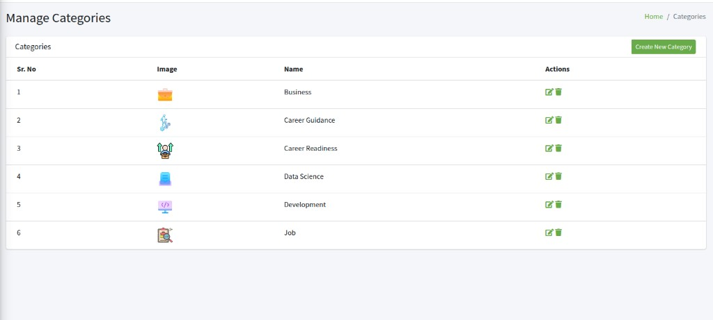

In **Actions**:

- Pencil icon — **Edit Category**. Change **Name**. To change the picture, use **Replace Image (PNG / JPG / WEBP, max 1 MB)**. Leave it empty to keep the current image. Click **Save**.
- Trash icon — **Delete Category**. The box says **Are you sure you want to delete Category?** and **Deleting this Category is permanent and cannot be undone.** Click **Yes, Delete it**, or **Close**.

---

## Manage Subjects {: #subjects }

manage subjects create new subject

Click **Subjects**. The page title is **Manage Subjects**. Breadcrumb: **Home / Subjects**.

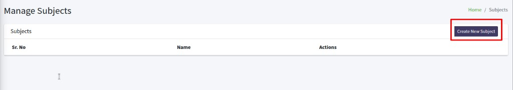

Click **Create New Subject**.

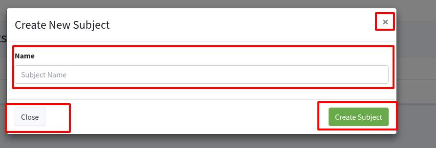

Type a **Name** (placeholder **Subject Name**), then click **Create Subject**. **Close** or **x** cancels.

The table shows **Sr. No**, **Name**, and **Actions**.

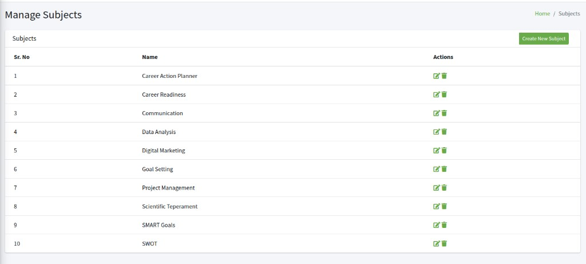

In **Actions**:

- Pencil icon — **Edit Subject**. Change **Name**, then **Save**.
- Trash icon — **Delete Subject**. The box says **Are you sure you want to delete Subject?** Click **Yes, Delete it**, or **Close**.

---

## Manage Difficulty Levels {: #difficulty-levels }

manage difficulty levels create new difficulty level beginner intermediate

Click **Difficulty Levels**. The page title is **Manage Difficulty Levels**. Breadcrumb: **Home / Difficulty Levels**.

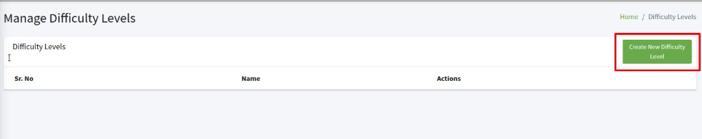

Click **Create New Difficulty Level**.

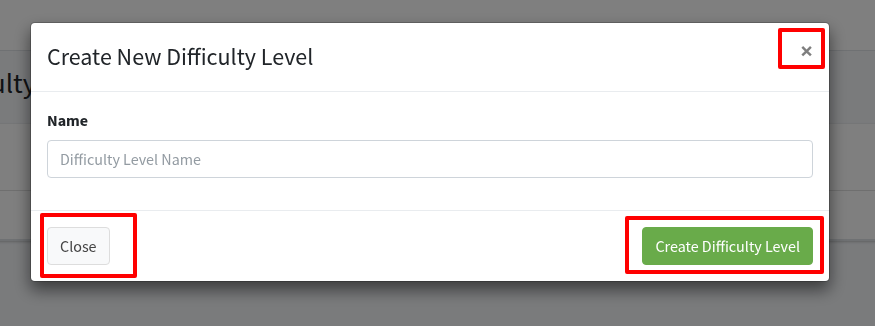

Type a **Name** (placeholder **Difficulty Level Name**), then click **Create Difficulty Level**. **Close** or **x** cancels.

The table shows **Sr. No**, **Name**, and **Actions**.

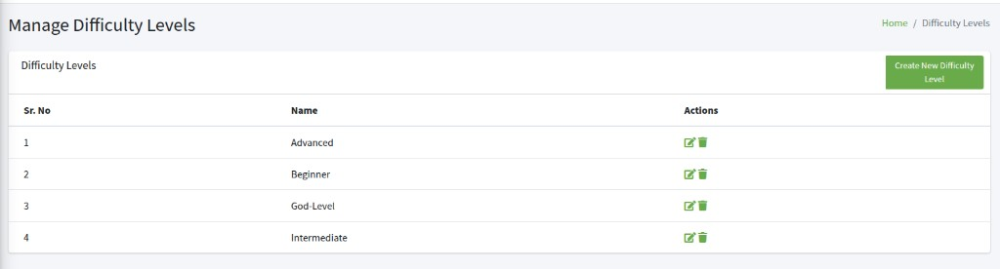

In **Actions**:

- Pencil icon — **Edit Difficulty Level**. Change **Name**, then **Save**.
- Trash icon — **Delete Difficulty Level**. The box says **Are you sure you want to delete Difficulty Level?** Click **Yes, Delete it**, or **Close**.

---

## Manage Tags {: #tags }

manage tags create new tag

Click **Tags**. The page title is **Manage Tags**. Breadcrumb: **Home / Tags**.

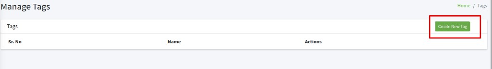

Click **Create New Tag**.

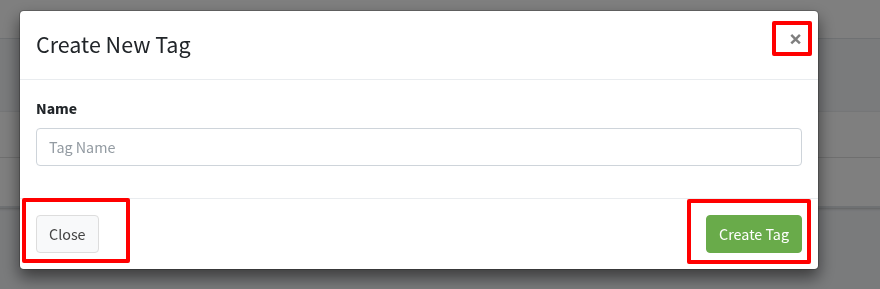

Type a **Name** (placeholder **Tag Name**), then click **Create Tag**. **Close** or **x** cancels.

The table shows **Sr. No**, **Name**, and **Actions**.

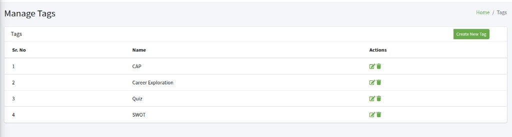

In **Actions**:

- Pencil icon — **Edit Tag**. Change **Name**, then **Save**.
- Trash icon — **Delete Tag**. The box says **Are you sure you want to delete Tag?** Click **Yes, Delete it**, or **Close**.

---

## Manage Courses {: #courses }

manage courses search course list view grid view create new course

Click **Courses**. The page title is **Manage Courses**. Breadcrumb: **Home / Courses**.

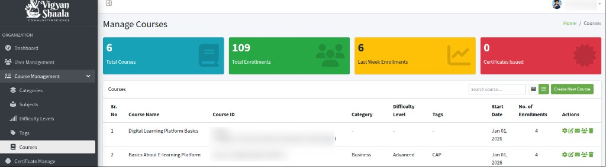

The cards at the top:

- **Total Courses** — how many courses are on the site
- **Total Enrollments** — how many people are enrolled across all courses
- **Last Week Enrollments** — how many enrollments happened in the last 7 days
- **Certificates Issued** — how many certificates learners have received

These numbers are an example. Your site shows its own counts.

Use **Search course…** to find a course. Switch **Grid view** (grid icon) or **List view** (list icon). List view is on by default.

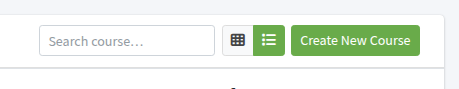

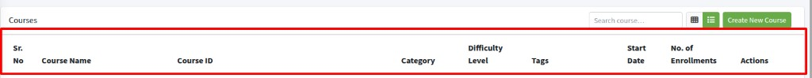

---

## Create New Course {: #create-course }

create new course studio home new course cms

Click **Create New Course**.

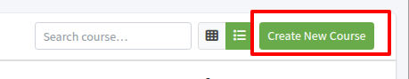

You go to **Studio home** (CMS). There, click **+ New course** to start a course. You can also use **+ New library**.

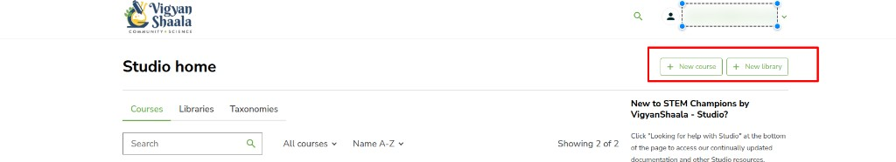

---

## Update Course Configuration {: #update-course-config }

update course configuration gear icon select category tags certificate

In **Actions**, click the gear icon.

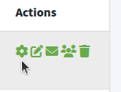

The box is **Update Course Configuration**.

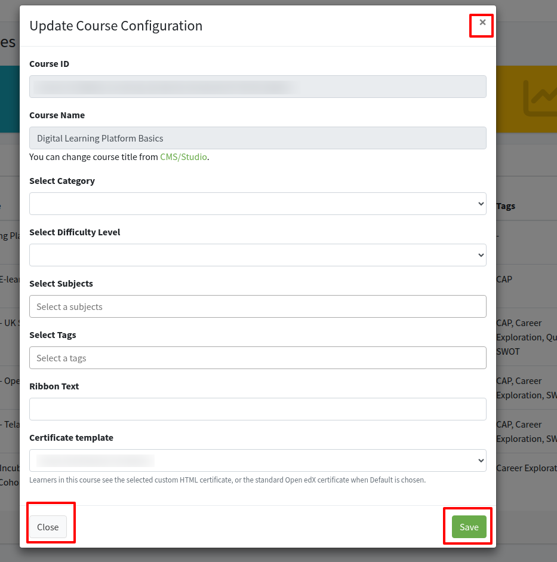

- **Course ID** — you cannot change this here
- **Course Name** — you cannot change this here. Change the title from **CMS/Studio**
- **Select Category**
- **Select Difficulty Level**
- **Select Subjects** (placeholder **Select a subjects**)
- **Select Tags** (placeholder **Select a tags**)
- **Ribbon Text** — short label on the course card
- **Certificate template** — choose an **Active** template from [Certificate Manage](certificate-manage.md#assign-to-course), then **Save**. Learners who complete this course get that certificate with their name, the course name, and the signatories. If you choose **Open edX Default Certificate**, they get the standard Open edX certificate. Inactive templates do not appear here.

Click **Save**. **Close** or **x** cancels.

---

## Course outline {: #course-outline }

course outline pencil icon studio section subsection unit

In **Actions**, click the pencil icon.

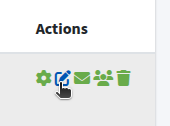

You go to that course in Studio, on **Course outline**. There you can add sections, subsections, units, and more course content.

---

## Batch Enrollments for a course {: #course-batch-enrollments }

batch enrollments envelope icon automatically enroll send email notifications

In **Actions**, click the envelope icon for that course.

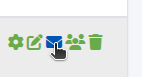

The page title is **Batch Enrollments for (course name)**. **Enrollment Activity** lists past jobs.

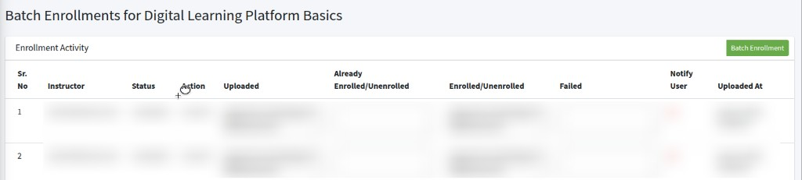

Columns: **Sr. No**, **Instructor**, **Status**, **Action**, **Uploaded**, **Already Enrolled/Unenrolled**, **Enrolled/Unenrolled**, **Failed**, **Notify User**, **Uploaded At**.

Click **Batch Enrollment**.

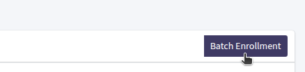

The box is **Batch Enrollment**. Enter email addresses and/or usernames, separated by commas or new lines. Ensure all entries are accurate as you will not receive notifications for failed email deliveries.

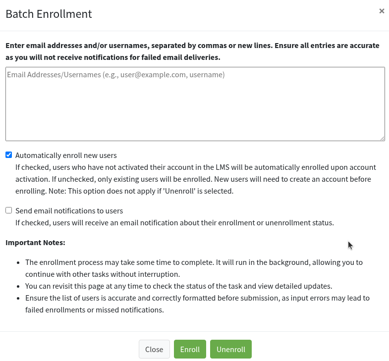

**Automatically enroll new users**

If checked, users who have not activated their account in the LMS will be automatically enrolled upon account activation. If unchecked, only existing users will be enrolled. New users will need to create an account before enrolling. Note: This option does not apply if **Unenroll** is selected.

**Send email notifications to users**

If checked, users will receive an email notification about their enrollment or unenrollment status.

Click **Enroll** or **Unenroll**. **Close** or **x** cancels.

---

## Enrollments for a course {: #course-enrollments }

enrollments for course people icon total enrollments delete enrollment

In **Actions**, click the people icon for that course.

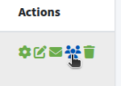

The page title is **Enrollments for (course name)**. Breadcrumb: **Home / Enrolled Users**.

Cards for that course:

- **Total Enrollments**
- **Last 24h Active Enrollments**
- **Last Week Active Enrollments**
- **Certificates Issued**

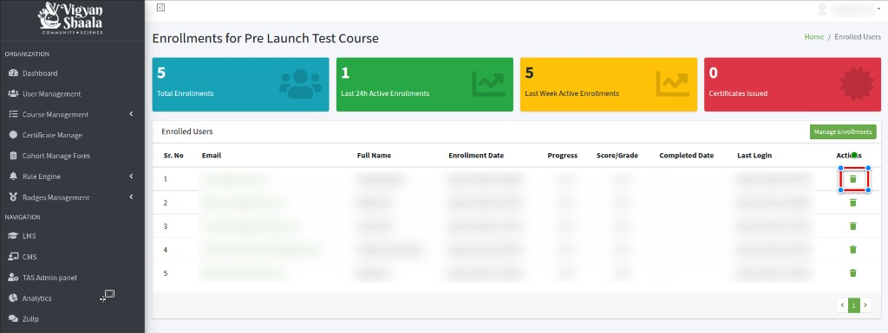

**Enrolled Users** columns: **Sr. No**, **Email**, **Full Name**, **Enrollment Date**, **Progress**, **Score/Grade**, **Completed Date**, **Last Login**, **Actions**.

Trash icon — **Delete Enrollment**. That person loses access to this course only (the account stays).

**Manage Enrollments** on this page opens **Batch Enrollments** for the same course. See [Batch Enrollments for a course](#course-batch-enrollments).

---

## Delete Course {: #delete-course }

delete course trash icon permanent yes delete it

This step is important. Be careful.

In **Actions**, click the trash icon.

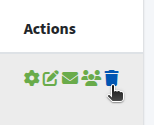

The box is **Delete Course**. It says **Are you sure you want to delete course?** and **Deleting this course is permanent and cannot be undone.**

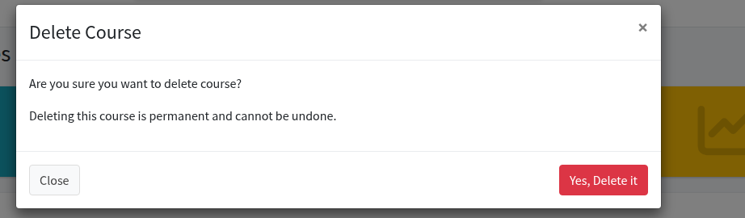

**Yes, Delete it** removes the course and related records (content, enrollments, and the other actions for that course). You cannot get them back. **Close** or **x** cancels.
