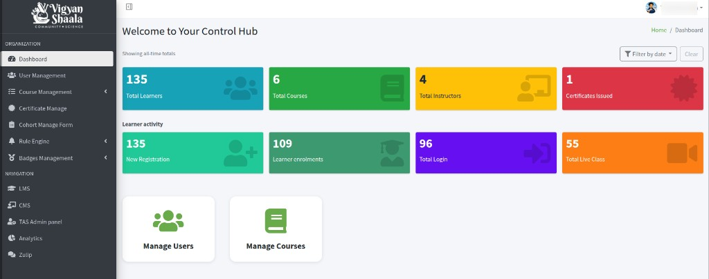
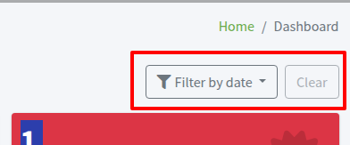
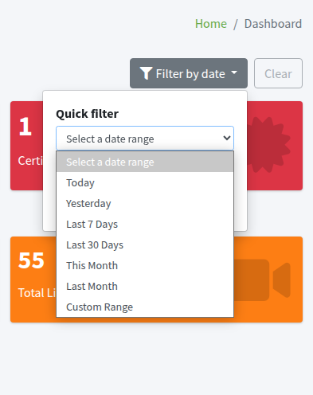
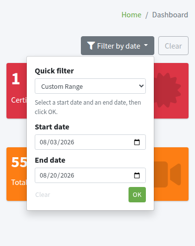
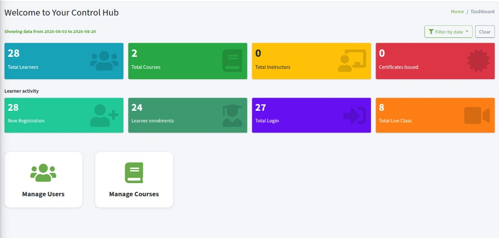

---
hide:
  - navigation
  - toc
---

# Dashboard

**Dashboard** is the first page in Control Hub. It shows platform totals, learner activity, and shortcuts to **Manage Users** and **Manage Courses**. The breadcrumb is **Home / Dashboard**.

## Dashboard overview {: #overview }

control hub dashboard totals learners courses instructors certificates live class

When no date filter is set, the line above the cards says **Showing all-time totals**.

The first row is platform totals. In this example:

- **135** **Total Learners**
- **6** **Total Courses**
- **4** **Total Instructors**
- **1** **Certificates Issued**

**Learner activity** is the second row. In this example:

- **135** **New Registration**
- **109** **Learner enrolments**
- **96** **Total Login**
- **55** **Total Live Class**

These numbers are an example. Your Control Hub shows the counts for your site.

---

## Filter by date {: #filter-by-date }

filter by date today yesterday last 7 days last 30 days this month last month

Use **Filter by date** to show counts for a time range instead of all time.

1. Click **Filter by date** (top right).
2. Under **Quick filter**, choose a range:
   - **Today**
   - **Yesterday**
   - **Last 7 Days**
   - **Last 30 Days**
   - **This Month**
   - **Last Month**
   - **Custom Range**
3. Click **OK**.

The cards update to that range. **Clear** is available after a filter is applied. Click **Clear** to return to **Showing all-time totals**.

---

## Custom date range {: #custom-range }

custom range start date end date filter ok

To pick your own dates:

1. Click **Filter by date**.
2. In **Quick filter**, choose **Custom Range**.
3. Set **Start date** and **End date**.
4. Click **OK**.

The dashboard then shows counts for that range only. Example: **Start date** 03 Aug 2026 and **End date** 20 Aug 2026. The status line becomes **Showing data from 2026-08-03 to 2026-08-20**, and the cards change (for example **Total Live Class** may drop from **55** to a smaller number for those days).

---

## Manage Users and Manage Courses {: #shortcuts }

manage users manage courses shortcut

At the bottom of Dashboard:

- **Manage Users** opens **User Management**.
- **Manage Courses** opens **Course Management** → **Courses**.
