---
hide:
  - navigation
  - toc
---

# Instructor dashboard (LMS)

**Instructor dashboard** is inside a live course. Sign in with your **admin** account, open a course you can access, then click **Instructor**.

## How to reach Instructor dashboard {: #open }

how to reach instructor dashboard lms my dashboard continue start staff studio course info membership cohorts extensions student admin discussions data download special exams certificates reports course dashboard at-risk learners

Sign in with your admin account. After login you land on **My Dashboard** — the same learner home.

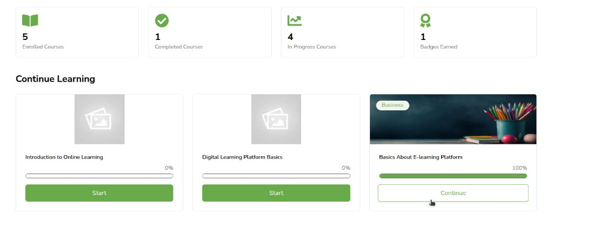

Open a course you have access to. Click **Start** or **Continue** on the course card.

The course opens. At the top you may see **View this course as:** **Staff** and **View course in:** **Studio**.

- **View this course as: Staff** — you see unpublished content and staff tools (for example **Staff Debug Info** on problems).
- **View course in: Studio** — opens this course in Studio in a new tab.

On the course tabs, click **Instructor**. Only people on the course team see this tab. Learners see **Course**, **Progress**, **Discussion**, and the rest — not **Instructor**.

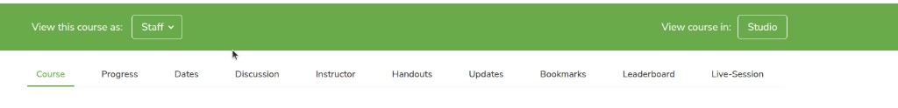

You come to **Instructor Dashboard**. **Course Info** is selected. **VIEW COURSE IN STUDIO** opens the course in Studio.

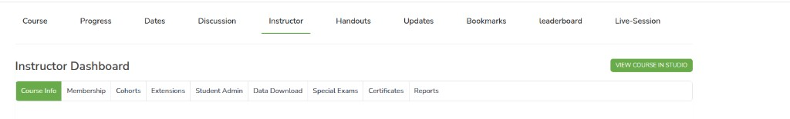

Which tabs you see depends on your course team role. **Staff** and **Admin** see most pages. **Course Data Researcher** is mainly for [Data Download](#data-download). Learners never see the **Instructor** tab.

The tabs across the top are the pages of this dashboard. Open a tab, or use these topics:

- [Course Info](#course-info)
- [Membership](#membership)
- [Cohorts](#cohorts)
- [Extensions](#extensions)
- [Student Admin](#student-admin)
- [Gradebook](#gradebook)
- [Discussions](#discussions)
- [Data Download](#data-download)
- [Special Exams](#special-exams)
- [Certificates](#certificates)
- [Reports](#reports)

---

## Course Info {: #course-info }

course info instructor dashboard enrollment information verified audit honor professional basic course information start end sections grade cutoffs

On **Instructor Dashboard**, click **Course Info**. This page is a snapshot. Learners never see it. You do not edit the course here.

**Enrollment Information** counts everyone in the course (admins, staff, and students) by enrollment type, then **Total**. The types on the page (for example **Honor**, **Audit**, **Verified**, **Professional**) are how people are enrolled. New enrollments from [Membership](#membership) usually go into the default type for this site. Staff and admins in the course are counted here too.

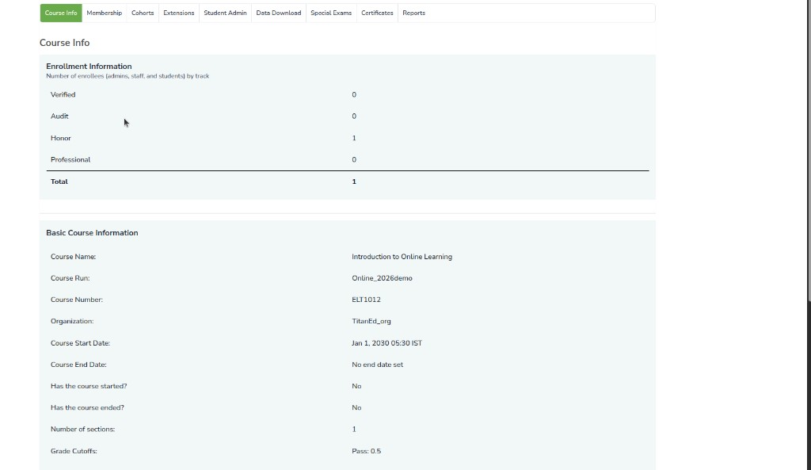

**Basic Course Information** fields:

| On the page | What it means |
|-------------|----------------|
| **Course Name** | Title learners see. Set in Studio when you create the course. |
| **Course Run** | Which run of the course (for example a year or term). Set at create; usually fixed. |
| **Course Number** | Short course code. Part of the course URL. |
| **Organization** | Which organisation owns the course. Part of the course URL. |
| **Course Start Date** / **Course End Date** | When the course opens and closes for learners. |
| **Has the course started?** / **Has the course ended?** | Yes or No from those dates and today. |
| **Number of sections** | Every section in Studio, including unpublished. |
| **Grade Cutoffs** | Pass line (for example **Pass: 0.5** = 50%). Learners who earn **exactly** the cutoff pass. |

Change start/end dates and grading in Studio (**Settings** → schedule and **Settings** → **Grading**). If you change grading after learners have started, their totals and **Progress** page change. Announce unavoidable grading changes to learners.

- Enroll or unenroll people → [Membership](#membership)
- Who can enroll but has not yet → [Data Download](#data-download) (**Download a CSV of learners who can enroll**)
- Full profile CSV → [Data Download](#data-download) (**Download profile information as a CSV**)

---

## Membership {: #membership }

membership batch enrollment enroll unenroll auto enroll notify email beta testers course team staff admin limited staff discussion moderator enrollment start

Click **Membership**. Use this page to enroll learners, add beta testers, and give course team roles.

### Batch Enrollment {: #batch-enrollment }

Enter email addresses or usernames, separated by new lines or commas. You can paste a short list from a spreadsheet. Check spelling — bounced emails are not reported.

Leave **Auto Enroll** ticked. People with an account are enrolled at once. If they do not have an account yet, they are enrolled when they register with that email. You can enroll before the Studio **Enrollment Start Date**.

Leave **Notify users by email** ticked to send them a message.

Click **Enroll**. The course appears on the learner’s **My Dashboard**. They can open it when enrollment and the course start allow it.

Click **Unenroll** to take them off the course. The course leaves their dashboard. They cannot open content or post in discussions. Their work is not deleted — if they enroll again, it comes back. **Auto Enroll** does nothing when you unenroll. To stop them enrolling themselves again, set the enrollment end date in the past in Studio **Settings** → **Schedule and Details**.

Wrong emails are not reported as bounced — double-check addresses before you click **Enroll**.

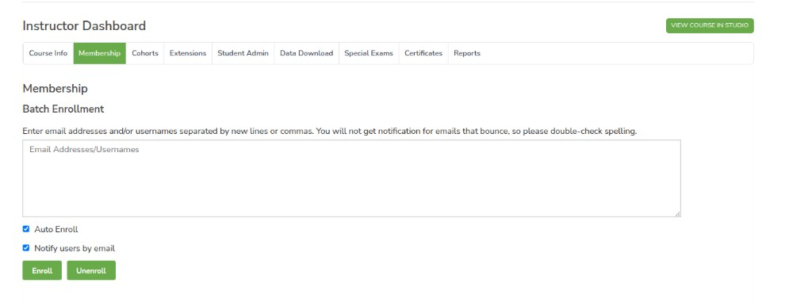

### Batch Beta Tester Addition {: #beta-testers }

Beta testers can open content **before** other learners (days early is set in Studio **Settings** → **Advanced Settings**, **Days Early for Beta Users**). They must already have an activated account.

If the beta period starts before enrollment starts, testers cannot enroll themselves — leave **Auto Enroll** ticked, or enroll them under **Batch Enrollment**.

When the test has started and they are enrolled, they see the course on **My Dashboard** like a learner, with the early content.

**Remove beta testers** takes away the tester role only. They stay enrolled unless you also **Unenroll**.

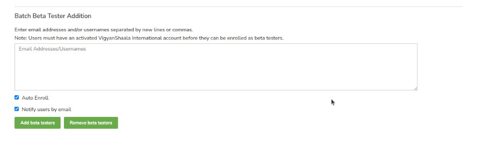

### Course Team Management {: #course-team }

This is the team for **this course** (not Control Hub). Pick a role, then add a person by username or email. The text next to the list explains the role you picked.

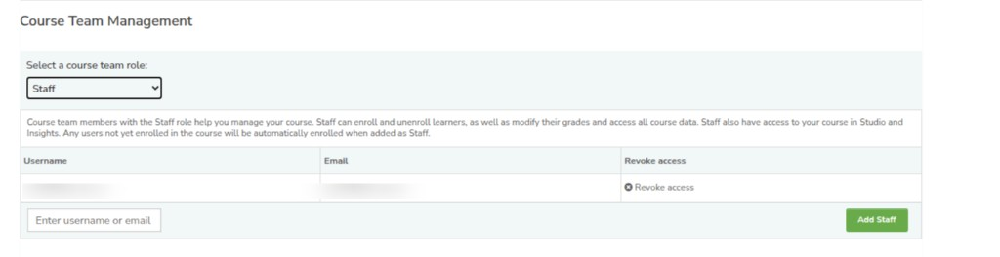

**Select a course team role** lists **Staff**, **Limited Staff**, **Admin**, **Beta Testers**, **Discussion Admins**, **Course Data Researcher**, **Discussion Moderators**, **Group Community TA**, and **Community TA**.

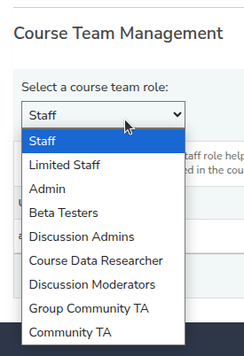

**Staff** and **Admin** can use Instructor dashboard and Studio. **Staff** can enroll learners, change grades, and see course data. Anyone you add as Staff who is not yet in the course is enrolled automatically. The person must already have an account on this site.

**Limited Staff** has fewer Instructor tools. **Admin** on the course can add other team roles. **Course Data Researcher** can use [Data Download](#data-download) only — assign this role here; they must already be enrolled. **Discussion Admins**, **Discussion Moderators**, and **Community TA** moderate discussions (enrolled; Staff not required). **Group Community TA** only sees posts for their own [cohort](#cohorts).

The table lists people in that role. **Revoke access** removes the role (they stay enrolled). Type a username or email and click **Add Staff** (the button label follows the role you selected). If the person is not found, they may need an account first or a different email spelling.

---

## Cohorts {: #cohorts }

cohorts enable cohorts add a new cohort automatic manual content group instructor dashboard default cohort manage learners add learners csv assign students

Click **Cohorts**. These cohorts are groups of learners **inside this course**. They are not the registration forms in Control Hub.

Tick **Enable Cohorts**. Set this up before many learners start. Under **Add a New Cohort**, type a **Cohort Name**. Learners can see the name of the cohort they are in.

**Cohort Assignment Method:** **Automatic** places a learner into a cohort when they first open course content or a divided discussion — not when they only open the course home page. The site picks one of the **Automatic** cohorts at random. **Manual** means you add people yourself. Keep at least one **Automatic** cohort before the first learner opens content. If you do not, the site creates a default cohort.

**Associated Content Group** can show different units to that cohort. **No Content Group** means everyone sees the same content. Content groups are created in Studio — see [Course team and Group configurations](studio-guide.md#course-team). If none exist, the page says **No content groups exist. Create a content group**.

You cannot delete a cohort after you create it. You can change its name or assignment method. Be careful changing cohorts after the course is live — learners may lose access to content or discussions they saw before.

Click **Save**. **Cancel** closes without saving.

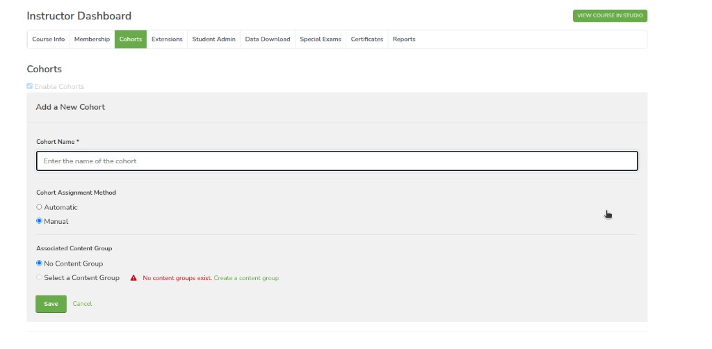

### Assign learners to a cohort {: #assign-cohorts }

After cohorts exist, scroll to **Cohort Management**. Choose a cohort in **Select a cohort**.

On **Manage Learners**, under **Add learners to this cohort**, paste usernames or emails (commas or new lines). Click **Add Learners**. Each learner belongs to **only one** cohort — adding them here moves them out of their previous cohort. The page tells you how many were added or moved.

People without an account yet may show as **Preassigned**. When they enroll, they join that cohort automatically.

**Assign students to cohorts by uploading a CSV file** — **Browse**, then **Upload File and Assign Students**. If some rows fail, the page lists the emails or usernames that could not be added. Check cohort assignments in [Data Download](#data-download) (profile CSV includes cohort when enabled).

Finish manual assignments before the course is busy. If people enroll later, add them to a cohort as soon as you can.

Do not turn **Enable Cohorts** off after the course is live. Content and discussion posts that were only for one cohort become visible to everyone.

If you move a learner to another cohort after they have posted, be careful — old posts stay with the old group rules. See [Discussions](#discussions) to split or unify topics.

---

## Extensions {: #extensions }

extensions individual due date extensions change due date student utc reset due date subsection extra time

Click **Extensions**. Use **Individual due date extensions** when one learner needs more time on a graded subsection (illness, extra support, disability accommodation, and similar).

This only extends **subsection** due dates. You cannot make work due **earlier**. Open-response due dates are not changed here. If the page does not work on an old course, **Publish** the course in Studio first.

For the learner, that subsection stays open until the new date. Other learners keep the original due date.

Enter the learner’s email or username. Choose the graded subsection from the list (only graded subsections appear). Set the new due date and time in **UTC** as **MM/DD/YYYY HH:MM**. Type a **Reason for extension** (required). Click **Change due date for student**. If more than one extension exists, the **latest** date wins.

Times are **UTC**, not your local time zone. Convert before you save.

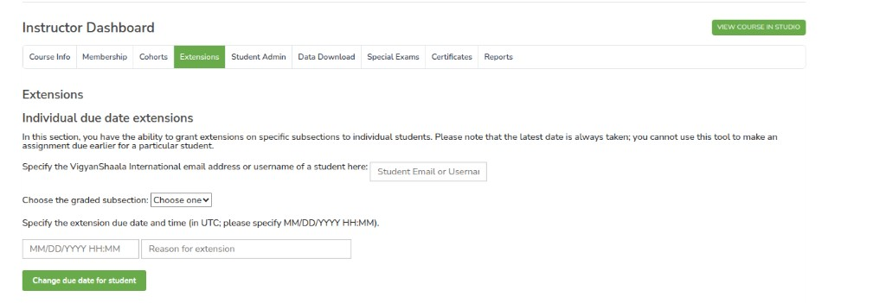

**Viewing granted extensions** — pick a subsection and click **List all students with due date extensions**, or enter a learner and click **List date extensions for student**.

**Resetting extensions** — enter the learner, the subsection, and a **Reason for reset**. Click **Reset due date for student**. The learner goes back to the original due date.

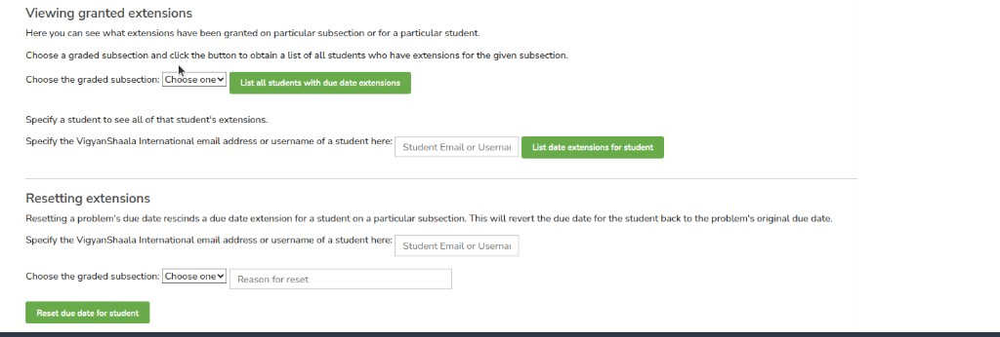

---

## Student Admin {: #student-admin }

student admin view gradebook enrollment status view progress page reset attempts rescore override learner score delete learner state problem location staff debug info

Click **Student Admin**. Start here to open the gradebook, look up one learner, or change scores for a problem.

**View gradebook for enrolled learners** — click **View Gradebook**. That page is the class list of scores. See [Gradebook](#gradebook).

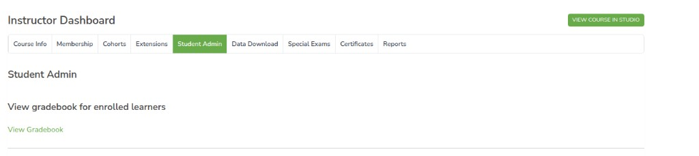

You can also change one learner’s score from the live **Course** page: open the problem, click **Staff Debug Info**, enter the username, then use **Override Score**, **Rescore**, **Reset Learner’s Attempts to Zero**, or **Delete Learner’s State**. For whole-class changes, use this **Student Admin** page and the problem **location**.

### Find the problem location {: #problem-location }

On the live course, open the problem. Below it, click **Staff Debug Info**. Copy the full value after **location =** (starts with `block-v1:` or `i4x://`). Paste that into the **Location of problem in course** boxes below.

### View a specific learner's enrollment status {: #enrollment-status }

Enter the learner’s email or username. Click **View Enrollment Status**. You see whether they are in the course. They do not get a message.

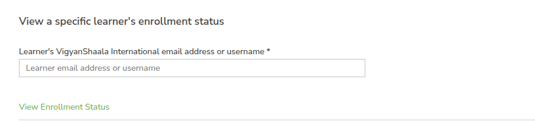

The email or username is required. If you click without it, you see **Please enter a student email address or username.**

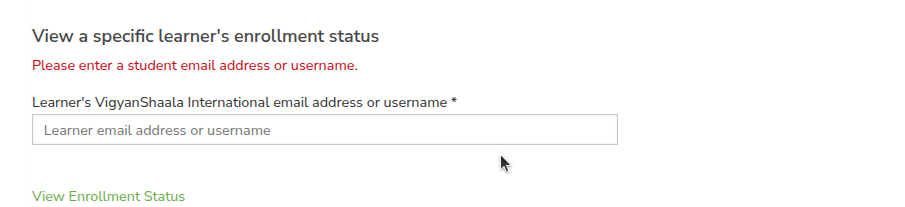

### View a specific learner's grades and progress {: #view-progress }

Enter the email or username. Click **View Progress Page**. You open the same **Progress** page that learner sees — their scores and how they are doing in the course.

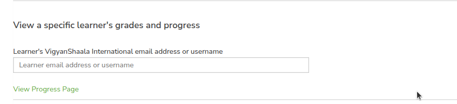

### Adjust a learner's grade for a specific problem {: #adjust-learner-grade }

Use this after you change a problem, or when one learner needs a different score. Rescore only works for problems that have a correct answer in Studio. It does not rescore open-response (ORA) work — change those scores in Studio for that assignment.

Enter the learner, then **Location of problem in course**. Paste the location from [Find the problem location](#problem-location). If you added, removed, or reordered answer fields, do not rescore — scores can go wrong.

**Attempts** — **Reset Attempts to Zero** lets a learner who has used all tries work on the problem again. Their old tries no longer count against the limit.

**Rescore** — recalculates from the current correct answer. **Rescore Learner's Submission** always applies the new score (it can go down). **Rescore Only If Score Improves** updates the score only when it goes up.

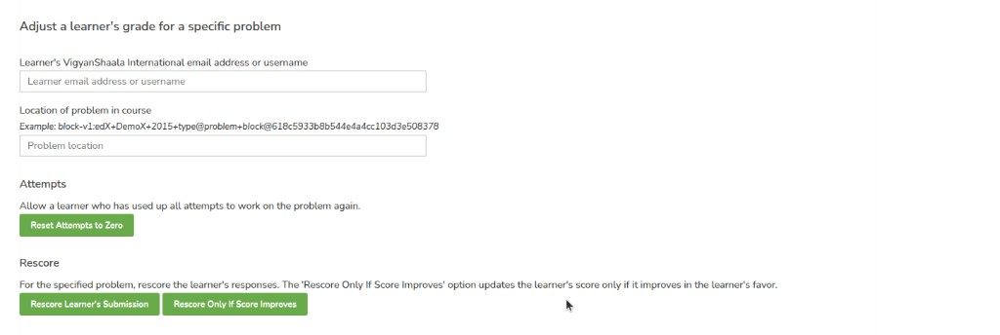

**Score Override** — type a **New score for problem, out of the total points available for the problem**, then click **Override Learner's Score**. That is the score the learner sees. Use points out of the problem total.

**Problem History** — **Delete Learner's State** permanently removes that learner’s answers and scores for this problem. They start it again. Confirm before you click. For an open-response assignment, they must redo every step of that assignment.

**Task Status** — **Show Task Status** shows whether a rescore or override you started has finished. Wait for it. Do not click the same button again. Confirm each dialog when the page asks.

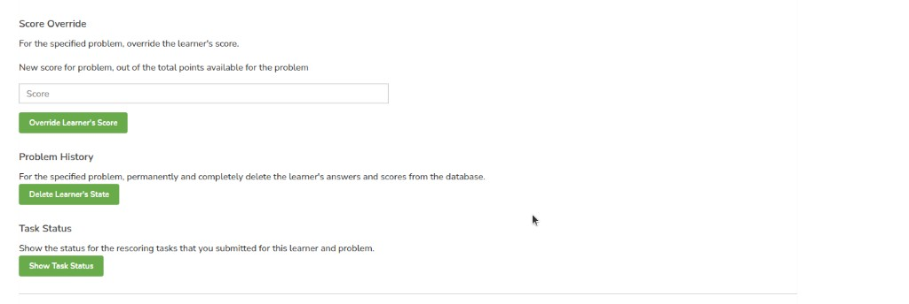

### Adjust all enrolled learners' grades for a specific problem {: #adjust-all-grades }

Paste the same problem location. This updates **every** enrolled learner on that problem.

**Reset Attempts to Zero** lets everyone try again. **Rescore All Learners' Submissions** rescores everyone (scores can go down). **Rescore Only If Scores Improve** only raises scores. **Show Task Status** checks those bulk actions. Large courses can take a while.

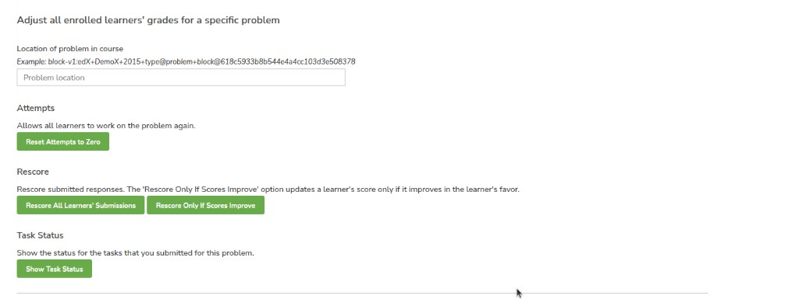

---

## Gradebook {: #gradebook }

gradebook view gradebook edit filters score view percent absolute assignment types overall grade tracks cohorts include course team members back to dashboard

On **Student Admin**, click **View Gradebook**.

The page is **Gradebook**. You see learner scores. Learners do not see this table — they see their own scores on **Progress**. Course team (Staff, Admin, beta testers, and similar roles) is hidden by default so the list is learners only. Search by username, email, or **student key** (external ID when your site uses one).

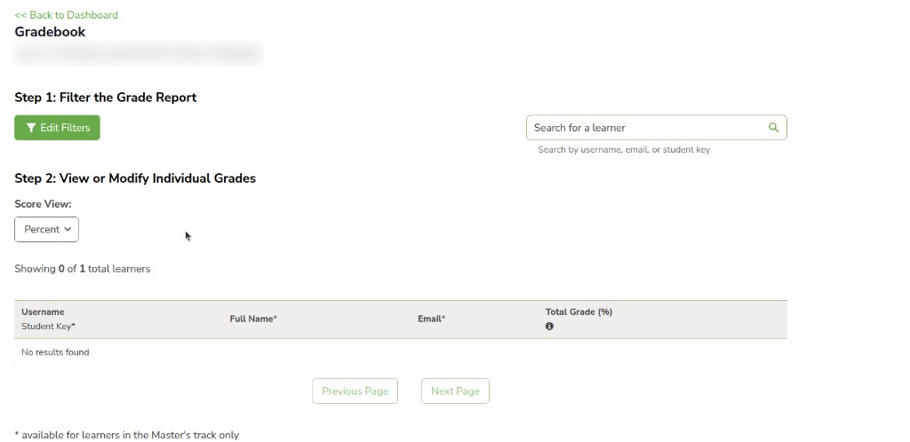

**Step 1: Filter the Grade Report** — click **Edit Filters**.

**Step 2: View or Modify Individual Grades** — **Score View** is **Percent** or **Absolute**.

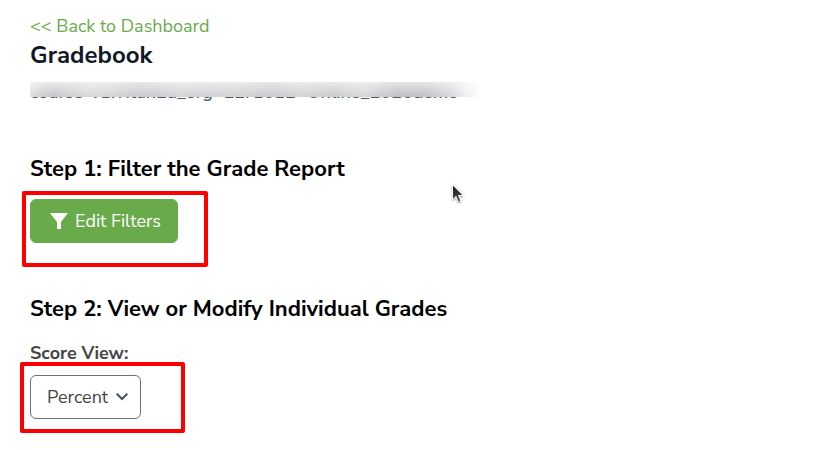

**Percent** shows scores as a percentage. **Absolute** shows points. This only changes how **you** read the table, not what the learner sees.

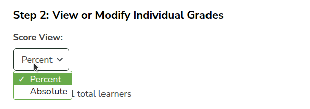

Under **Assignments**, you can limit the list by **Assignment Types**, a single **Assignment**, and **Min Grade** / **Max Grade**. Click **Apply**.

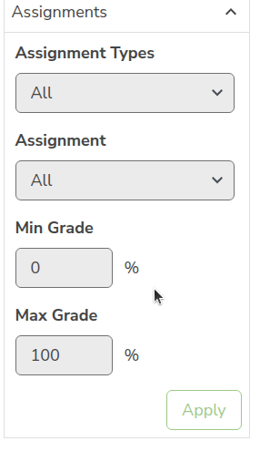

**Overall Grade** filters by total course grade. **Student Groups** filters by **Tracks** and **Cohorts**. Tick **Include Course Team Members** if you also want staff in the table. Click **Apply**.

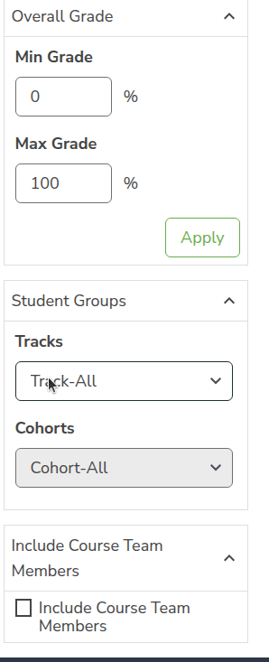

If you see **Download Grades** and **Import Grades**, you can download a CSV of subsection scores for the current filters, fill **new_override** columns, and upload to change many subsection grades at once. Use **View Bulk Management History** to see past uploads. Large files can take several minutes.

When you are done, click **<< Back to Dashboard** to return to **Instructor Dashboard**.

---

## Discussions {: #discussions }

discussions not divided cohorts course-wide discussion topics general content-specific discussion topics save visible only to

On **Instructor Dashboard**, use **Discussions** after you turn on [cohorts](#cohorts). Choose whether posts are shared or split by cohort. Set this before many people post. Changing the split later can confuse who sees older posts.

**Not divided** — every learner sees every post, response, and comment. This is the default.

**Cohorts** — everyone sees the same topic names, but inside a divided topic, learners only see posts from their own cohort. On a divided post, the learner sees that it is visible only to their group.

Click **Save**. A green banner confirms, for example **Discussion topics in the course are not divided.**

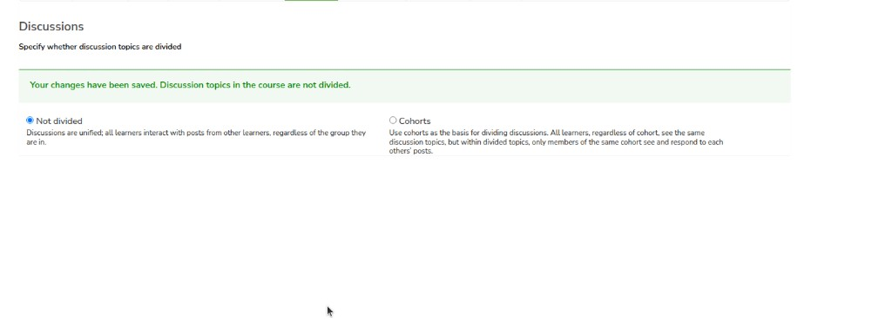

When **Cohorts** is selected, tick the course-wide topics to divide (for example **General**), then **Save**. Leave **General** unticked if the whole class should still talk together. Learners see **This post is visible only to {cohort name}** on divided posts.

For discussions inside units, choose **Always divide content-specific discussion topics** or **Divide the selected content-specific discussion topics**. If none are in the course yet, the page says **No content-specific discussion topics exist.** Content-specific topics come from discussion components in course units.

**Discussion Admins**, **Discussion Moderators**, and **Community TA** can read posts in every group. **Group Community TA** only sees their own cohort. See [Membership](#membership) to give those roles.

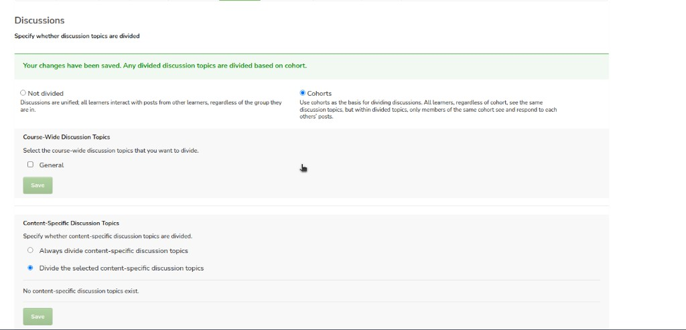

---

## Data Download {: #data-download }

data download grading configuration reports csv profile grade report problem responses certificates submission files archive pending tasks

Click **Data Download**. Use this page to view grading setup and to generate CSV (and ZIP) reports. Learners never see this page. Reports include personal data — download them, do not email the link.

**Grading Configuration** shows how graded subsections add up to the course grade (for example homework as 30%). You cannot change grading here — that is **Settings** → **Grading** in Studio. Changing grading after the course has started changes every learner’s total. Tell them if you must change it.

Anonymized student IDs are under **Reports** on this page, not in this top section.

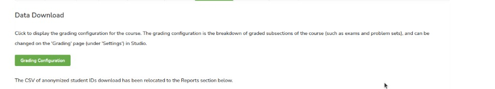

### Reports {: #data-download-reports }

Large courses can take a long time (sometimes hours). You can leave the page while a report runs. Reload later and look for the file at the bottom (or **Pending Tasks**). Do not click the same button again and again — that slows the queue.

**Download profile information as a CSV** — every enrolled learner, with the profile they entered (email, username, and the rest). The CSV is complete. **List enrolled students' profile information** (further down) shows a table on the page instead; long answers there may be cut short. Use the on-page list only for small courses.

**Download a CSV of learners who can enroll** — people allowed to enroll who have not enrolled yet. Use with [Membership](#membership) **Batch Enrollment** when you want to invite them.

**Download a CSV of learners who have not activated their account** — enrolled, but they have not activated. They cannot use the course until they activate.

**Get Student Anonymized IDs CSV** — IDs with names removed, for research.

Problem-answer reports are limited to **5000** responses. For larger courses, run the report by chapter or by problem.

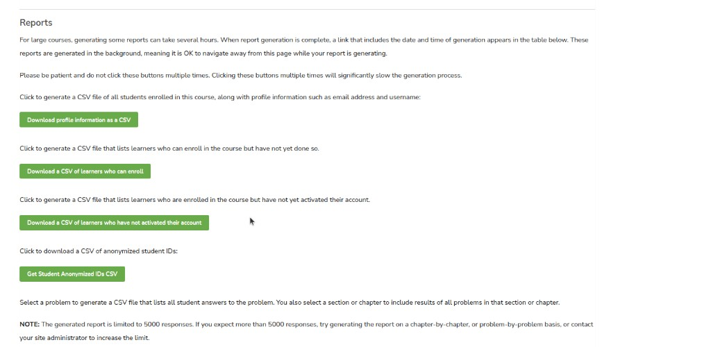

**Generate Grade Report** — one row per learner: total course grade and cohort (if used). Good for final grades.

**Generate Problem Grade Report** — scores per problem for every learner. Good for item analysis.

**Generate ORA Data Report** / **Generate ORA Summary Report** — open-response assignments: each submission and how it was scored.

**Generate Submission Files Archive** — ZIP of text submissions and file uploads from the course.

**Create a report of problem responses** — raw answers for problems in a section you pick (max **5000** responses per run; use smaller sections in large courses).

**View Certificates Issued** / **Download CSV of Certificates Issued** — who has a certificate for this course.

Ready files appear under **Reports Available for Download**, named with the UTC date and time. Links expire in **5 minutes** — download straight away. Files are removed **90 days** after they are generated, so save a copy if you will need it later. Use **Pending Tasks** to see jobs that are still running.

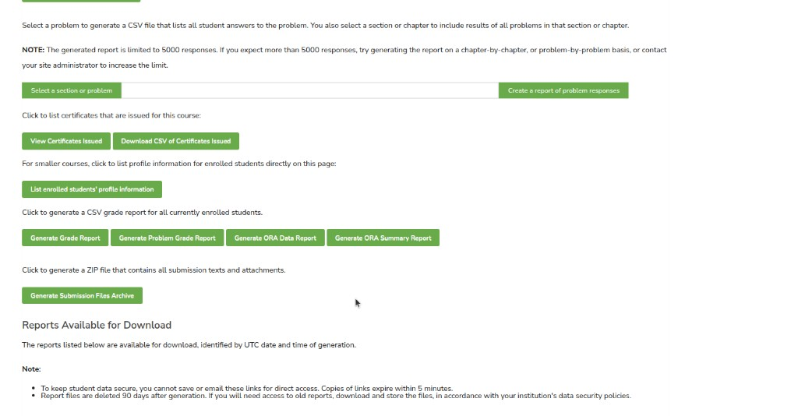

---

## Special Exams {: #special-exams }

special exams timed proctored exam allowance extra time multiplier review policy exception add allowance student special exam attempts reset resume ready to error

On **Instructor Dashboard**, click **Special Exams**. Use this page for **timed** and **proctored** exams.

In Studio, on a graded subsection: **Configure** → **Advanced** → **Set as a special exam** → **Timed** or **Proctored**. Set **Time Allotted** as **HH:MM** (hours and minutes). See [How to create a subsection](studio-guide.md#create-subsection). Learners never see this Instructor page.

If no subsection is a special exam yet, the lists here stay empty.

Click a section title to open or close it.

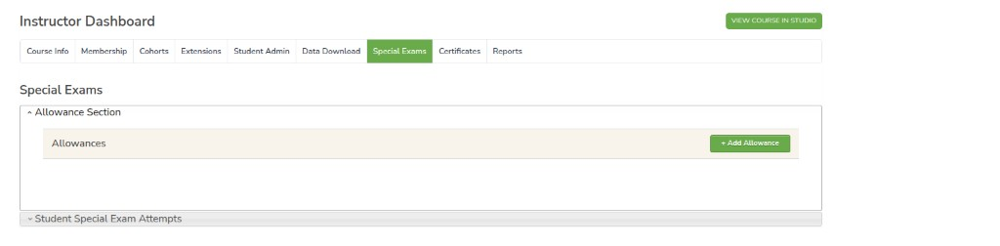

### Add extra time {: #add-extra-time }

Open **Allowance Section**. Click **+ Add Allowance**.

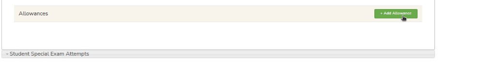

The box is **Add a New Allowance**.

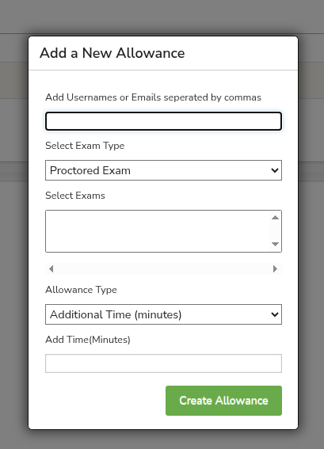

1. **Add Usernames or Emails seperated by commas** — paste usernames or emails. The label on the page is spelled this way.
2. **Select Exam Type** — **Proctored Exam** or the timed type, matching how you set the subsection in Studio.
3. **Select Exams** — click the exam in the list.
4. **Allowance Type** — **Additional Time (minutes)** or **Time Multiplier**. For a **Proctored Exam**, you may also see **Review Policy Exception** (for example an extra person in the room). Enter a short description for that type.
5. **Add Time(Minutes)** — for extra minutes, a whole number greater than 0. For **Time Multiplier**, a number greater than 1. Example: a 30-minute exam with **1.5** gives 15 extra minutes.

Click **Create Allowance**.

Give extra time or a policy exception **before** the learner starts the exam. Tell the learner when it is set. The course grace period does not apply to special exams.

What the learner sees: their timer is longer. They still must submit before time runs out.

### Student Special Exam Attempts {: #special-exam-attempts }

Open **Student Special Exam Attempts**. Search by username or email, then click **Search**. **Clear** empties the box.

If nobody has started an exam, you see **No exam results found.**

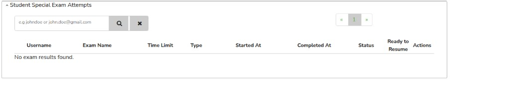

When there are rows, use **Actions**:

- **Reset** removes that attempt so the learner can start again. All answers for that exam are deleted. This cannot be undone.
- If **Status** is **Error**, click the gear icon. **Resume** keeps their answers and remaining time. **Status** becomes **Ready to Resume** — they can open the exam again. **Reset** still deletes the attempt.

---

## Certificates {: #certificates }

certificates instructor dashboard enable student-generated regenerate exception list invalidate generate exception certificates csv

On **Instructor Dashboard**, click **Certificates**. Use this page to let passing learners generate a certificate, to regenerate certificates, to issue one as an exception, and to invalidate a certificate. Learners never see this page.

The look of the certificate (name layout, images) is set in Control Hub **[Certificate Manage](certificate-manage.md)**. This page only issues or takes back certificates for **this course**.

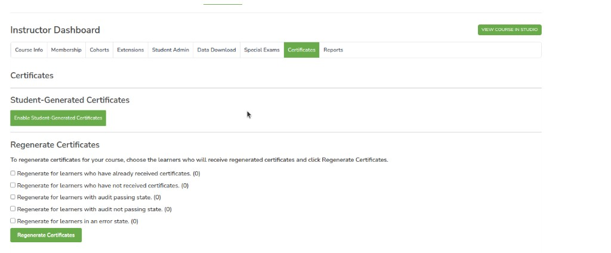

### Enable Student-Generated Certificates {: #enable-certificates }

Click **Enable Student-Generated Certificates** when you want a learner who reaches the pass grade to generate their own certificate (usual for a self-paced course).

What the learner sees: a way to get the certificate on **Progress**. It also appears on **My Dashboard** and **Profile**.

If the button later says to turn this off, generation is already on.

Some courses also let you start a **generate** job for everyone who already passes (batch). Wait for the job to finish before you regenerate or invalidate.

### Regenerate Certificates {: #regenerate-certificates }

Use this after you change grading or the certificate template, or to retry people in an error state. Tick the groups you want (the number in brackets is how many learners are in that group right now — for example **downloaded**, **issued**, **error**), then click **Regenerate Certificates**. Generation runs in the background — check **Certificate Generation History**.

### SET CERTIFICATE EXCEPTIONS {: #certificate-exceptions }

Use this when a learner did **not** meet the pass rule, but the course team still wants to issue a certificate. People on this list are allowed a certificate even when they would not pass the grade rule.

**Certificate Generation History** lists past generate jobs.

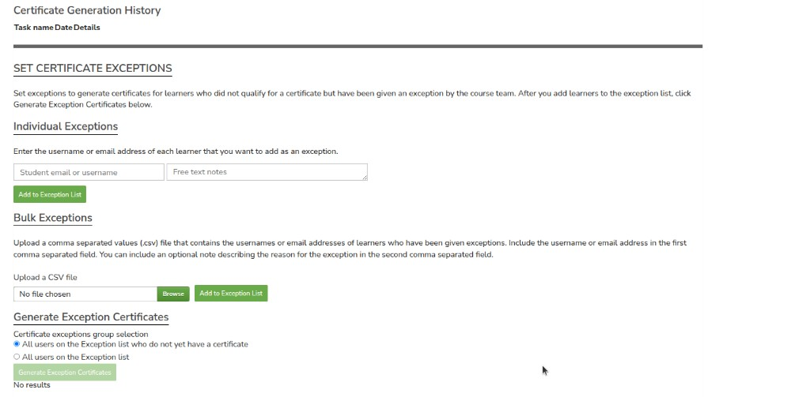

**Individual Exceptions** — enter **Student email or username** and **Free text notes**, then click **Add to Exception List**.

**Bulk Exceptions** — upload a **.csv** file. The first field is username or email. An optional second field is a note. Click **Browse**, then **Add to Exception List**.

When the list is ready, choose:

- **All users on the Exception list who do not yet have a certificate** (usual), or
- **All users on the Exception list**

Click **Generate Exception Certificates**. If the list is empty, the button stays inactive and you see **No results.**

### Invalidate Certificates {: #invalidate-certificates }

Use this to take back a certificate so it no longer shows.

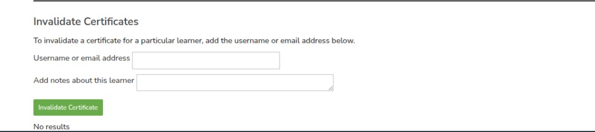

Enter **Username or email address** and **Add notes about this learner**, then click **Invalidate Certificate**.

What the learner sees: that certificate no longer opens. If they are still on the exception list, clear that first or invalidate may not stick. To list who already has a certificate, use [Data Download](#data-download).

---

## Reports {: #reports }

reports instructor dashboard course dashboard at-risk learners individual learner enrollment engagement performance view dashboards

On **Instructor Dashboard**, click **Reports**. Use this page for live charts for **this course**: who enrolled, who may need help, and one learner at a time. Learners never see this page.

Numbers can lag behind what you just did in the course.

This is the same dashboards as Control Hub **[Analytics](analytics-guide.md#dashboards)**, already filtered to the course you have open. Use Analytics when you need Home, all courses, or to build a chart.

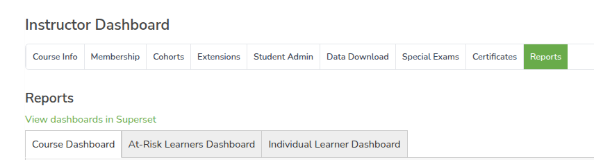

**Course Dashboard** is the default tab. Switch to **At-Risk Learners Dashboard** or **Individual Learner Dashboard** at the top. Click **View dashboards** to open the same boards in [Analytics](analytics-guide.md#dashboards) in a new tab.

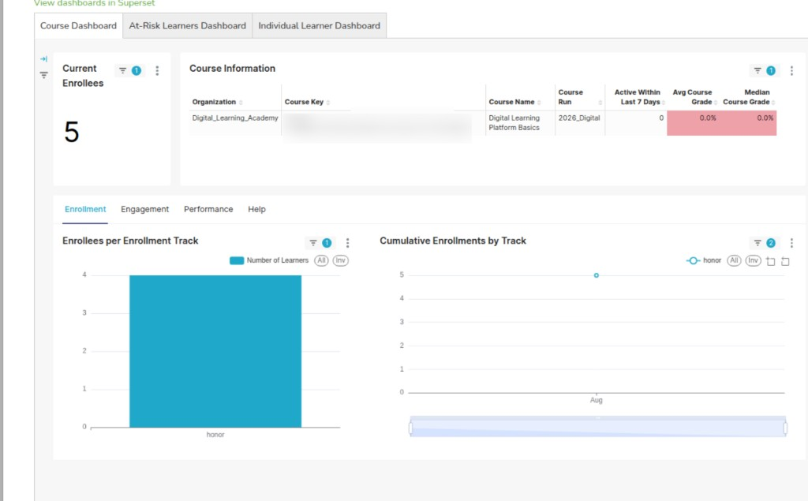

Full detail: [Analytics dashboards and types](analytics-guide.md#dashboards).

**Current Enrollees** is how many people are in the course right now. The **Course Information** table shows active learners and typical grades for this run.

On **Course Dashboard** tabs:

- **Enrollment** — how enrolments grew and by track.
- **Engagement** — **Pages**, **Problems**, and **Videos**.
- **Performance** — pass rates and grade spread.
- **Help** — guidance for this board.

Click a bar or row to filter other charts. Click again, or clear the filter, to undo.

**At-Risk Learners Dashboard** — learners enrolled, active beyond the home page, not passed, no visit for **seven or more days**. See [At-Risk Learners Dashboard](analytics-guide.md#at-risk-learners).

**Individual Learner Dashboard** — one learner’s summary and activity. See [Individual Learner Dashboard](analytics-guide.md#individual-learner-dashboard).

To compare several courses, open **View dashboards** in Analytics and choose **Course Comparison Dashboard**. See [Course Comparison Dashboard](analytics-guide.md#course-comparison-dashboard).
