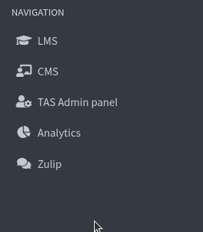
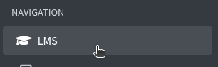
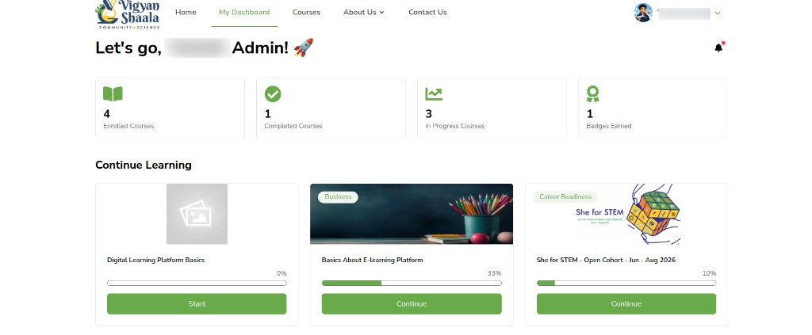
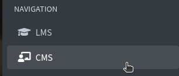
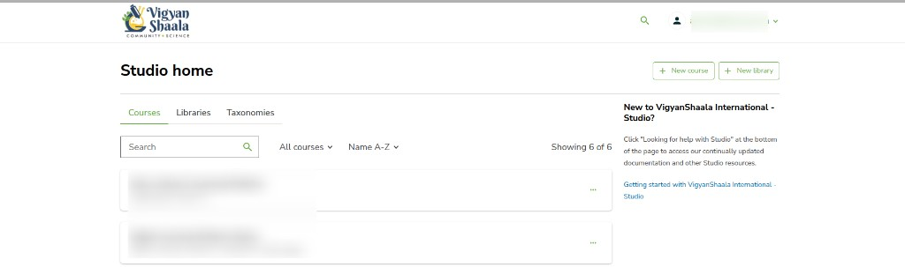
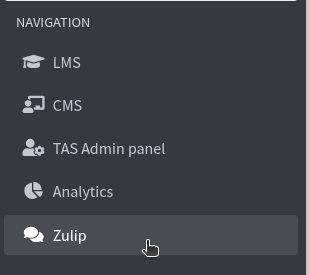
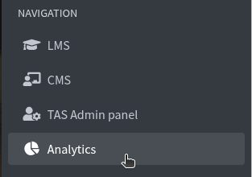

---
hide:
  - navigation
  - toc
---

# NAVIGATION

**NAVIGATION** is the second group in the Control Hub left menu. Each item opens another site in a **new tab**. Stay in Control Hub for users, courses, certificates, forms, rules, and badges.

## NAVIGATION overview {: #overview }

navigation sidebar lms cms tas admin panel analytics zulip

On the left, under **NAVIGATION**:

- **LMS** — the learning site (**My Dashboard**)
- **CMS** — **Studio home**, where you create courses
- **TAS Admin panel** — assignment templates (see the [TAS Admin guide](/admin/tas-admin/))
- **Analytics** — dashboards and charts (see the [Analytics guide](/admin/analytics/))
- **Zulip** — chat

---

## LMS {: #lms }

lms my dashboard enrolled courses continue learning

Click **LMS**. A new tab opens the learning site.

You land on **My Dashboard** — your own enrolled courses, the same layout learners use.

Use **Home**, **My Dashboard**, and **Courses** at the top. Cards show **Enrolled Courses**, **Completed Courses**, **In Progress Courses**, and **Badges Earned**. Under **Continue Learning**, click **Start** or **Continue**.

This is not Control Hub. To manage other users or courses, go back to the Control Hub tab.

---

## CMS {: #cms }

cms studio home new course new library courses libraries taxonomies

Click **CMS**. A new tab opens **Studio home**.

On **Studio home**:

- **+ New course** — start a course
- **+ New library** — start a library
- Tabs: **Courses**, **Libraries**, **Taxonomies**

Search, **All courses**, and **Name A-Z** filter the list. After you create a course in Studio, manage names and settings in Control Hub **Course Management**.

---

## Zulip {: #zulip }

zulip chat navigation

Click **Zulip**. Chat opens in a new tab.

Use it to message your team. Close the tab to return to Control Hub.

---

## TAS Admin panel and Analytics {: #other-guides }

tas admin panel analytics new tab

**TAS Admin panel** and **Analytics** are also under **NAVIGATION**. They open in a new tab. Their full guides are not inside Control Hub:

- [TAS Admin panel](/admin/tas-admin/) — types, rubrics, and templates
- [Analytics](/admin/analytics/) — dashboards, charts, and reports

