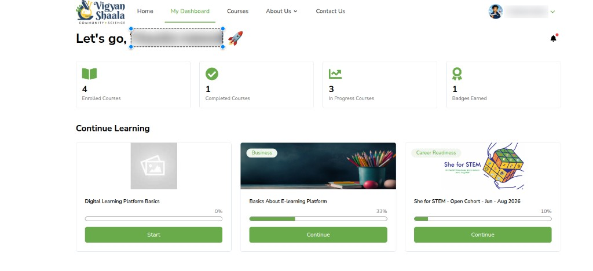
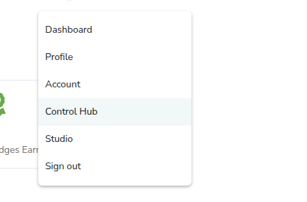

---
hide:
  - navigation
  - toc
---

# How to reach Control Hub

Use the same website login as learners. Sign in with your **admin** account. After login you land on **My Dashboard**. Control Hub is in the menu under your name at the top right.

## Log in with your admin email id and password {: #log-in }

admin login sign-in email password control hub

Use **Log In** with the **email** and **password** for your admin account.

Start from the [home page](https://mycommunity.vigyanshaala.com/){ target="_blank" }. Click **Log In**. Enter your admin email and password, then click **Log In**. After a successful sign-in you go to **My Dashboard**.

You can also [log in with Google](#log-in-google) or with your [WhatsApp number](#log-in-mobile) from the same page.

---

## Log in with your admin Google SSO {: #log-in-google }

admin gmail sso google login continue with google

**Continue with Google** lets you sign in with the Google account linked to your admin user, instead of typing a password. Use the same Google account every time.

- On the Log In page, click **Continue with Google**.

- If your Google account is already listed, click it.
- If it is not listed, click **Use another account** and add your Google account.

- Allow access. You go to **My Dashboard** after Google confirms your sign-in.

---

## Log in with your WhatsApp number (admin) {: #log-in-mobile }

admin otp whatsapp phone mobile login

Use the **Mobile** tab if you prefer to sign in with the WhatsApp number on your admin account. A one-time code (OTP) is sent to that number. You must use a number that can receive WhatsApp messages.

Open the Log In page, choose the **Mobile** tab, enter your WhatsApp number, and tap **Send OTP**. Enter the code you receive, then continue to **My Dashboard**.

---

## Open Control Hub from My Dashboard {: #open-control-hub }

control hub studio profile menu admin dashboard

After you log in as admin, you first see **My Dashboard** — the same learner dashboard. Control Hub is not a separate login.

1. Click your **name** or photo at the **top right**.
2. In the list, click **Control Hub**.
3. You open **Welcome to Your Control Hub**.

The menu also includes **Dashboard**, **Profile**, **Account**, **Studio**, and **Sign out**. **Control Hub** appears only for admin accounts.

---

## Left menu {: #left-menu }

organization navigation sidebar lms cms tas admin panel analytics zulip cohort rule engine badges

The dark menu on the left has two groups: **ORGANIZATION** and **NAVIGATION**.

**ORGANIZATION** stays in Control Hub:

- **Dashboard** — totals and shortcuts. See [Dashboard](dashboard.md).
- **User Management** — create, find, edit, enroll, and export users. See [User Management](user-management.md).
- **Course Management** — **Categories**, **Subjects**, **Difficulty Levels**, **Tags**, and **Courses**. See [Course Management](course-management.md).
- **Certificate Manage** — certificate templates. See [Certificate Manage](certificate-manage.md).
- **Cohort Manage Form** — registration forms, link or QR, submissions. See [Cohort Manage Form](cohort-manage-form.md).
- **Rule Engine** — **Notification Rules**, **Email Templates**, **WhatsApp Templates**, **Push Templates**, and **Notification Logs**. See [Rule Engine](rule-engine.md).
- **Badges Management** — **Badges** and **Earned Badges**. See [Badges Management](badges-management.md).

**NAVIGATION** opens another site in a new tab. See [NAVIGATION](navigation.md) for LMS, CMS, and Zulip. **TAS Admin panel** and **Analytics** have their own guides on the [admin home](/admin-guide/).
