---
hide:
  - navigation
  - toc
---

# Rule Engine

**Rule Engine** is in the left sidebar. A **Notification Rule** decides *when* a message goes out, *who* gets it, and *which* template to use. Templates are the actual Email, WhatsApp, or Push text. **Notification Logs** shows whether each send worked.

## Rule Engine menu {: #menu }

rule engine notification rules email templates whatsapp push logs

Click **Rule Engine**. You see:

- **Notification Rules** — create and edit rules
- **Email Templates** — subject and body for email
- **WhatsApp Templates** — WhatsApp text (must be **Approved** before a rule can use it)
- **Push Templates** — title and body for a phone notification
- **Notification Logs** — Success, Failed, or Pending for each send

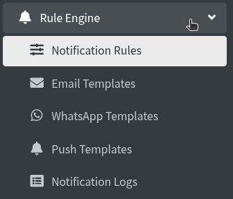

---

## Notification Rules {: #overview }

notification rules new rule all kinds all status all channels search

Click **Notification Rules**. Page title: **Notification Rules**. Breadcrumb: **Home / Rules**.

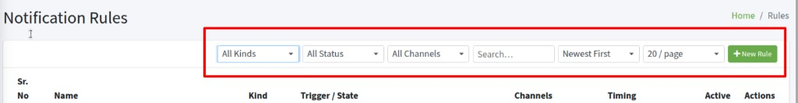

If the list is empty: **No rules configured yet.**

The bar above the table is for finding rules. Change a filter and the list updates.

- **All Kinds** — **Event Based** (sends when something happens) or **Schedule Based** (sends for people stuck in a state, such as never activated)
- **All Status** — **Active** (can send) or **Inactive** (paused)
- **All Channels** — rules that use **Email**, **WhatsApp**, **SMS**, or **Push**
- **Search…** — type part of the rule name
- **Newest First** — also **Oldest First**, **Name A–Z**, **Name Z–A**
- **20 / page** — how many rows to show (10, 20, 50, or 100)

Click **+ New Rule** to add a rule.

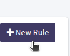

Pencil icon — **Edit**. Trash icon — **Delete**.

**Kind** in the table is **Event** or **Scheduled**. **Trigger / State** is the event name or the schedule state. **Active** is **Yes** or **No**.

---

## Create Notification Rule {: #create-rule }

create notification rule rule identity rule name rule kind rule active create rule

The box is **Create Notification Rule**. Fill the five steps, then **Create Rule**.

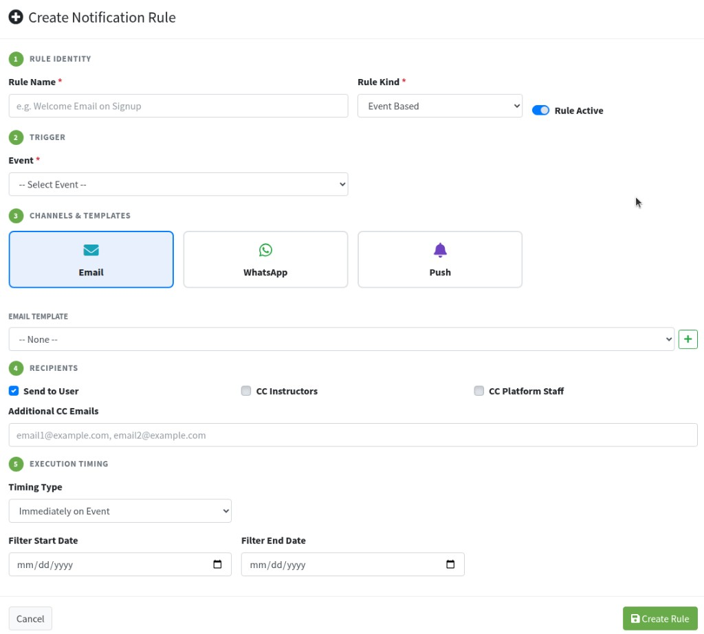

**1 Rule Identity**

- **Rule Name \*** — required. Must be unique. Placeholder: **e.g. Welcome Email on Signup**. Empty name: **Rule name is required.**
- **Rule Kind \*** — **Event Based** or **Schedule Based**. This changes step 2.
- **Rule Active** — leave on so the rule can send. Turn off to pause without deleting.

**Cancel** or **x** closes without saving.

---

## Rule Kind — Event Based {: #event-based }

rule kind event based event select event

Choose **Event Based** when the message should go out because something just happened (signup, enrollment, a live class, and so on).

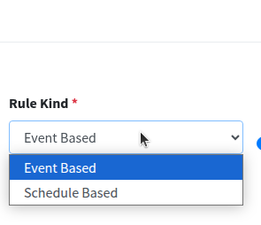

**2 Trigger** then shows **Event \***. Placeholder: **-- Select Event --**. If you skip it: **Please select an event.**

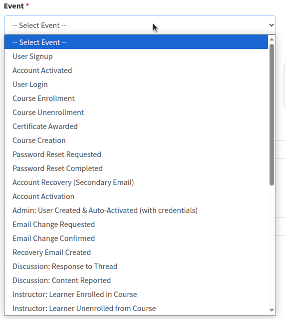

Pick the event that should start the send. Scroll the list — it includes signup and login, enrollment, certificates, password and email changes, discussion posts, instructor enroll actions, Zoom meetings, assignments, and course progress.

Under **Execution Timing**, **Filter Start Date** and **Filter End Date** limit the days this event rule may send. Leave both empty for no date limit.

---

## Rule Kind — Schedule Based {: #schedule-based }

rule kind schedule based schedule state

Choose **Schedule Based** to remind people who have not finished a step. The rule looks for that state, then sends on the timing you set.

**2 Trigger** then shows **Schedule State \***. Placeholder: **-- Select State --**. If you skip it: **Please select a schedule state.**

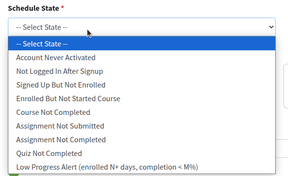

- **Account Never Activated** — signed up, account not activated
- **Not Logged In After Signup** — has an account, has not logged in
- **Signed Up But Not Enrolled** — no course yet
- **Enrolled But Not Started Course** — enrolled, no progress
- **Course Not Completed** — started, not finished
- **Assignment Not Submitted**
- **Assignment Not Completed**
- **Quiz Not Completed**
- **Low Progress Alert (enrolled N+ days, completion &lt; M%)** — enrolled for a while, still below a % 

---

## Channels & Templates {: #channels }

channels templates email whatsapp push none plus create select

**3 Channels & Templates**. Click **Email**, **WhatsApp**, and/or **Push** to turn a channel on (blue / green / purple border). You can use more than one. A template row appears for each channel that is on.

**EMAIL TEMPLATE** — pick a saved template, or **-- None --**. The green **+** opens **Quick Create Email Template** (name, subject, plain body). **Create & Select** saves it and selects it. For HTML and a signature, create the template under **Email Templates** first, then pick it here.

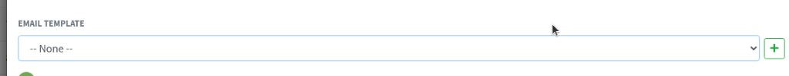

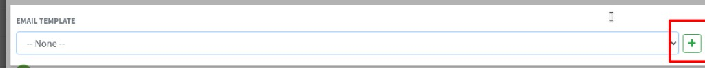

**WHATSAPP TEMPLATE (Only approved templates shown)** — only **Approved** templates appear. **+** can create a new one, but it stays **Pending Approval** until the Glific UUID works. A pending template cannot be used on a rule yet.

**PUSH TEMPLATE** — pick a push template, or **+** for **Quick Create Push Template** (name, title, body).

Turn a channel off if you do not want that send. A rule with no channel selected will not send.

---

## Recipients {: #recipients }

recipients send to user cc instructors cc platform staff additional cc emails

**4 Recipients** — who gets the message.

- **Send to User** — the user the event is about (checked by default). Keep this on for welcome and reminder messages.
- **CC Instructors** — course instructors. Useful for enrollment and certificate events.
- **CC Platform Staff** — staff accounts on this site.
- **Additional CC Emails** — extra addresses, separated by commas. Placeholder: **email1@example.com, email2@example.com**

You can tick more than one. If **Send to User** is off and no CC is set, nobody is notified.

---

## Execution Timing {: #timing }

execution timing timing type immediately after n days weekly filter start date

**5 Execution Timing** — when to send after the trigger.

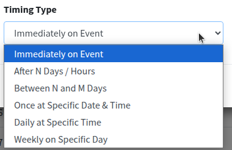

- **Immediately on Event** — send at once. Extra fields stay hidden.
- **After N Days / Hours** — **Unit** (**Days** or **Hours**) and **After** (for example **3**). Send that long after the event or after the person entered the schedule state.
- **Between N and M Days** — **After**, **Before**, and **Unit**. **Before** must be greater than **After**. People in that window can get the message.
- **Once at Specific Date & Time** — **Run At (date & time)**. Sends once, then stops.
- **Daily at Specific Time** — **Time of Day**. Runs every day at that time (used with schedule states).
- **Weekly on Specific Day** — **Time of Day** and **Weekday** (**Monday** … **Sunday**, or **-- Any --**).

For **Event Based**, **Filter Start Date** and **Filter End Date** (`mm/dd/yyyy`) are the days the rule is allowed to fire.

Click **Create Rule**.

---

## Edit and delete a rule {: #edit-delete-rule }

edit rule save changes delete rule

Pencil icon — **Edit**. The box is **Edit Rule** (**Loading rule data...**, then the same five steps). Click **Save Changes**.

Trash icon — **Delete**. **Delete Rule** asks **Delete rule (name)?** and **All associated conditions and notification logs will also be removed.** Click **Delete**, or **Cancel**. The template itself is not deleted.

---

## Email Templates {: #email-templates }

email templates new email template create html body plain text signature

Click **Email Templates**. Breadcrumb: **Home / Email Templates**.

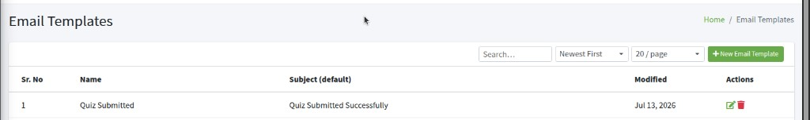

**Search…** finds a template by name. **Newest First** and **20 / page** work like the rules list.

Pencil icon — **Edit**. Trash icon — **Delete**. **Delete Email Template** says **Templates used by active rules cannot be deleted.** Open those rules, pick another template (or **-- None --**), save, then delete.

Click **+ New Email Template**. The box is **Create Email Template**.

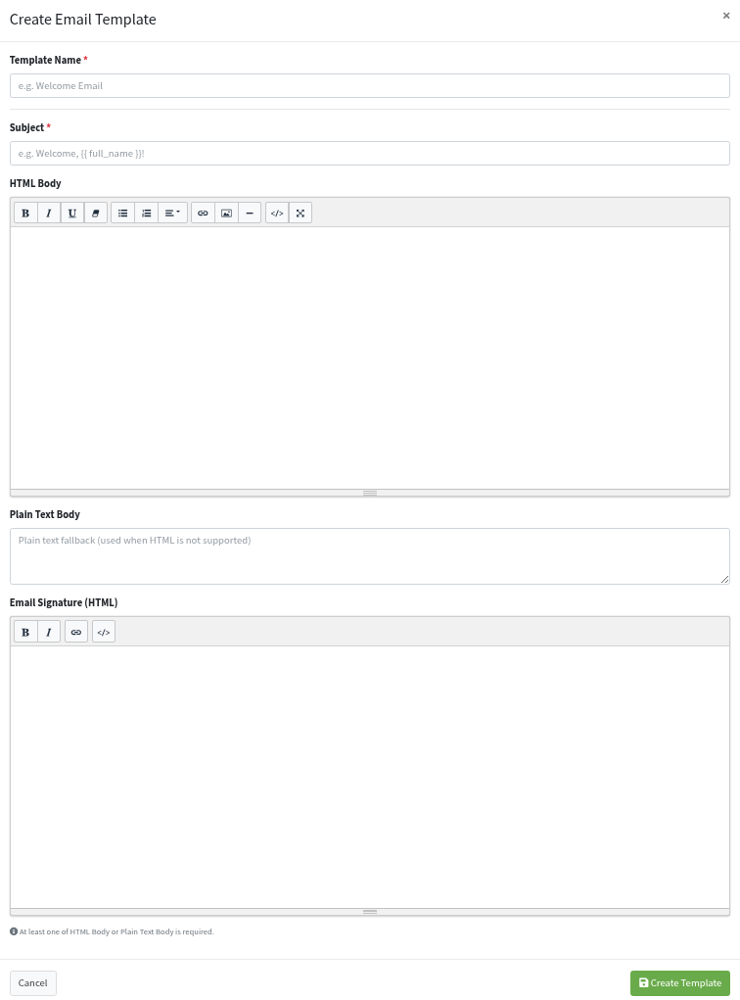

- **Template Name \*** — placeholder **e.g. Welcome Email**
- **Subject \*** — placeholder **e.g. Welcome, {{ full_name }}!** Tags like `{{ full_name }}` are replaced with the user’s name when the email is sent
- **HTML Body** — formatted email (bold, lists, links, image)
- **Plain Text Body** — used when HTML cannot be shown. Placeholder: **Plain text fallback (used when HTML is not supported)**
- **Email Signature (HTML)** — footer under the body

**At least one of HTML Body or Plain Text Body is required.**

Click **Create Template**. Then choose this name under **Create Notification Rule** → **EMAIL TEMPLATE**.

---

## WhatsApp Templates {: #whatsapp-templates }

whatsapp templates all approval pending approved glific uuid

Click **WhatsApp Templates**. Breadcrumb: **Home / WhatsApp Templates**.

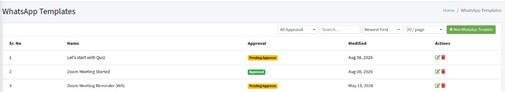

**All Approval** shows **Pending Approval** or **Approved**. Only **Approved** templates appear in a rule’s WhatsApp list.

Pencil icon — **Edit**. Trash icon — **Delete**. **Templates in use by rules cannot be deleted.**

Click **+ New WhatsApp Template**. The box is **Create WhatsApp Template**.

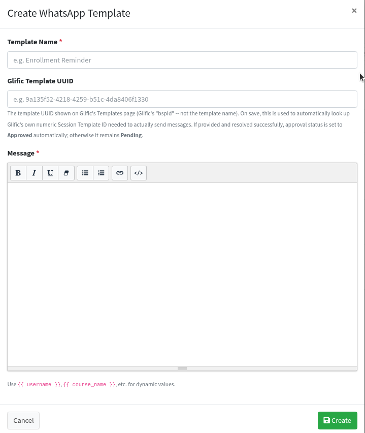

- **Template Name \*** — placeholder **e.g. Enrollment Reminder**
- **Glific Template UUID** — the UUID from Glific’s Templates page (bspId), not the template name. If it is found, **Approval** becomes **Approved**. If not, it stays **Pending** and the rule cannot use it yet
- **Message \*** — use `{{ username }}`, `{{ course_name }}`, and similar tags. They are filled when the message is sent

Click **Create**.

---

## Push Templates {: #push-templates }

push notification templates create title body click action

Click **Push Templates**. Page title: **Push Notification Templates**. Breadcrumb: **Home / Push Templates**.

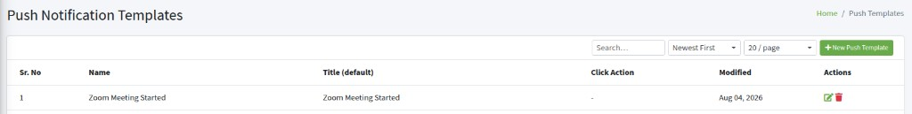

**Search…**, sort, and **20 / page** work like the other lists. Pencil icon — **Edit**. Trash icon — **Delete**. **Templates in use by rules cannot be deleted.**

Click **+ New Push Template**. The box is **Create Push Template**.

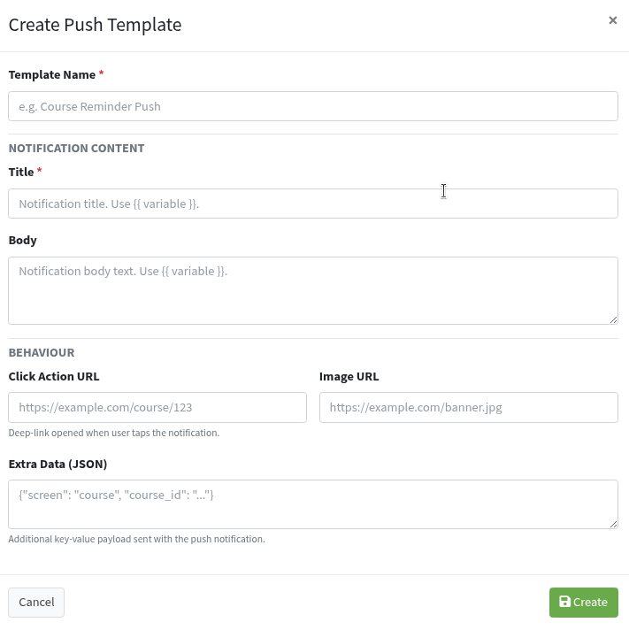

- **Template Name \*** — placeholder **e.g. Course Reminder Push**

**NOTIFICATION CONTENT**

- **Title \*** — short line on the phone. Placeholder: **Notification title. Use {{ variable }}.**
- **Body** — longer text. Placeholder: **Notification body text. Use {{ variable }}.**

**BEHAVIOUR**

- **Click Action URL** — page opened when the user taps the notification
- **Image URL** — optional picture
- **Extra Data (JSON)** — extra data for the app, for example `{"screen": "course", "course_id": "..."}`

Click **Create**. Then pick this template under **PUSH TEMPLATE** on the rule.

---

## Notification Logs {: #notification-logs }

notification logs all channels all statuses all rules success failed

Click **Notification Logs**. Breadcrumb: **Home / Notification Logs**. This page is a history. You do not create rows here.

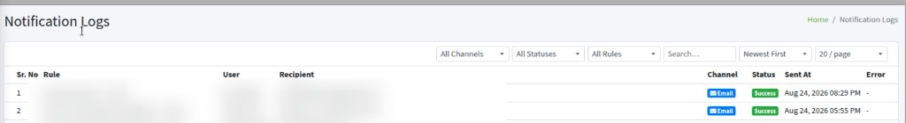

**Filters:**

- **All Channels** — Email, WhatsApp, SMS, or Push
- **All Statuses** — **Success**, **Failed**, or **Pending**
- **All Rules** — one rule name, to see only that rule’s sends
- **Search…** — user, recipient, or rule name
- Sort and **20 / page** — same idea as the other lists

**Status** **Success** means the send went out. **Failed** did not. Hover the error icon to read why. **Error** is **—** when there was no error.

If the list is empty: **No notification logs found.**
