---
hide:
  - navigation
  - toc
---

# Studio

**Studio** is where you create courses, build the course outline, manage libraries of reusable content, and manage taxonomies (tag lists). Sign in with your **admin** account, then open Studio from your name at the top right. It opens in a **new tab**.

## How to reach Studio {: #open }

how to reach studio my dashboard user menu studio home courses libraries search

Sign in with your admin account. After login you land on **My Dashboard** — the same learner home. Studio is not a separate login.

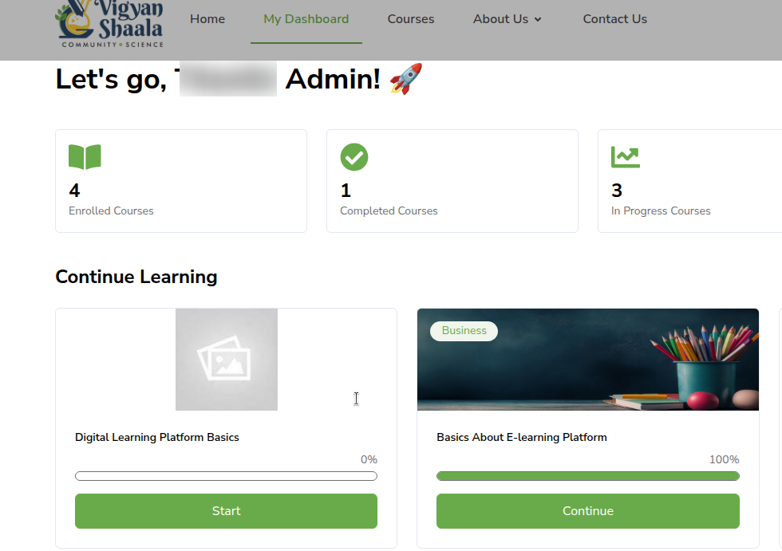

Click your **name** or photo at the **top right**. In the list, click **Studio**.

The same menu also has **Dashboard**, **Profile**, **Account**, **Control Hub**, and **Sign out**. Use **Studio** to write course content. Use **Control Hub** to manage users, enrollments, and course names on the site.

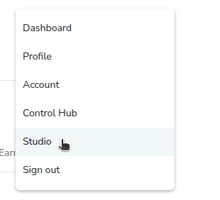

You go to **Studio home**.

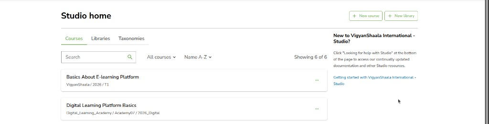

**Studio home** is the list of courses you can edit. At the top right:

- **+ New course** — start a course
- **+ New library** — start a library of reusable units

Tabs under the title:

- **Courses** — every course you can open
- **Libraries** — reusable content collections
- **Taxonomies** — tag lists you can apply to content

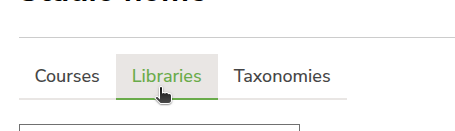

On **Courses**, use search to find a course by name. **All courses** narrows the list. **Name A-Z** sorts it. The count (for example **Showing 6 of 6**) is how many courses match.

Each row is one course: the title, then the organisation, course number, and run (for example **Digital_Learning_Academy / Academy07 / 2026_Digital**). Click the course title to open **Course outline**. The three-dot menu on the right is extra actions for that course.

Click **Libraries** when you need a library instead of a course. See [How to create a library](#create-library) and [How to explore a library](#explore-library). Click **Taxonomies** to manage tags. See [Taxonomies](#taxonomies).

---

## How to create a course {: #create-course }

how to create a course new course course name organization course number course run create cancel

On **Studio home**, click **+ New course**.

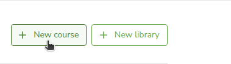

The page title is **Create a new course**. Fill in all four fields. Three of them become part of the course URL, so choose them carefully.

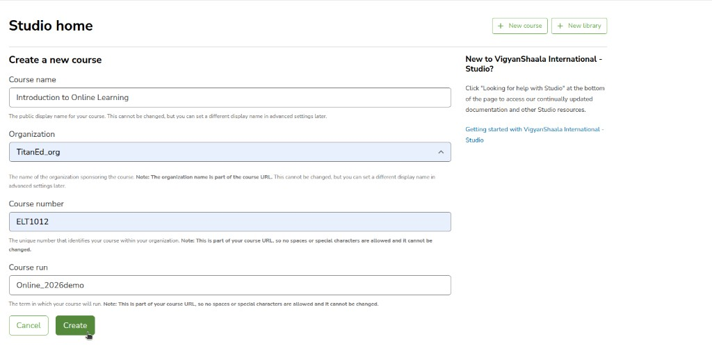

**Course name**

The public display name for your course. This cannot be changed, but you can set a different display name in advanced settings later.

Type the title learners should see (placeholder **e.g. Introduction to Computer Science**).

**Organization**

The name of the organization sponsoring the course. Note: The organization name is part of the course URL. This cannot be changed, but you can set a different display name in advanced settings later.

Pick the organisation from the list (placeholder **e.g. UniversityX or OrganizationX**).

**Course number**

The unique number that identifies your course within your organization. Note: This is part of your course URL, so no spaces or special characters are allowed and it cannot be changed.

Use letters and numbers only, with no spaces (placeholder **e.g. CS101**).

**Course run**

The term in which your course will run. Note: This is part of your course URL, so no spaces or special characters are allowed and it cannot be changed.

Use a term code such as a year and intake (placeholder **e.g. 2014_T1**). No spaces.

**Cancel** closes the form without creating a course.

When the four fields are filled, click **Create**. The button shows **Creating** with a spinner. Wait until it finishes. Do not close the tab.

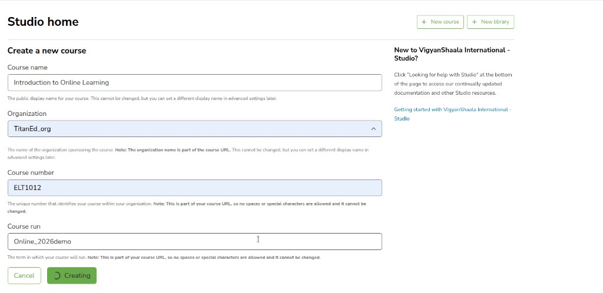

When it is done, you land on **Course outline** for the new course. After that, set the display name, category, and certificate in Control Hub **Course Management**.

---

## Course outline {: #course-outline }

course outline new section view live start date pacing type checklists course tags

**Course outline** is the map of the course: sections, then subsections, then units. Learners see this same order. After you click **Create**, the outline is empty until you add a section.

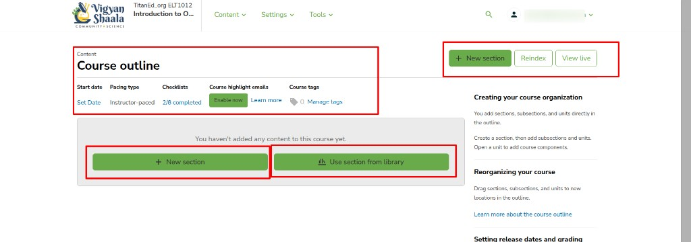

The course name is next to the logo at the top. Menus: **Content**, **Settings**, and **Tools**.

Under **Course outline**:

- **Start date** — when the course opens for learners. Click **Set Date** if it is not set yet
- **Pacing type** — **Instructor-paced** means you set dates. Self-paced lets learners move at their own speed
- **Checklists** — setup progress for this course
- **Course highlight emails** — optional emails about new sections. Click **Enable now** if you want them
- **Course tags** — tags from **Taxonomies**. Click **Manage tags** to add them

On the right: **+ New section**, **Reindex**, and **View live**. **Reindex** and **View live** stay unavailable until there is content to publish.

Until you add a section, the outline says **You haven't added any content to this course yet.**

- **+ New section** — add the first section
- **Use section from library** — pull in a section you already saved in a library

The right-hand help text is **Creating your course organization**. Add a section, then subsections and units inside it. Open a unit to add text, video, problems, and other components. Drag items to reorder.

Click **+ New section** to start building. See [How to create a section](#create-section), [How to create a subsection](#create-subsection), and [How to create a unit](#create-unit). Adding Template Based Assignment is in the [TAS Admin panel](/admin/tas-admin/) guide.

On the **Course outline** or a **Unit** page, click **Analytics** at the top to open a sidebar of engagement and performance charts next to the content. Details: [In-Context Analytics in Studio](analytics-guide.md#in-context).

---

## How to create a section {: #create-section }

how to create a section new section pencil icon rename collapse expand section highlights unscheduled configure publish duplicate delete release date hide from learners

On **Course outline**, click **+ New section** (top right, or in the empty outline). A card named **Section** appears.

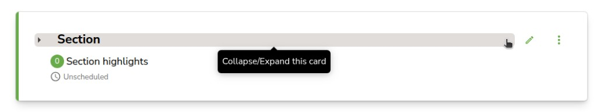

The arrow on the left expands or collapses the card. Hover the header to see **Collapse/Expand this card**.

**0 Section highlights** is how many highlight emails this section has. **Unscheduled** means no release date is set yet.

Click the **pencil icon**. The tooltip is **Rename**.

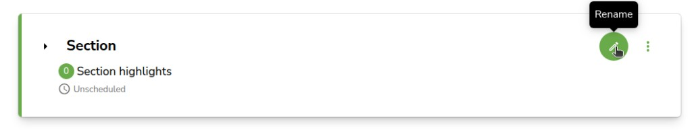

Type the name you need (for example **SectionA**). Click outside the box to save.

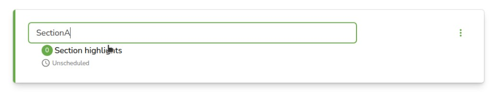

You can also click **Use section from library** to add a section you already saved in a library. See [How to create a library](#create-library) and [How to explore a library](#explore-library).

After the section is there, add a subsection. See [How to create a subsection](#create-subsection).

**Three-dot menu**

Click the three-dot menu on the section.

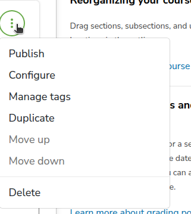

- **Publish** — make new or changed content available to learners (after the release date)
- **Configure** — open settings
- **Manage tags** — tags from [Taxonomies](#taxonomies)
- **Duplicate** — copy it just below, named **Duplicate of** …
- **Move up** / **Move down** — grey when you cannot move it
- **Delete** — removes it. You cannot get it back. Confirm if asked

You can also drag the card to a new place in the outline.

**Configure**

Click **Configure**. The box is **SectionA settings** (the name matches the section). Tabs: **Basic** and **Visibility**. **Cancel** or the **X** closes without saving. **Save** keeps the changes.

**Basic** is **Release date and time**. **Release date** (calendar) and **Release time in UTC**. The default is often **01/01/2030** and **00:00**. Change these so learners can see the section.

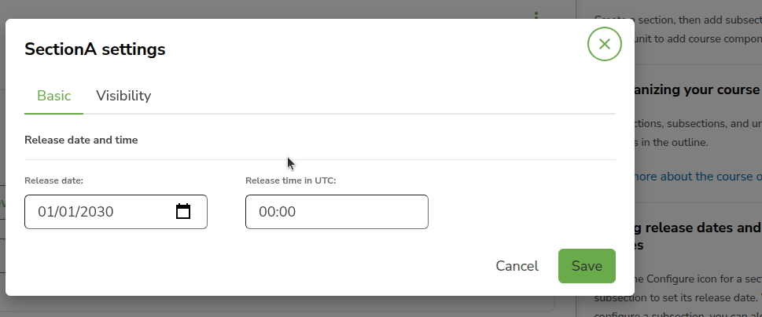

**Visibility** is **Section visibility**. **Hide from learners** hides the whole section, even if it is published. Leave it unchecked if learners should see it after the release date.

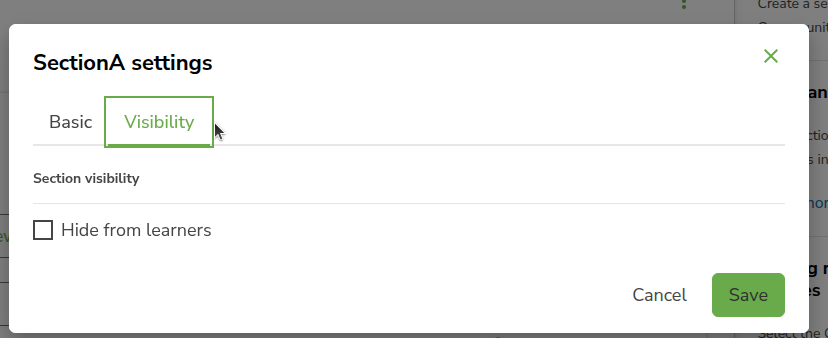

**Publish and schedule**

Set **Release date and time** in **Configure**, then click **Publish** on the three-dot menu. If it stays **Unscheduled**, learners will not see this section in the course. Leave **Hide from learners** unchecked. Do not hide graded assignments after they have been released.

---

## How to create a subsection {: #create-subsection }

how to create a subsection new subsection use subsection from library pencil icon rename configure grading due date visibility timed exam

Expand a section. You get two buttons:

- **+ New subsection** — start a new subsection
- **Use subsection from library** — add a subsection you already saved in a library

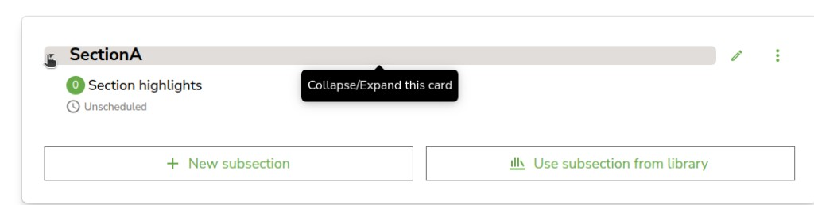

Click **+ New subsection**. A card appears with a default name. Click the **pencil icon** to **Rename** (for example **SubsectionB**). Click outside the box to save.

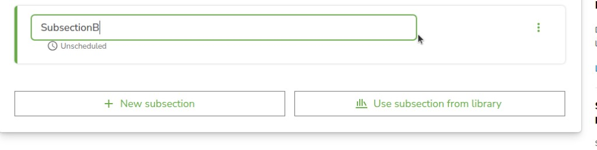

**Use subsection from library** pulls in a subsection from a library. See [How to create a library](#create-library) and [How to explore a library](#explore-library).

After the subsection is there, add a unit. See [How to create a unit](#create-unit).

The three-dot menu on a subsection is the same as on a section: **Publish**, **Configure**, **Manage tags**, **Duplicate**, **Move up**, **Move down**, and **Delete**.

**Configure**

Click **Configure**. The box is **SubsectionB settings**. Tabs: **Basic**, **Visibility**, and **Advanced**. **Cancel** or the **X** closes without saving. **Save** keeps the changes.

**Basic** has **Release date and time**. **Grading** is **Grade as** (for example **Not Graded**, or an assignment type), **Due date**, and **Due time in UTC**.

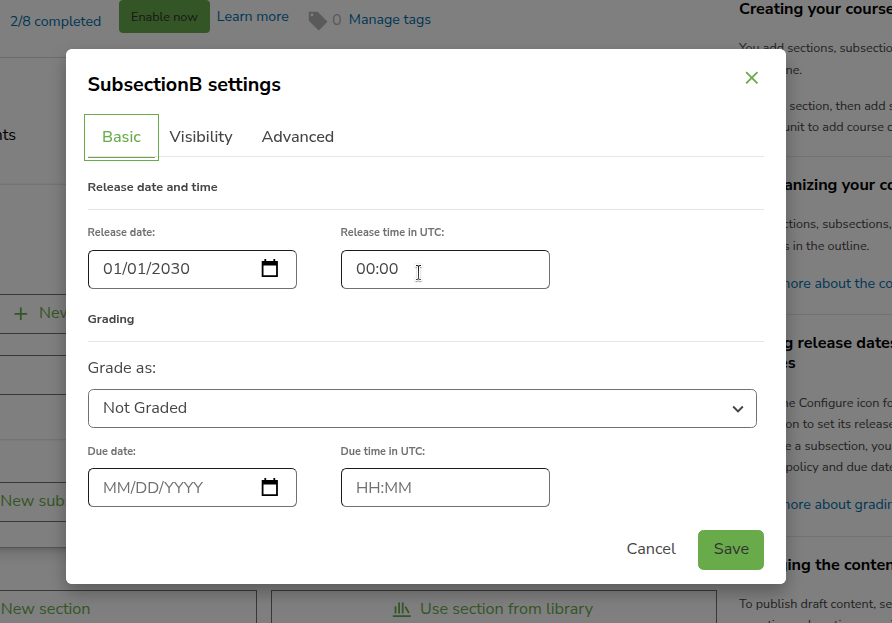

**Visibility** has **Subsection visibility** and **Assessment Results Visibility**. Pick one option in each list. The text under each option says what learners see.

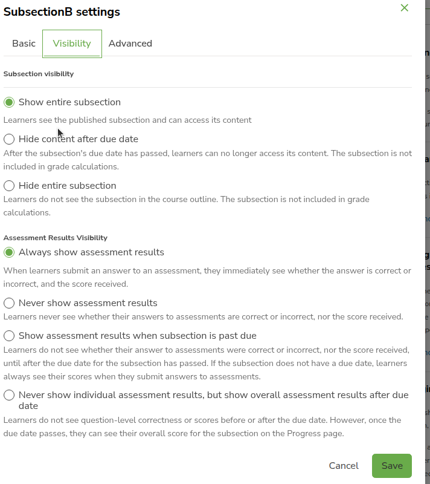

**Advanced** is **Set as a special exam**. **None** is the usual setting. **Timed** limits how long learners can spend on problems in this subsection. They must submit before the time ends. You can give extra time to one learner from **[Special Exams](instructor-guide.md#special-exams)** on Instructor Dashboard.

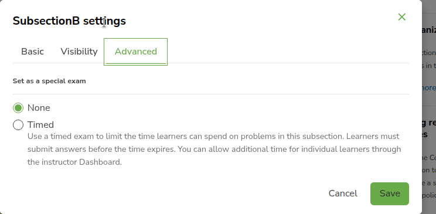

**Publish and schedule**

Set **Release date and time** in **Configure**, then click **Publish** on the three-dot menu. If it stays **Unscheduled**, learners will not see this subsection in the course. Leave **Hide from learners** unchecked. Do not hide graded assignments after they have been released.

---

## How to create a unit {: #create-unit }

how to create a unit new unit use unit from library paste unit clipboard add a new component text video problem advanced

Expand a subsection. You get:

- **+ New unit** — start a new unit
- **Use unit from library** — add a unit you already saved in a library
- **Paste unit** — paste a unit you copied
- **What's in my clipboard?** — see what you copied

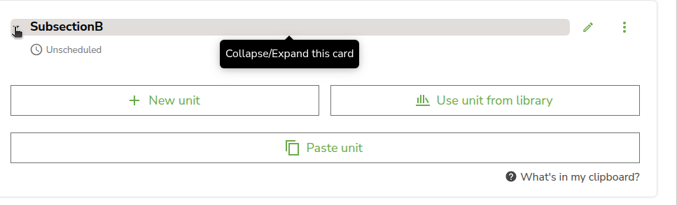

Click **+ New unit**. The **unit** page opens.

Breadcrumb: **SectionA** > **SubsectionB**. The title is **Unit**. Click the **pencil icon** to rename. Click the **gear icon** for unit settings (including **Hide from learners**).

Under **Add a new component**:

- **Text**
- **Video**
- **Problem**
- **Problem Bank**
- **Library Content**
- **Open Response**
- **Drag and Drop**
- **Advanced**

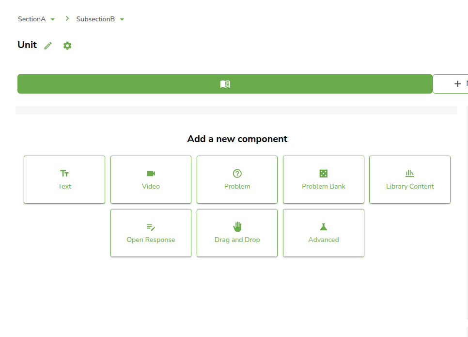

**Template Based Assignment** is under **Advanced**. See the [TAS Admin panel](/admin/tas-admin/) guide. You can also add [PDF](#add-pdf), [Google Document](#add-google-document), [Quick Quiz Maker](#add-quick-quiz-maker), [Staff Graded Assignment](#add-staff-graded-assignment), and [Zoom Live Class](#add-zoom-live-class).

**Use unit from library** pulls in a unit from a library. See [How to create a library](#create-library) and [How to explore a library](#explore-library).

The three-dot menu on a unit in the outline is the same as on a section: **Publish**, **Configure**, **Manage tags**, **Duplicate**, **Move up**, **Move down**, and **Delete**.

**Publish and schedule**

On the right: **RELEASE** may say **Unscheduled**. **WILL BE VISIBLE TO** is **Staff and learners**. Leave **Hide from learners** unchecked. Click **Publish**. If it stays **Unscheduled** or **Draft (never published)**, learners will not see this unit in the course. Do not hide graded assignments after they have been released.

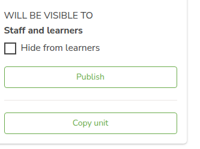

**Copy unit** copies this unit so you can paste it in another subsection. **Paste unit** on that subsection adds the copy.

**View live version** opens the published unit the way learners see it. **Preview** shows your current edits before they are published.

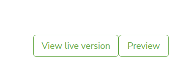

**Unit tags**

On the right, **Unit tags** shows how many tags this unit has (for example **0**). Click **Manage tags**.

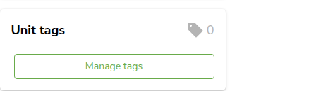

The page is **Manage tags**. Open a taxonomy (for example **VigyanShaala**). If none are set, it says **No tags added yet.** Click **Add tags**.

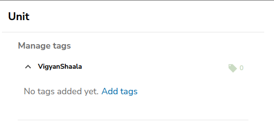

**Add a tag** lists tags from [Taxonomies](#taxonomies). Tick the tags you need, then click **Add tags**. **Cancel** closes the list.

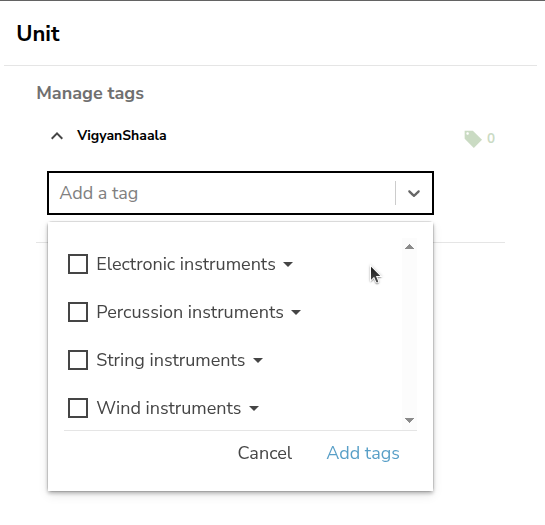

Click **Save** or the tags will not stay on the unit. **Cancel** closes without saving.

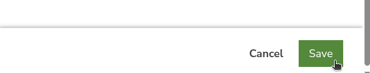

---

## Schedule & details {: #schedule-details }

schedule and details settings course start date time enrollment certificate display course card image instructors course introduction video save

At the top, click **Settings**, then **Schedule & Details**. This is where you set course dates and times.

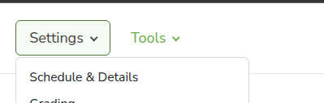

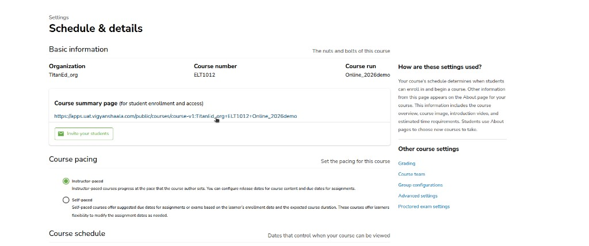

**Basic information** is **Organization**, **Course number**, and **Course run**. You cannot change these here. **Course summary page** is the enroll link for learners. **Invite your students** opens an email.

**Course pacing:** **Instructor-paced** (you set release and due dates) or **Self-paced** (learners move with suggested dates).

**Course schedule** — dates that control when the course can be viewed:

- **Course start date** / **Course start time** — first day the course begins
- **Course end date** / **Course end time** — last day the course is active
- **Enrollment start date** / **Enrollment start time** — first day learners can enroll

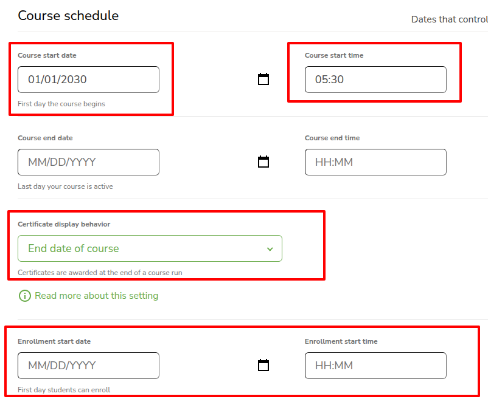

**Certificate display behavior** is when learners can see a certificate:

- **Immediately upon passing**
- **End date of course**
- **A date after the course end date**

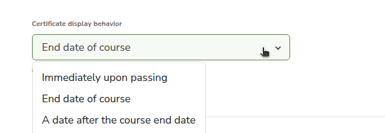

**Course card image** is the picture on the course card. You can manage it with **files and uploads**.

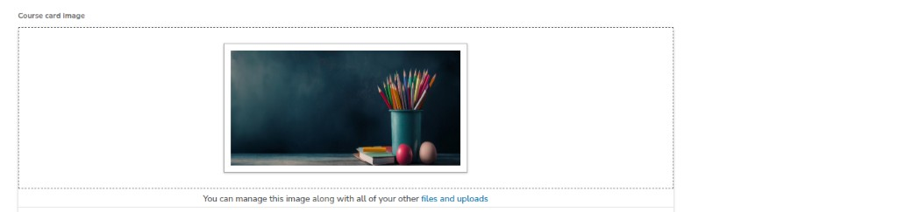

**Course Introduction Video** is on this same page. Paste your YouTube video ID (placeholder **your YouTube video's ID**). The preview plays here. **Delete Current Video** removes it.

**Instructors** — add **Name**, **Title**, **Organization**, and **Biography**. Drag a photo (JPEG or PNG, **200x200px**) or paste **Instructor photo URL**. **Delete** removes that instructor.

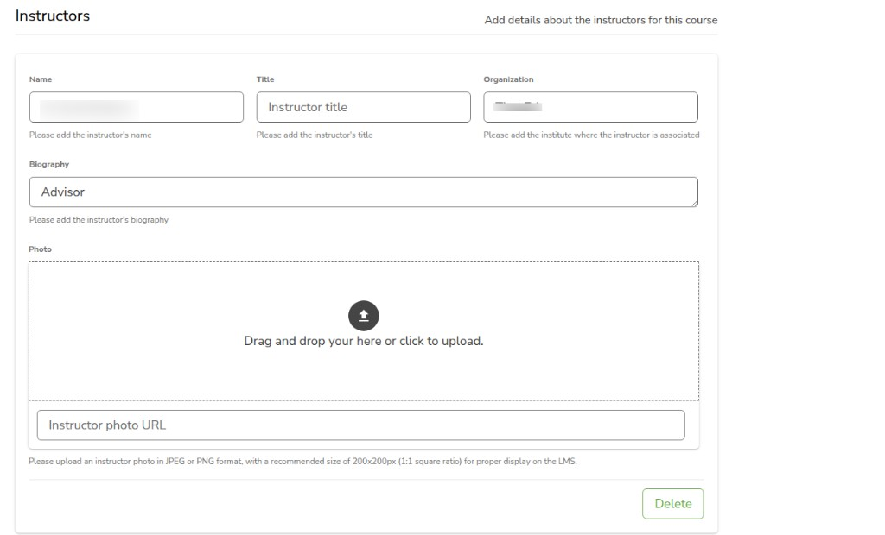

Click **Save** or the dates, video, and details will not stay.

---

## Course team and Group configurations {: #course-team }

course team add user email staff admin group configurations content groups cohorts add your first content group

**Settings** has two pages for people on the course: **Course Team** (who can edit) and **Group Configurations** (who sees extra content).

You must be **Admin** on the course to add people. The person you add must already have an account, and you must use that same email.

At the top, click **Settings**, then **Course Team**.

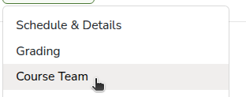

The box is **Add a user to your course's team**. Type **User's email address**. Click **Add user**. **Cancel** closes without adding.

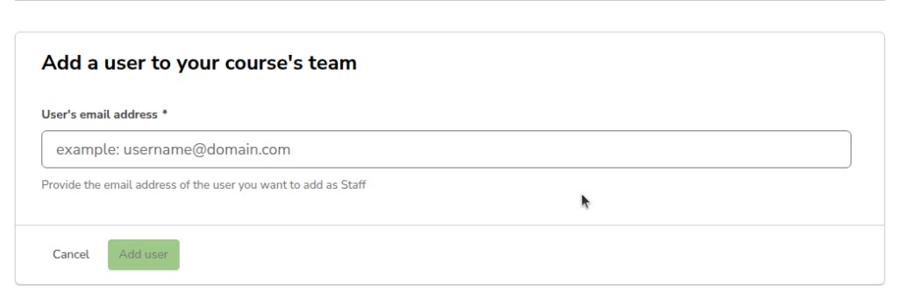

They join as **Staff**. Staff can edit the course. Only **Admin** can add or remove other team members. You can later give someone **Admin** so they can add people too.

At the top, click **Settings**, then **Group Configurations**.

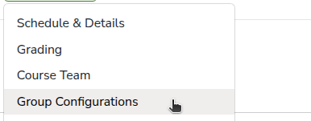

The page is **Group configurations**. **Content groups** let you show some course content only to certain learner groups (cohorts). Each content group can be linked to one or more cohorts.

If there are none yet, the page says **You have not created any content groups yet.** Click **+ Add your first content group**. If you already have groups, click **New content group**.

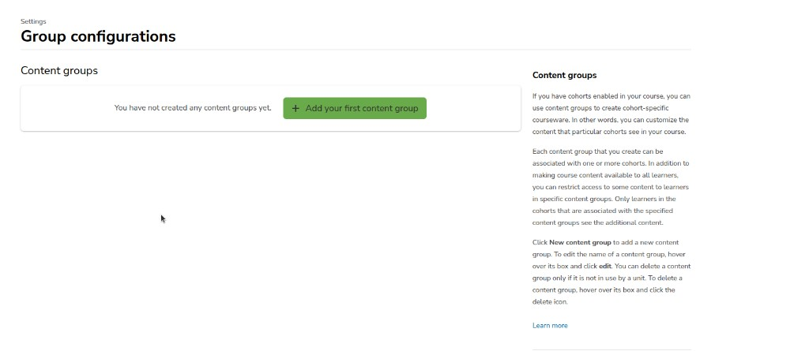

Type a name, then create the group. Hover a group to **edit** the name or delete it. You can delete a content group only if it is not in use by a unit.

After a content group exists, set who can see a unit or component (for example **Manage Access**). Learners not in a linked cohort do not see that extra content.

---

## Advanced settings {: #advanced-settings }

advanced settings advanced module list save changes json quotation marks extra course options

At the top, click **Settings**, then **Advanced Settings**. It is in the same menu as [Schedule & details](#schedule-details), **Course Team**, and **Group Configurations**.

This page is extra course options. A change here can override what you set on other pages. Only change a setting if you know what it does.

If a value is text, put double quotation marks around it, for example `"My course"`. Do not use single quotation marks.

**Advanced Module List** lists extra tools for this course (the keys that unlock items under **Advanced** when you [add a component](#create-unit)). Keep the list inside `[ ]`. Put each key in double quotation marks. Separate keys with a comma.

Click **Save Changes**. If the text is not valid, it will not save.

---

## Course updates and handouts {: #course-updates }

course updates handouts content new update post edit handouts pencil icon lms updates tab handouts tab

At the top, click **Content**, then **Course Updates**.

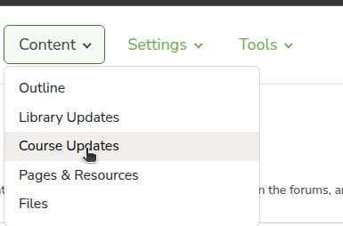

The page is **Course updates**. Use updates for important dates, exams, schedule changes, and answers to learner questions.

If there are no updates yet, the page says **You have not added any updates to this course yet.** Click **+ Add first update** or **+ New update**.

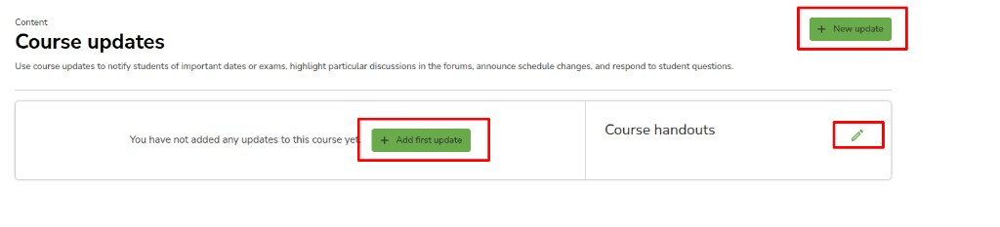

The form is **Add new update**. Set **Date**. Type the message. Click **Post**. **Cancel** closes without posting.

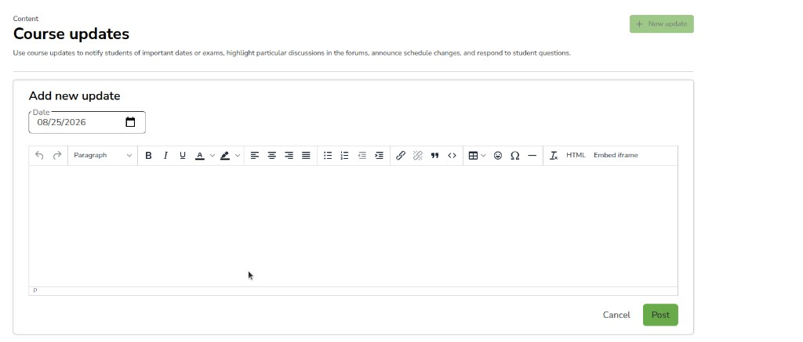

After you post, the update shows with the date. Click the **pencil icon** to edit it. Click the **trash icon** to delete it.

**Course handouts** is on the right of the same page. Click the **pencil icon** next to **Course handouts**.

The box is **Edit handouts**. Type or paste the handout text. Click **Save**. **Cancel** closes without saving.

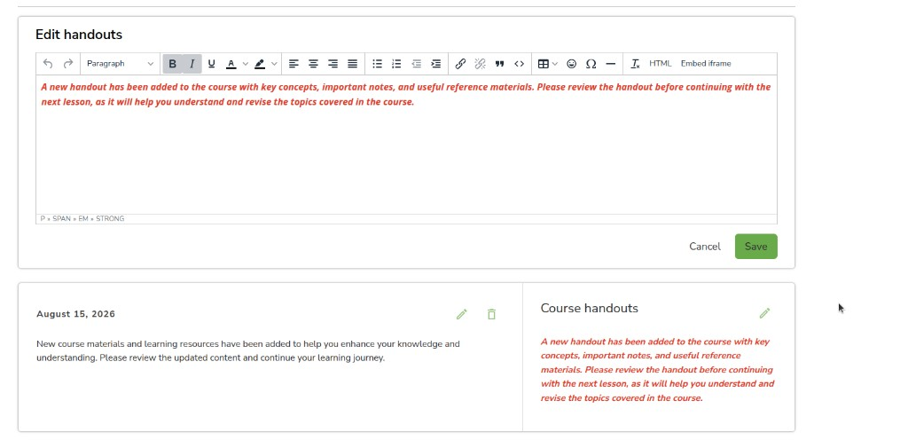

Learners see this in the course:

- **Updates** tab — the posts you add here
- **Handouts** tab — the handout text you save here

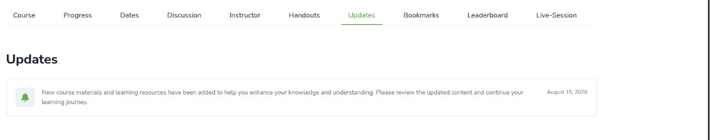

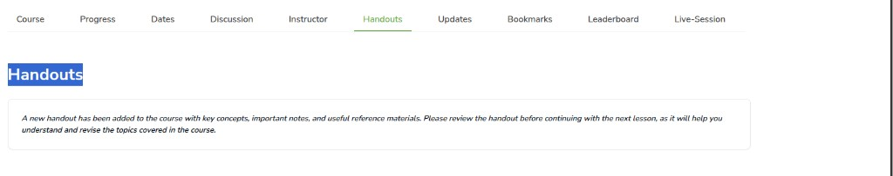

---

## How to upload files {: #upload-files }

how to upload files content files add files search sort and filter actions download delete

Upload images, documents, and other files here so you can use them in the course.

At the top, click **Content**, then **Files**.

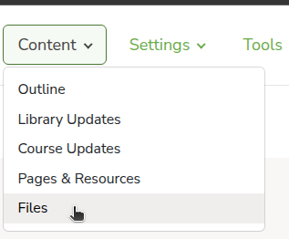

The page is **Files**. Use **Search file name** to find a file. Click **+ Add files** to upload from your computer.

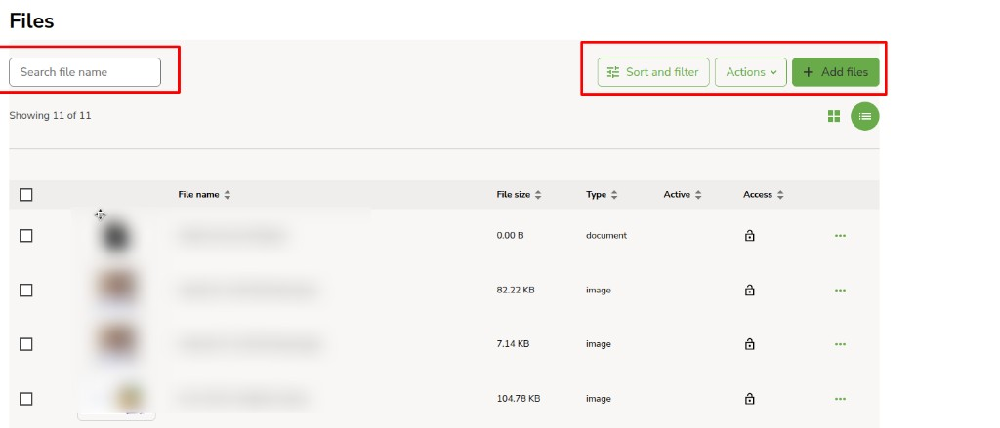

Each row is one file. Tick the files you want, then click **Actions**.

- **Download**
- **Delete**

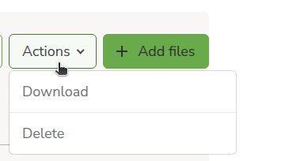

**Sort and filter** changes the list. Pick a **Sort by** option and tick **Filter by** checkboxes. **Clear all** removes the filters. Click **Apply**. **Cancel** or the **X** closes without changing the list.

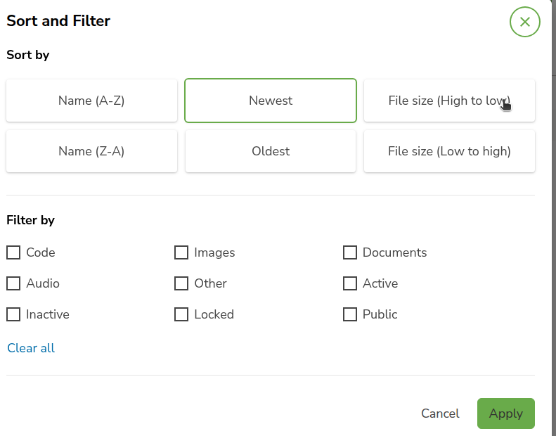

After a file is uploaded, copy its link if you need it in a component (for example [How to add PDF](#add-pdf) **PDF URL**).

---

## Import and export course {: #import-export }

import export course tools tar.gz course xml replace backup export course content

Use **Tools** to copy a whole course as a `.tar.gz` file, or to replace this course with one of those files.

Import replaces everything in this course. You cannot undo it. Export first if you need a backup. Stay on the page for the first two of the five stages. Do not edit the course until import finishes.

At the top, click **Tools**, then **Import**.

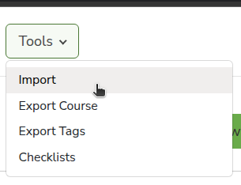

The page is **Course import**. The file must be `.tar.gz` and must contain `course.xml`. Drag and drop the file, or click to upload.

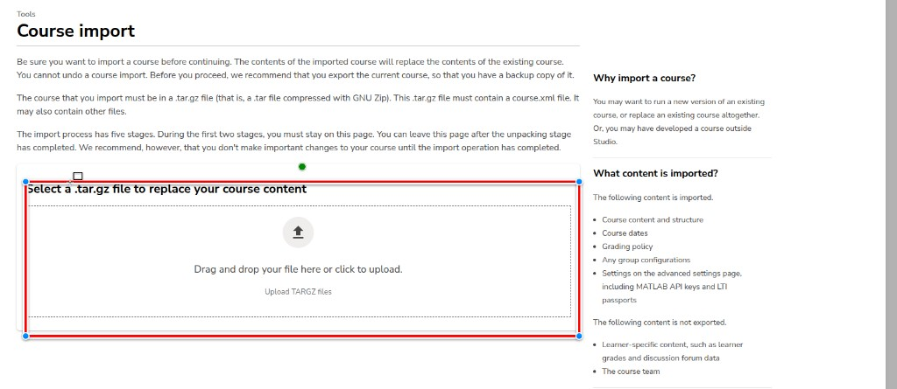

Import includes course content, dates, grading, group configurations, and [Advanced settings](#advanced-settings). It does **not** include learner data or the [course team](#course-team). Add the team again after import.

At the top, click **Tools**, then **Export Course**.

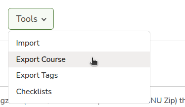

The page is **Course export**. Click **Export course content**. The file is `.tar.gz`. You can import it later. Exported files can include keys from Advanced settings — share them only with people you trust.

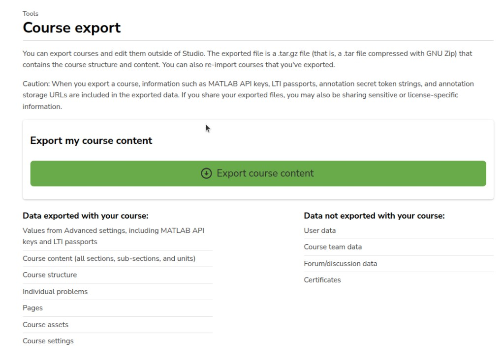

Export includes course content, structure, problems, pages, files, settings, and Advanced settings. It does **not** include user data, course team, discussions, or certificates.

---

## Export tags {: #export-tags }

export tags csv name type id taxonomies tools course tags

This downloads the [taxonomies](#taxonomies) tags on the course as a **CSV** file (not a `.tar.gz` course export).

At the top, click **Tools**, then **Export Tags**.

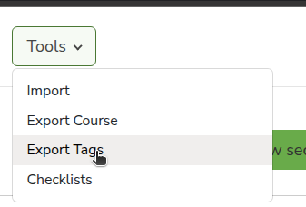

Wait for **Course tags exported successfully**. The file is named after the course, for example **Digital Learning Platform Basics.csv**.

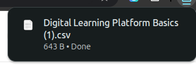

The first columns are **Name**, **Type**, and **ID**. Extra columns are your taxonomies.

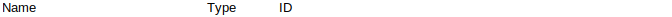

---

## Checklists {: #checklists }

checklists launch checklist best practices automatically verified mark as complete update

**Checklists** is a launch list for this course. It does not publish the course by itself.

At the top, click **Tools**, then **Checklists**.

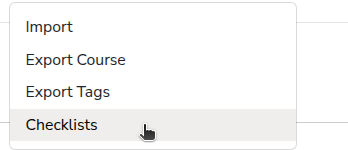

The page is **Checklists**. Breadcrumb: **Tools**.

**Launch Checklist** shows how many of the 18 items are done (for example **4/18 completed**). A green check is done. An empty circle is not done.

Items with **Automatically verified** are checked from the course. You cannot tick them by hand. Click **Update** to open the related page (for example [Schedule & details](#schedule-details), the [course outline](#course-outline), or [Course updates](#course-updates)).

Items with **Mark as complete** are for you to confirm. Tick the box when that work is done. Untick it if you need to do it again.

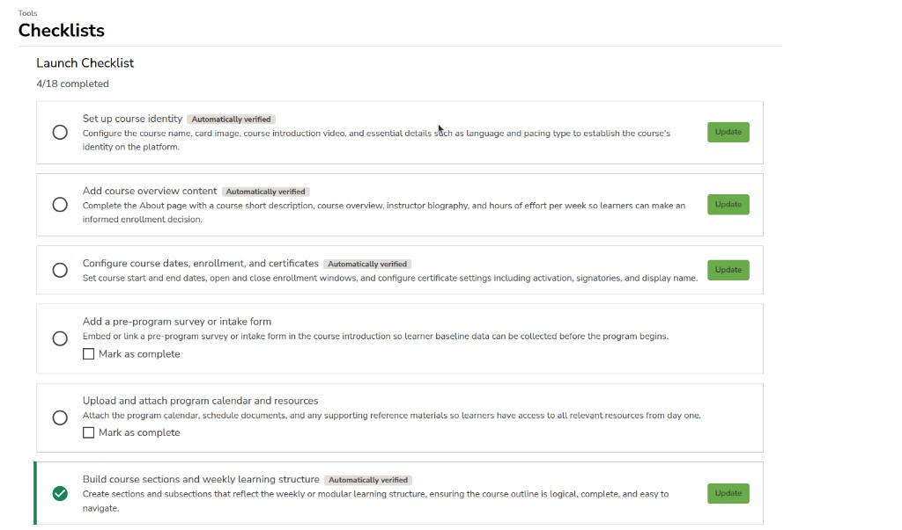

**Automatically verified** (click **Update**):

- **Set up course identity**
- **Add course overview content**
- **Configure course dates, enrollment, and certificates**
- **Build course sections and weekly learning structure**
- **Add live class links and session details**
- **Upload pre-recorded videos and learning resources**
- **Add quizzes, assignments, and grading settings**
- **Configure assignment deadlines and submission flow**
- **Publish all sections, units, and components**
- **Verify certificate eligibility and completion criteria**
- **Add a welcome message**

**Mark as complete** (you tick):

- **Add a pre-program survey or intake form**
- **Upload and attach program calendar and resources**
- **Add a feedback form or post-program survey**
- **Verify navigation flow and content order**
- **Preview and validate all content in learner view**
- **Test the complete student journey**
- **Perform final QA check**

**Best practices checklist** is below Launch Checklist (for example **1/3 completed**). These are quality checks, not launch steps. They are verified from the course:

- **Check video duration** — most videos shorter than 10 minutes
- **Build diverse learning sequences** — mix content types in subsections
- **Manage unit depth** — about three components per unit

If the course is self-paced, **Set weekly highlights** can also show here.

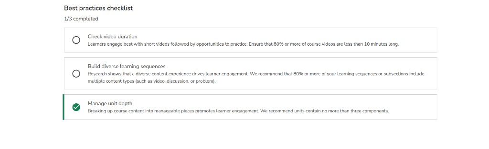

---

## How to add PDF {: #add-pdf }

how to add pdf advanced component select pencil icon display name pdf url download save publish draft learners

Open a [unit](#create-unit). Under **Add a new component**, click **Advanced**.

The box is **Add advanced component**. Select **PDF**.

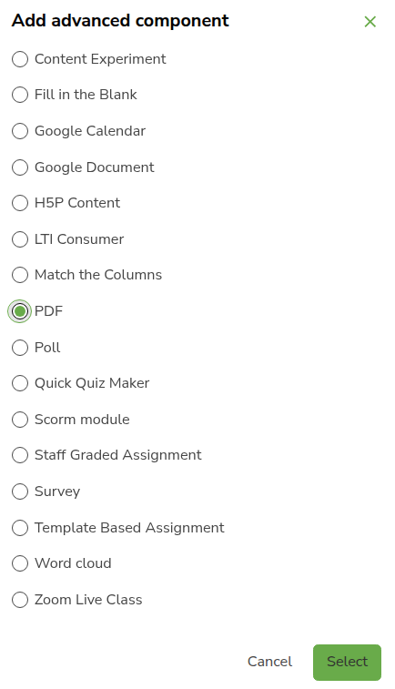

Click **Select**. **Cancel** or the **X** closes without adding it.

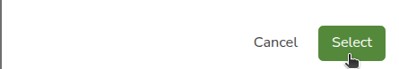

The **PDF** block is on the unit. Click the **pencil icon** to edit.

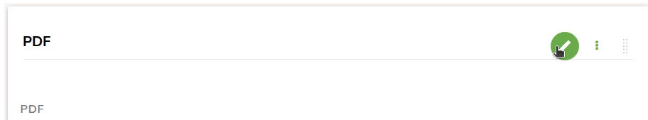

The box is **Editing: PDF**.

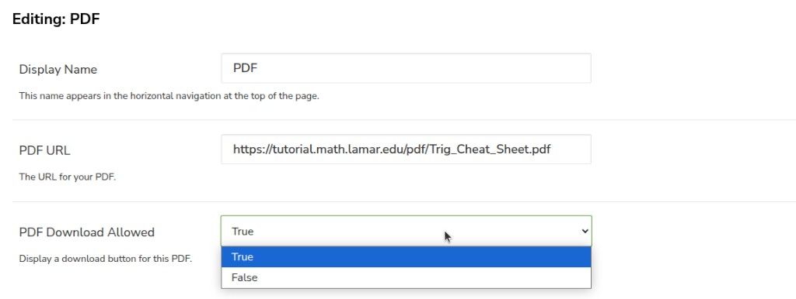

- **Display Name** — shown in the bar at the top of the page. Default **PDF**
- **PDF URL** — the URL of your PDF file
- **PDF Download Allowed** — **True** shows a download button. **False** hides it

Scroll for:

- **Source document button text** — default **Default : Download the source document**
- **Source document URL** — optional. A link to the source file of your PDF, for example the PowerPoint used to make it

Click **Save**. **Cancel** closes without saving.

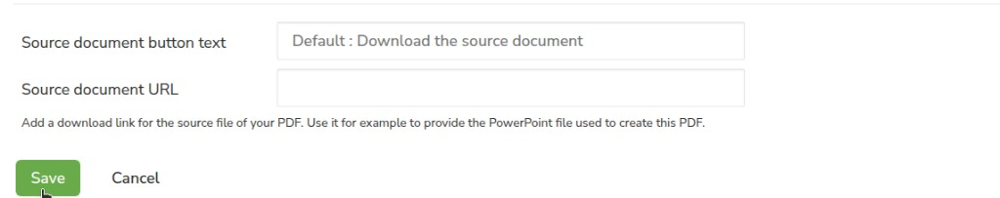

The PDF shows in the unit. Learners also see **Download the PDF** if download is allowed.

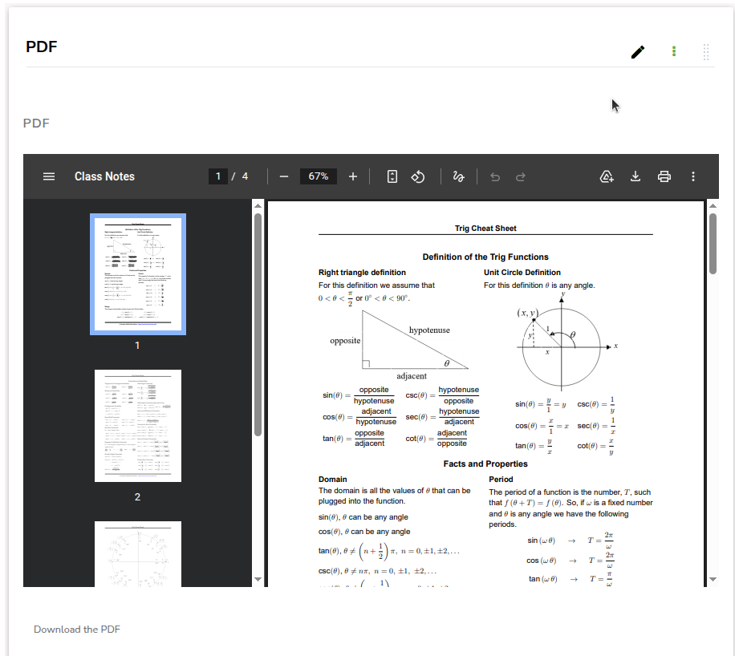

On the right, **RELEASE** may say **Unscheduled**. Click **Publish**. If the unit stays **Unscheduled** or **Draft (never published)**, learners will not see the PDF in the course. Leave **Hide from learners** unchecked. Do not hide graded assignments after they have been released.

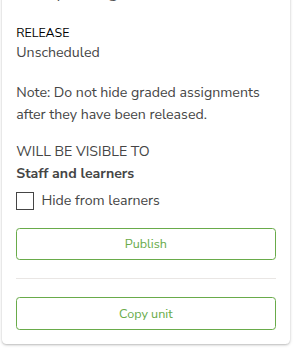

**Actions**

On the component, click the three-dot **Actions** menu: **Manage Access**, **Move**, **Manage tags**, **Copy to Clipboard**, **Duplicate**, or **Delete**. **Delete this component?** is permanent and cannot be undone.

---

## How to add Google Document {: #add-google-document }

how to add google document advanced component embed code publish to the web save iframe

Open a [unit](#create-unit). Under **Add a new component**, click **Advanced**.

The box is **Add advanced component**. Select **Google Document**.

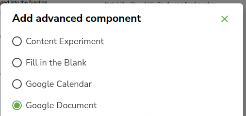

Click **Select**.

The **Google Document** block is on the unit. Click the **pencil icon** to edit.

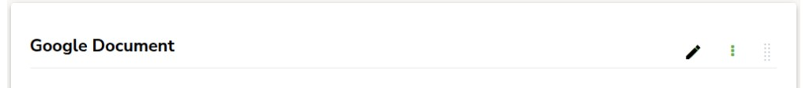

The box is **Editing: Google Document**.

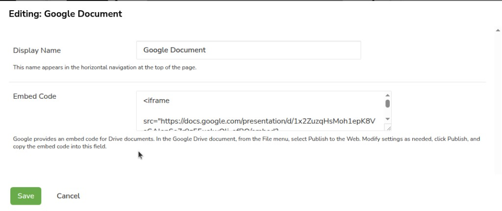

- **Display Name** — shown in the bar at the top of the page. Default **Google Document**
- **Embed Code** — paste the embed code from Google Drive

In the Google Drive file, open the **File** menu, then **Publish to the Web**. Set what you need, click **Publish**, and copy the embed code into **Embed Code**.

Click **Save**. **Cancel** closes without saving.

The document (or slides) shows in the unit.

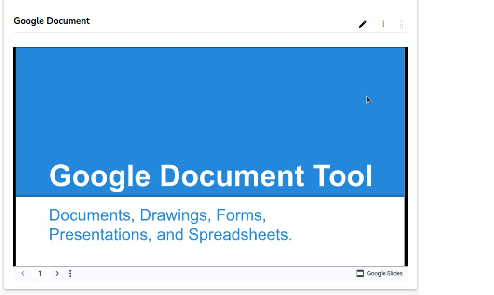

On the right, **RELEASE** may say **Unscheduled**. Click **Publish**. If the unit stays **Unscheduled** or **Draft (never published)**, learners will not see it in the course. Leave **Hide from learners** unchecked. Do not hide graded assignments after they have been released.

**Actions**

On the component, click the three-dot **Actions** menu: **Manage Access**, **Move**, **Manage tags**, **Copy to Clipboard**, **Duplicate**, or **Delete**. **Delete this component?** is permanent and cannot be undone.

---

## How to add Quick Quiz Maker {: #add-quick-quiz-maker }

how to add quick quiz maker display name download template xlsx upload question file question grouping create individual questions combine all questions save

**Quick Quiz Maker** lets you add many questions at once from an Excel file. Open a [unit](#create-unit). Under **Add a new component**, click **Advanced**.

The box is **Add advanced component**. Select **Quick Quiz Maker**.

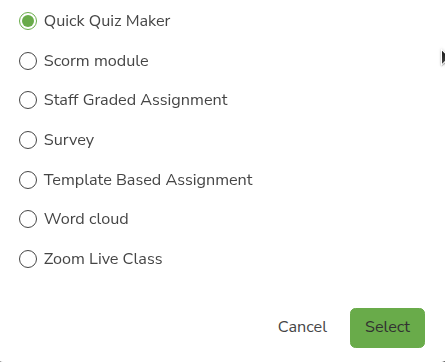

Click **Select**.

The **Quick Quiz Maker** block is on the unit. Click the **pencil icon** to edit.

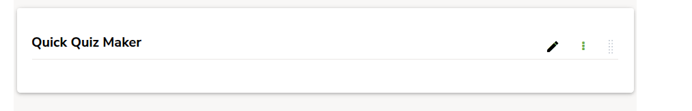

The box is **Editing: Quick Quiz Maker**.

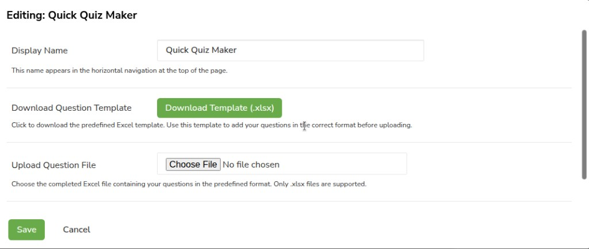

**Display Name**

Default **Quick Quiz Maker**. This name appears in the horizontal navigation at the top of the page.

**Download Question Template**

Click **Download Template (.xlsx)**. Use this template to add your questions in the correct format before uploading.

The first row must include: **Question**, **Question type**, **Problem Weight**, **Max Attempts**, **Show Reset Button**, **Correct Answer**, and **Option** columns as needed.

**Question type** in the file: **mcq**, **checkbox**, **dropdown**, **numerical_input**, or **text_input**. For **Show Reset Button**, use **yes** if the learner should get a reset button.

**Upload Question File**

Click **Choose File** and pick the completed **.xlsx** file. Only **.xlsx** files are supported. If the file is not **.xlsx**, you see: **Invalid file type. Please upload a valid .xlsx file.**

**Question Grouping**

- **Create Individual Questions** — each question becomes its own problem on the unit
- **Combine All Questions** — all questions go into one problem named **All Questions**

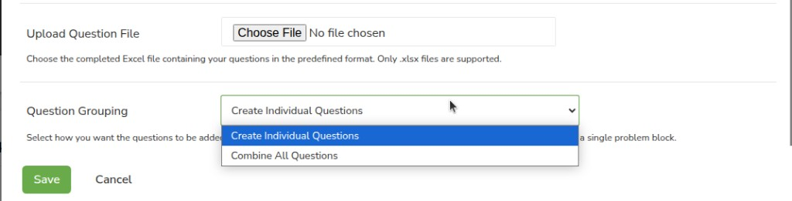

Click **Save**. **Cancel** closes without saving. After a successful save, the questions appear on the unit. **Quick Quiz Maker** itself is not shown to learners — they see the questions you uploaded.

On the right, **RELEASE** may say **Unscheduled**. Click **Publish**. If the unit stays **Unscheduled** or **Draft (never published)**, learners will not see the questions in the course. Leave **Hide from learners** unchecked. Do not hide graded assignments after they have been released.

**Actions**

On the component, click the three-dot **Actions** menu: **Manage Access**, **Move**, **Manage tags**, **Copy to Clipboard**, **Duplicate**, or **Delete**. **Delete this component?** is permanent and cannot be undone.

---

## How to add Staff Graded Assignment {: #add-staff-graded-assignment }

how to add staff graded assignment advanced component maximum score problem weight show answer solution upload your assignment publish unscheduled

Open a [unit](#create-unit). Under **Add a new component**, click **Advanced**.

The box is **Add advanced component**. Select **Staff Graded Assignment**.

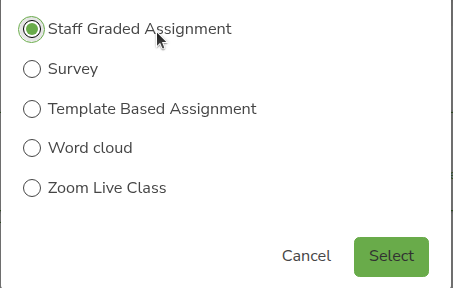

Click **Select**.

The **Staff Graded Assignment** block is on the unit. Click the **pencil icon** to edit.

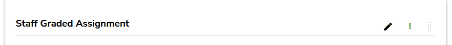

The box is **Editing: Staff Graded Assignment**.

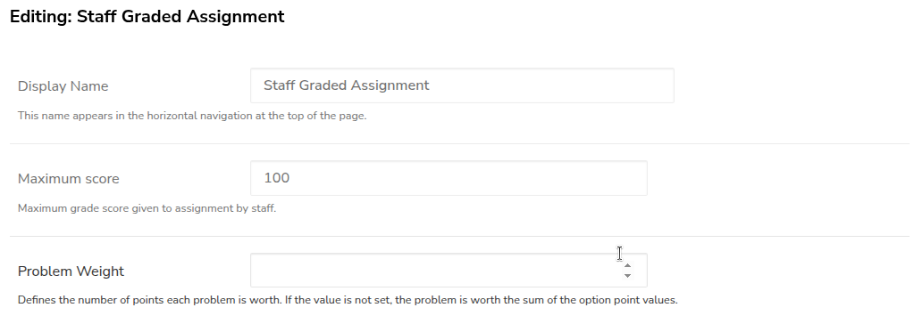

- **Display Name** — shown in the bar at the top of the page. Default **Staff Graded Assignment**
- **Maximum score** — default **100**. This is the maximum grade staff can give
- **Problem Weight** — how many points this assignment is worth. If you leave it empty, the weight is the sum of the option point values

Scroll for **Show Answer** and **Solution**.

- **Show Answer** — when learners see the answer. Default **Past Due (Default)**
- **Solution** — optional text (and formatting) for the solution

Click **Save**. **Cancel** closes without saving.

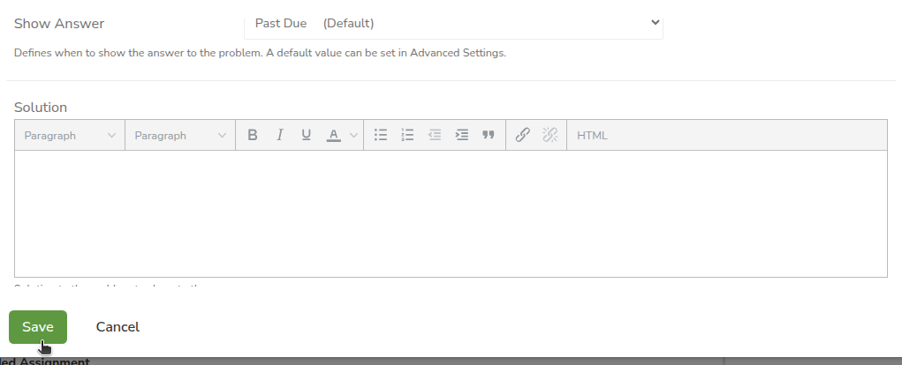

Learners see **Upload your assignment** to send their file for staff to grade.

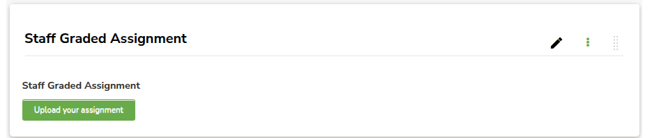

On the right, **RELEASE** may say **Unscheduled**. Click **Publish**. If the unit stays **Unscheduled** or **Draft (never published)**, learners will not see the assignment in the course. Leave **Hide from learners** unchecked. Do not hide graded assignments after they have been released.

**Actions**

On the component, click the three-dot **Actions** menu: **Manage Access**, **Move**, **Manage tags**, **Copy to Clipboard**, **Duplicate**, or **Delete**. **Delete this component?** is permanent and cannot be undone.

---

## How to add Zoom Live Class {: #add-zoom-live-class }

how to add zoom live class schedule meeting topic agenda duration external attendees alternative hosts save meeting actions delete

Open a [unit](#create-unit). Under **Add a new component**, click **Advanced**.

The box is **Add advanced component**. Select **Zoom Live Class**.

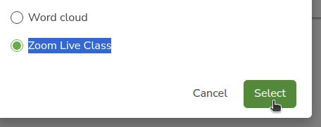

Click **Select**.

The **Zoom Live Class** block is on the unit. Click the **pencil icon** to edit.

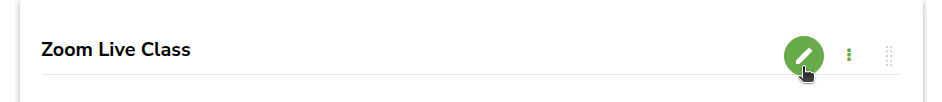

The box is **Editing: Zoom Live Class**. The form title is **Schedule Live Class**.

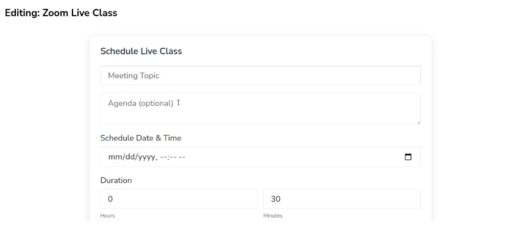

- **Meeting Topic** — name of the live class
- **Agenda (optional)**
- **Schedule Date & Time** — use the calendar
- **Duration** — **Hours** (default **0**) and **Minutes** (default **30**)
- **External Attendees** — comma-separated emails (optional)
- **Alternative Hosts** — comma-separated emails (optional)
- **Mute participants upon entry** — on by default
- **Keep participant video on** — off by default

Click **Save Meeting**. **Close** leaves the editor.

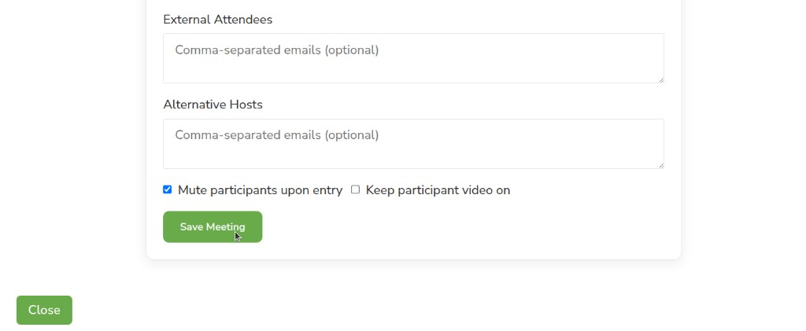

On the right, **RELEASE** may say **Unscheduled**. Click **Publish**. If the unit stays **Unscheduled** or **Draft (never published)**, learners will not see the live class in the course. Leave **Hide from learners** unchecked. Do not hide graded assignments after they have been released.

**Actions**

On the component, hover the three-dot menu to see **Actions**.

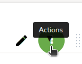

Click **Actions**:

- **Manage Access**
- **Move**
- **Manage tags**
- **Copy to Clipboard**
- **Duplicate**
- **Delete**

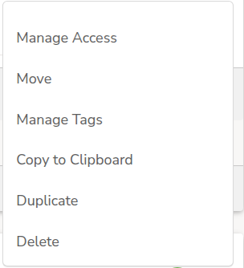

If you click **Delete**, the box is **Delete this component?** Deleting this component is permanent and cannot be undone. Click **Cancel** or **Delete**.

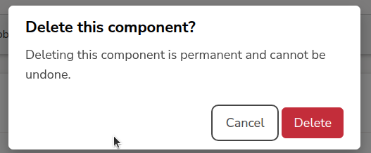

The same **Actions** menu is on PDF, Google Document, Quick Quiz Maker, Staff Graded Assignment, and the other components on a unit.

## Taxonomies {: #taxonomies }

taxonomies all taxonomies import upload csv json download template 100mb

A **taxonomy** is a tag list. You use those tags on courses and content so people can find the right material. On **Studio home**, click **Taxonomies**.

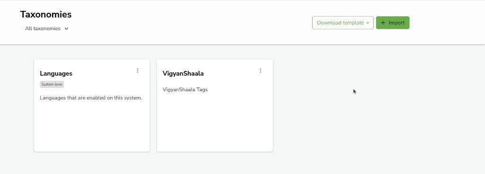

Each card is one taxonomy. **System-level** means it is built in for the whole site (for example **Languages**). Other cards are yours to edit (for example **VigyanShaala**). The three-dot menu on a card is extra actions for that taxonomy.

**All taxonomies** filters the list. Open it to show every taxonomy, only **Unassigned**, or one organisation.

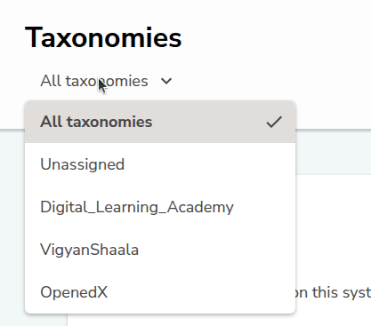

You add or change a taxonomy by uploading a file. You cannot type the whole tree in the page.

**Download template**

Click **Download template**, then **CSV template** or **JSON template**.

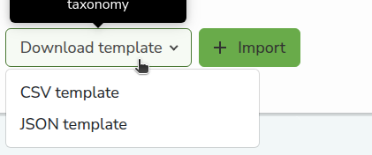

Open the CSV in a spreadsheet, or the JSON in a text editor. Fill in the rows, then save. Use the template so the columns match what Studio expects.

**+ Import**

Click **+ Import**. The box is **Upload file**.

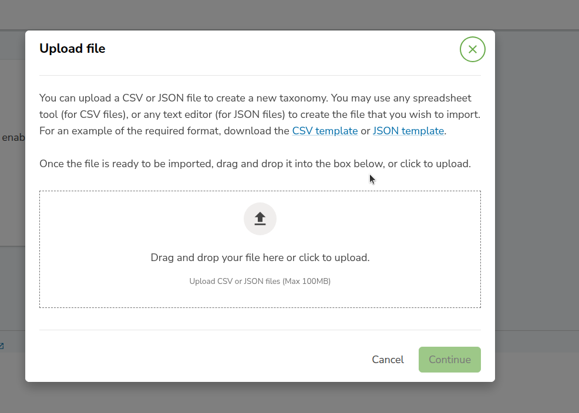

You can upload a CSV or JSON file to create a new taxonomy. You may use any spreadsheet tool (for CSV files), or any text editor (for JSON files) to create the file that you wish to import.

Need the layout again? Click **CSV template** or **JSON template** in this box.

When the file is ready, drag it into the dashed area, or click the area to choose a file. Upload **CSV** or **JSON** files (**Max 100MB**).

**Cancel** closes the box. **Continue** stays unavailable until a file is in the box. After you add a file, click **Continue**, then follow the name and description prompts. Wait until the import finishes. The new taxonomy appears as a card.

---

## How to create a library {: #create-library }

how to create a library new library library name organization library id create from archive zip

A **library** is a store of reusable content. You write a video, problem, or unit once, then add it to many courses. When you publish a change in the library, courses can pick up the new version.

On **Studio home**, click **+ New library**. You can also open the **Libraries** tab first, then click **+ New library**.

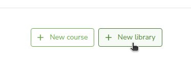

The page title is **Create new library**.

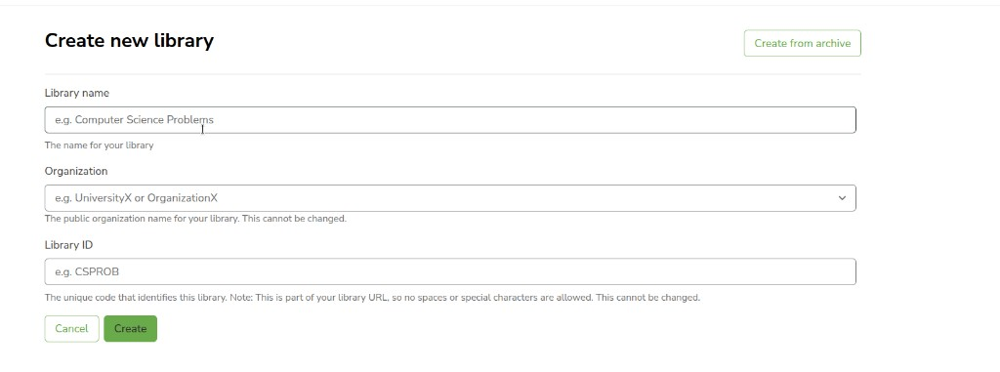

Fill in all three fields. **Organization** and **Library ID** become part of the library URL, so they cannot be changed later. Keep **Library name**, **Organization**, and **Library ID** short — together they must stay within **65** characters.

**Library name**

The name for your library. Placeholder **e.g. Computer Science Problems**. Pick a name the team will recognise.

**Organization**

The public organization name for your library. This cannot be changed. Placeholder **e.g. UniversityX or OrganizationX**.

**Library ID**

The unique code that identifies this library. Note: This is part of your library URL, so no spaces or special characters are allowed. This cannot be changed. Placeholder **e.g. CSPROB**.

**Cancel** closes the form. Click **Create** when the fields are filled. You become **Library Admin** on the new library. Then you can add components. See [How to explore a library](#explore-library).

**Create from archive**

To start from a backup file instead of a blank library, click **Create from archive**.

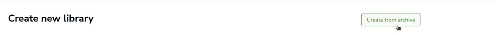

Drag a **ZIP** file into the box, or click to upload. Upload ZIP files (**Max 5GB**). Then fill in **Library name**, **Organization**, and **Library ID**, and click **Create**.

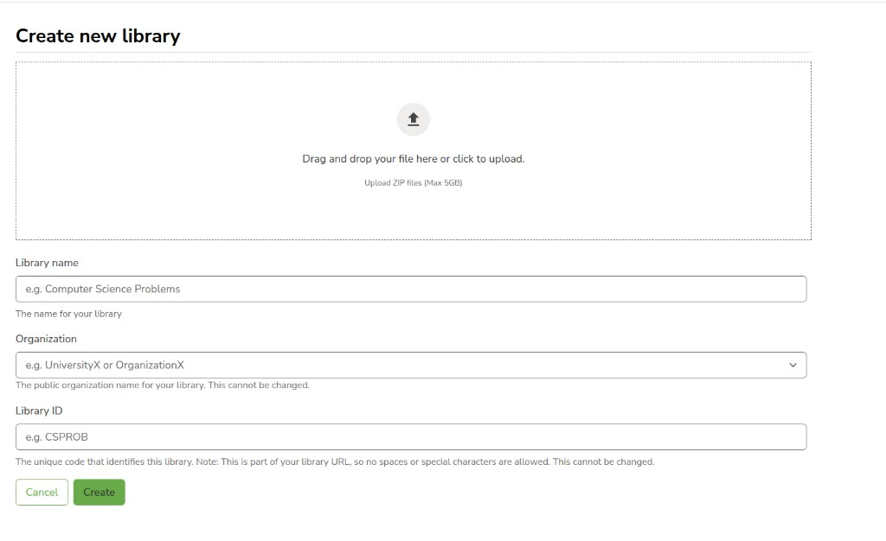

A backup does not include edit history or team access. Anyone who has the file can see the content. You restore it as a **new** library on this site or another site.

---

## How to explore a library {: #explore-library }

explore library search filter tags type publish status recently modified library info new add content

On **Studio home**, click **Libraries**. Search by name. **Name A-Z** sorts the list. The count (for example **Showing 5 of 5**) is how many libraries match.

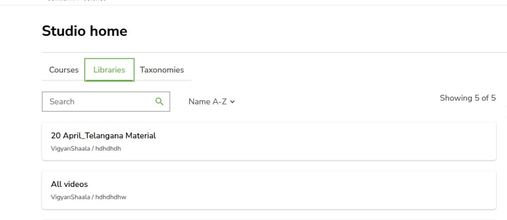

Click **Name A-Z** to change the order: **Name A-Z**, **Name Z-A**, **Newest**, or **Oldest**.

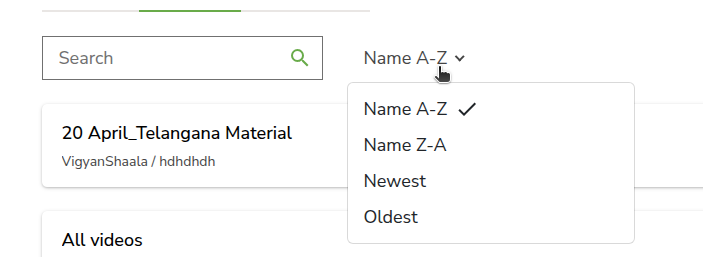

Click a library card to open it (for example **20 April_Telangana Material**).

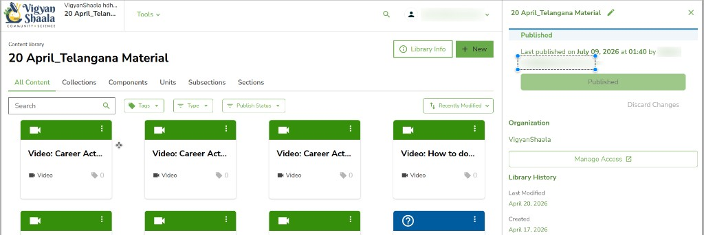

This is the library home. Tabs split the content:

- **All Content** — everything
- **Collections** — groups of items
- **Components** — single blocks (video, problem, text)
- **Units**, **Subsections**, **Sections** — the same layers you use in a course

**Library Info** opens the right-hand panel. **+ New** adds content.

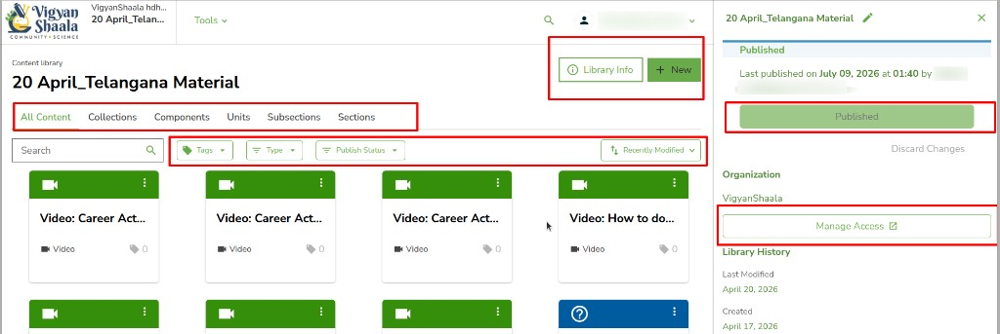

**Collections**

If none exist yet: **You have not added any collections to this library yet.** Click **+ Add collection**.

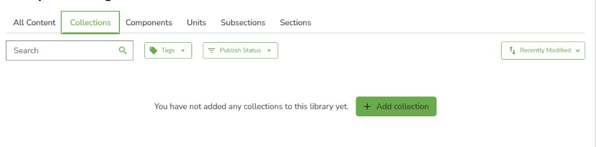

**Components**

Cards show the title, type (for example **Video**), tag count, and a three-dot menu.

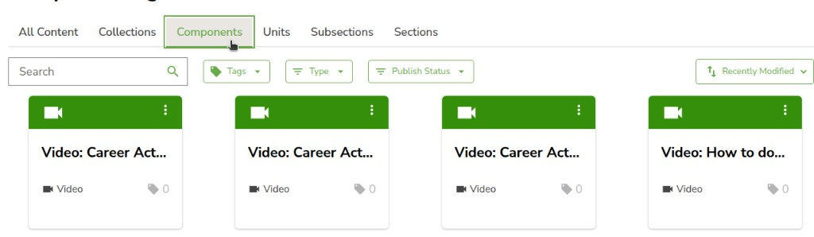

**Units**, **Subsections**, and **Sections**

If that layer is empty: **You have not added any content to this library yet.** Click **+ Add component**.

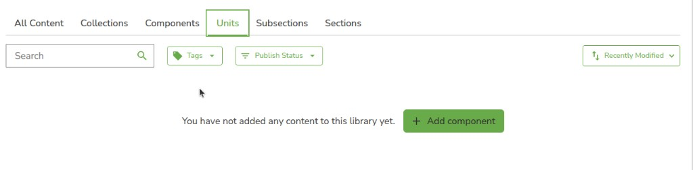

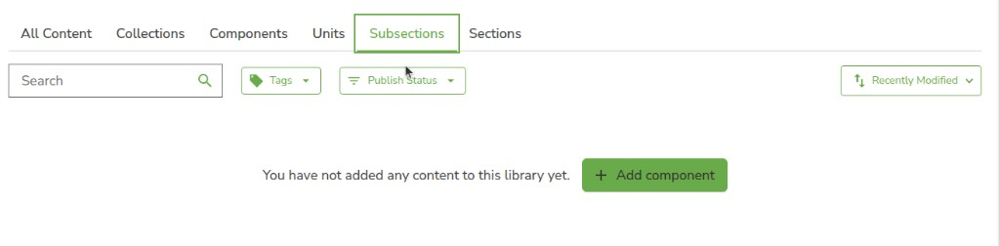

**+ New**

Click **+ New**.

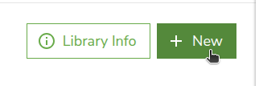

The box is **Add Content**. Close it with **X**.

Top group (structure): **Collection**, **Section**, **Subsection**, **Unit**.

Bottom group (blocks): **Text**, **Problem**, **Open Response**, **Drag Drop**, **Video**, **Advanced / Other**, **Paste From Clipboard**.

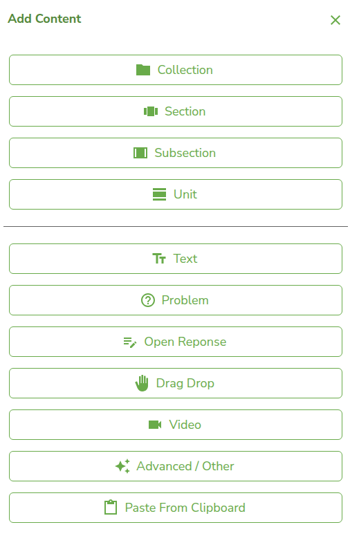

**Library Info**

Click **Library Info**.

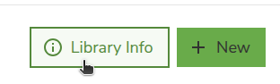

The panel shows the library name (pencil icon to rename), **Published** status, last published date, **Organization**, **Manage Access**, and **Library History** (**Last Modified** and **Created**). **Discard Changes** is available only when there are unpublished edits. Click **Manage Access** to open [Library Team Management](#library-team).

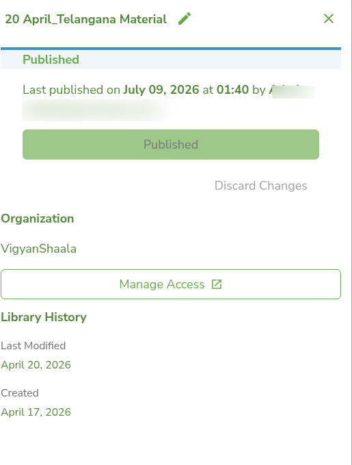

**Search and filters**

On the library home, type in **Search**. Then use:

**Publish Status** — **Published**, **Modified since publish**, **Never published**. Each option shows a count.

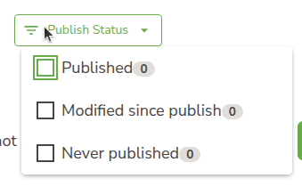

**Type** — for example **Lti**, **Pdf**, **Problem**, **Video**. **Problem** can open a further list of problem kinds.

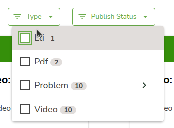

**Recently Modified** opens **Sort By**: **Recently Modified**, **Recently Published**, **Title, A-Z**, **Title, Z-A**, **Newest**, **Oldest**.

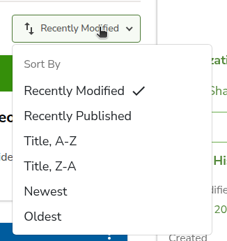

**Tags** filters by taxonomy tags you assigned.

---

## Library Team Management {: #library-team }

library team management manage access add new team member add new role library admin author contributor user permissions allow public read

Library access is separate from course access. A change here applies only to this library.

From **Library Info**, click **Manage Access**. Breadcrumb: **Manage Access / Library Team Management**. The library ID is under the title (for example **lib:VigyanShaala:hdhdhdh**).

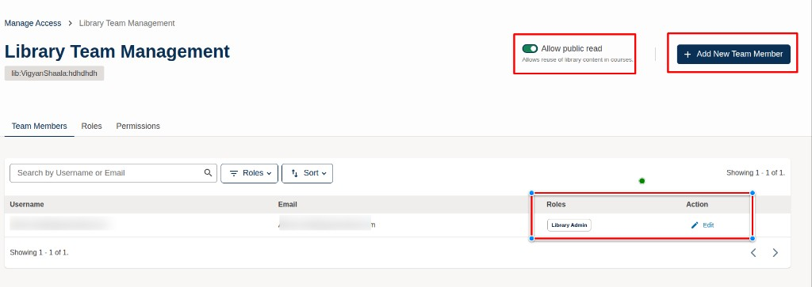

**Allow public read** lets other course authors reuse this library in courses. Turn it on when the library should be shared.

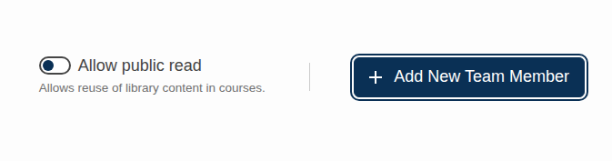

Tabs: **Team Members**, **Roles**, **Permissions**. Only a **Library Admin** (or a site admin) can add people or change roles.

**Team Members**

**Search by Username or Email** finds a person. **Roles** filters the table: **Library Admin**, **Library Author**, **Library Contributor**, **Library User**.

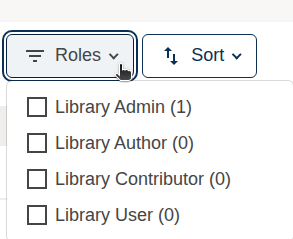

**Sort** orders the table **Name A-Z** or **Name Z-A**.

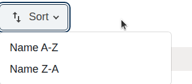

The table columns are **Username**, **Email**, **Roles**, and **Action**. Click **Edit** (pencil icon) to change that person’s role.

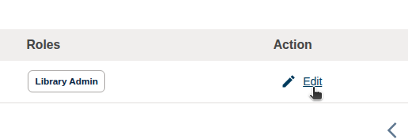

**+ Add New Team Member**

Click **+ Add New Team Member**. The box says: Add new members to this library's team and assign them a role to define their permissions.

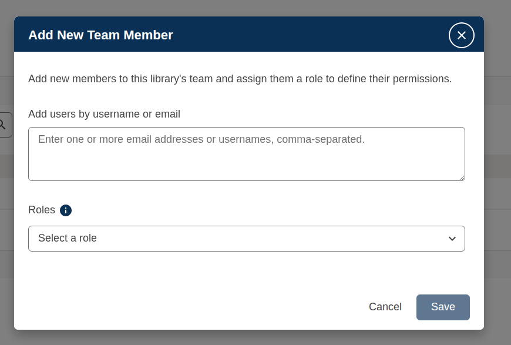

**Add users by username or email** — enter one or more email addresses or usernames, comma-separated. They must already have an account.

**Roles** — click **Select a role**, then **Library Admin**, **Library Author**, **Library Contributor**, or **Library User**.

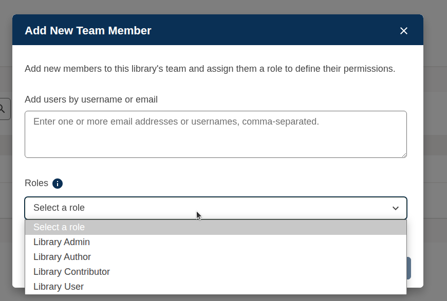

Click **Save**. **Cancel** closes without adding anyone. After save, they appear in the table.

**+ Add New Role** (after **Edit**)

On the person’s page, click **+ Add New Role**. Under **Roles**, pick the extra role, then save.

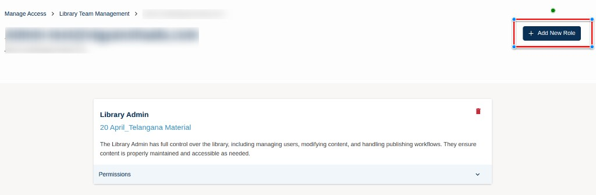

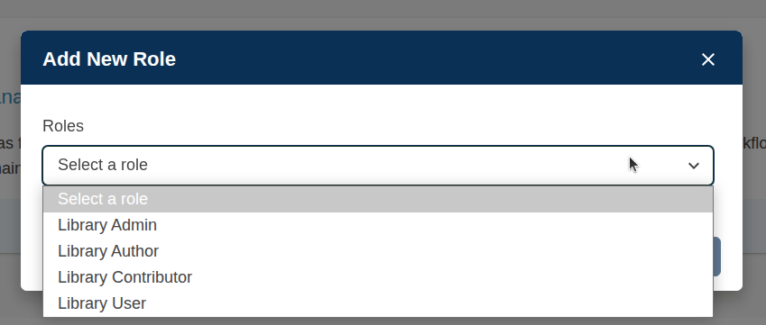

A role card (for example **Library Admin**) summarises what that role can do. The trash icon removes that role. If you remove their last role, they lose access to this library.

**Roles** tab

Click **Roles** to read all four roles at once.

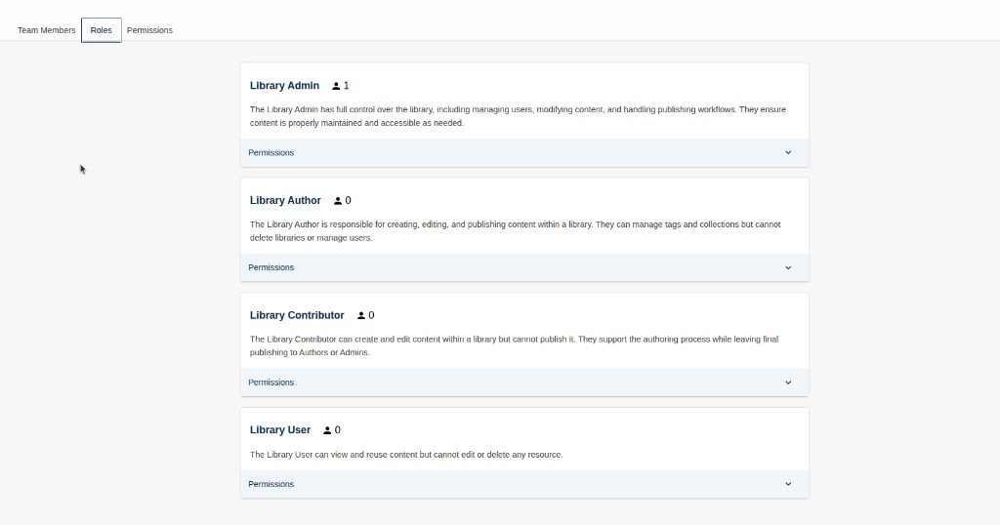

- **Library Admin** — full control: users, content, and publishing
- **Library Author** — create, edit, and publish; manage tags and collections; cannot delete the library or manage users
- **Library Contributor** — create and edit; cannot publish
- **Library User** — view and reuse; cannot edit or delete

Open **Permissions** on a card to see the detailed list.

**Permissions** tab

Click **Permissions** for the full grid. A check means that role can do the action. An X means it cannot.

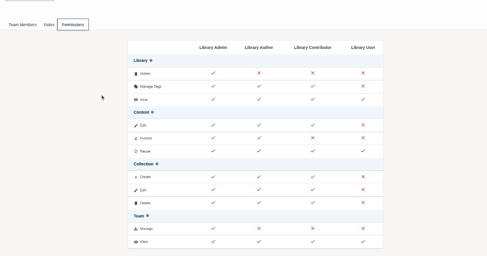

In short: only **Library Admin** can **Delete** the library and **Manage** the team. **Admin** and **Author** can **Publish**. **Admin**, **Author**, and **Contributor** can **Edit** content and manage collections. Every role can **View** and **Reuse**.

---

## Library Backup {: #library-backup }

library backup tools back up to local archive download library backup

Use a backup to keep a copy on your computer, or to create the same library on another site.

On the library home, click **Tools**, then **Back up to local archive**.

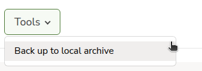

The page title is **Library Backup**.

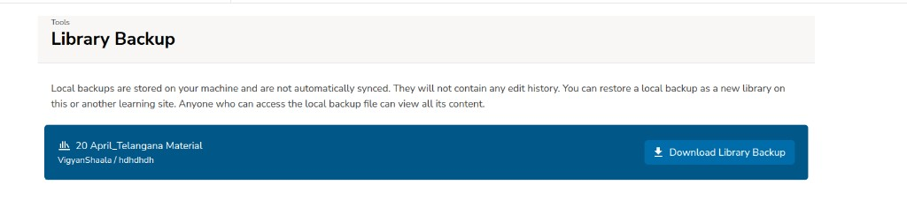

Local backups are stored on your machine and are not automatically synced. They will not contain any edit history. You can restore a local backup as a new library on this or another learning site. Anyone who can access the local backup file can view all its content.

Click **Download Library Backup** on the library banner. To restore, use **Create from archive** on [How to create a library](#create-library).

