---
hide:
  - navigation
  - toc
---

# TAS Admin panel

**TAS Admin panel** is where you make assignment templates: the type, the rubric, the image, and the fields learners fill in. Open it from Control Hub **NAVIGATION**. It opens in a **new tab**. After a template is ready, add it to a course in Studio as a **Template Based Assignment**.

## How to reach TAS Admin panel {: #open }

how to reach tas admin panel overview templates manage types new type

In Control Hub, under **NAVIGATION**, click **TAS Admin panel**. It opens in a new tab.

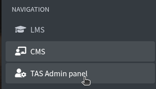

The first page is **Templates**. The count (for example **16 of 16 templates**) is under the title.

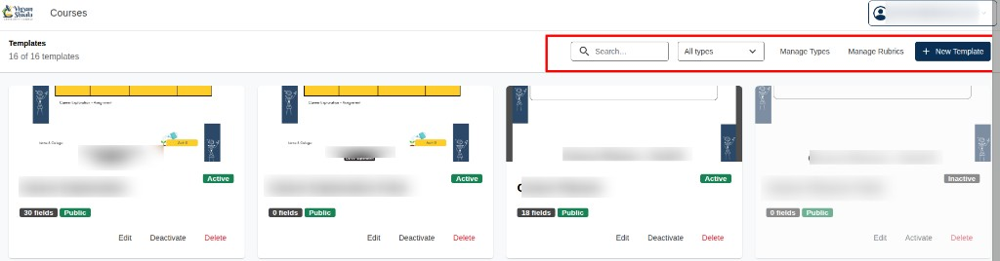

At the top right:

- **Search...** — find a template by name
- **All types** — show every type, or pick one type
- **Manage Types** — add or edit types
- **Manage Rubrics** — add or edit rubrics
- **+ New Template** — start a new template

Each card shows a thumbnail, **Active** or **Inactive**, how many **fields**, and **Public**. On the card: **Edit**, **Deactivate** or **Activate**, and **Delete**.

On **Templates**, click **Manage Types**. You see **Existing Types**.

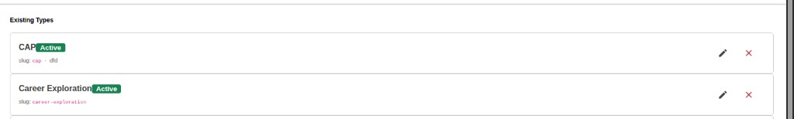

Each type shows **Active**, its **slug**, a pencil icon to edit, and a red X icon to delete.

Click **New Type**. Breadcrumb: **Templates / Template Types**.

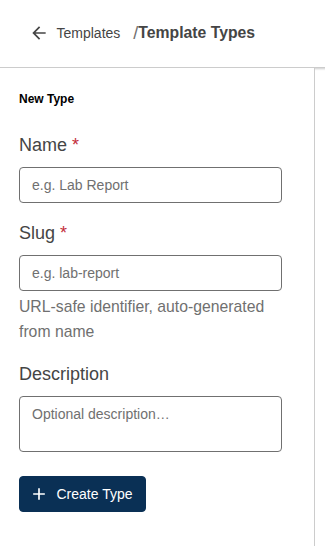

Fill in:

- **Name \*** — required. Placeholder **e.g. Lab Report**
- **Slug \*** — required. Placeholder **e.g. lab-report**. The hint is **URL-safe identifier, auto-generated from name**. You can edit it if you need to.
- **Description** — optional. Placeholder **Optional description…**

Click **+ Create Type**. The new type appears under **Existing Types** and in **All types** on **Templates**.

---

## Manage Rubrics {: #manage-rubrics }

manage rubrics new rubric categories add category criteria label points category total feedback create rubric

Click **Manage Rubrics**, then **New Rubric**.

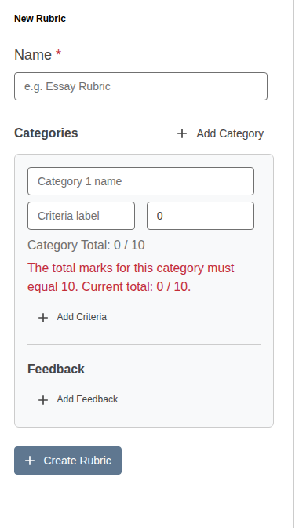

**Name \*** is required. Placeholder **e.g. Essay Rubric**.

Under **Categories**, click **+ Add Category**. Type the category name (placeholder **Category 1 name**).

For each criterion: **Criteria label** and points (the small box, often **0** to start). The line **Category Total: 0 / 10** must reach **10**. If it does not, you see: **The total marks for this category must equal 10. Current total: 0 / 10.**

Click **+ Add Criteria** to add another row. Under **Feedback**, click **+ Add Feedback**.

Click **+ Create Rubric** when the totals are correct.

---

## New Template {: #new-template }

new template name description type image thumbnail fields add label font size max chars position create zoom

On **Templates**, click **+ New Template**. Breadcrumb: **Templates / New Template**.

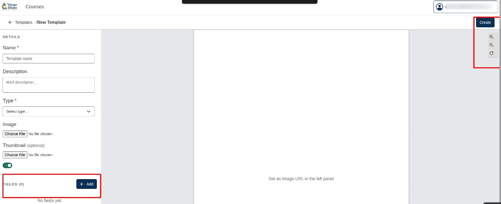

On the left, **DETAILS**:

- **Name \*** — required. Placeholder **Template name**
- **Description** — optional. Placeholder **Brief description...**
- **Type \*** — required. Choose a type from **Manage Types**
- **Image** — **Choose File** for the main picture
- **Thumbnail (optional)** — **Choose File** for a small preview
- The green toggle turns the template on

The centre is the preview. Until you pick an image it says **Set an Image URL in the left panel.**

**Create** saves the template. Use the zoom-in, zoom-out, and reset icons to move around the preview.

Under **FIELDS (0)**, click **+ Add**. The count becomes **FIELDS (1)**. Until you add one, it says **No fields yet.**

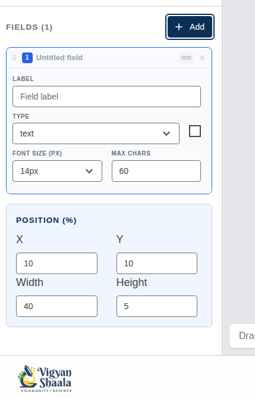

The field starts as **Untitled field**, type **text**. Set:

- **LABEL** — placeholder **Field label**
- **TYPE** — for example **text**
- **FONT SIZE (PX)** — for example **14px**
- **MAX CHARS** — for example **60**

**POSITION (%)** places the box on the image:

- **X** and **Y** — where it starts
- **Width** and **Height** — how large it is

Click **+ Add** again for another field. The **x** icon removes that field. Drag the handle to reorder. Click **Create** when you are done.

---

## How to create Template Based Assignment from Studio {: #create-template-based-assignment }

how to create template based assignment from studio home new section subsection unit advanced select

Open **Studio home**. Click the course you want to add the assignment to.

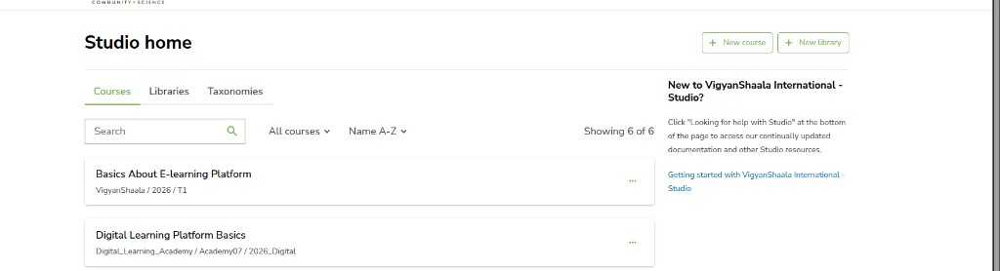

You land on **Course outline**. Click **+ New section**.

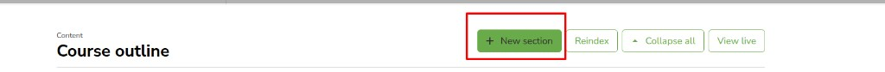

In that section, click **+ New subsection**. You can rename the section and the subsection with the pencil icon next to the name.

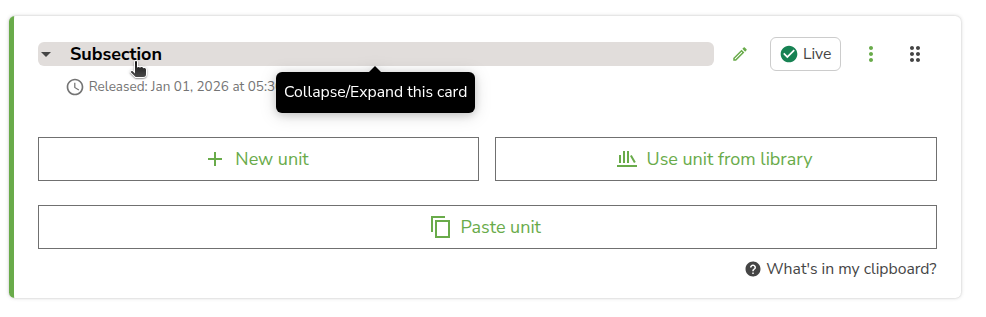

In the subsection, click **+ New unit**.

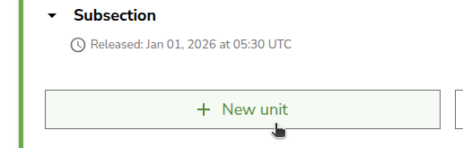

The unit opens. Under **Add a new component**, you see the component list. Click **Advanced**.

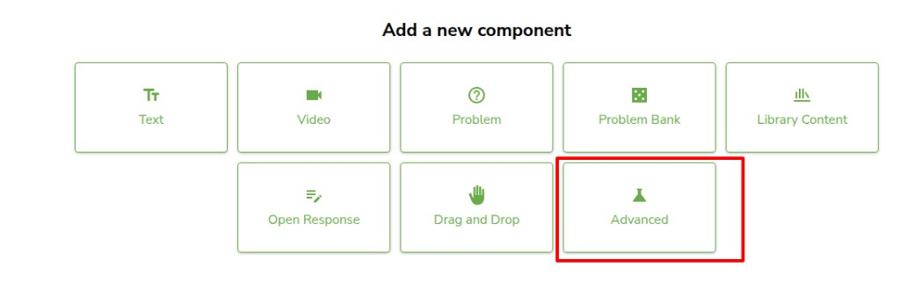

The **Add advanced component** box opens. Select **Template Based Assignment**.

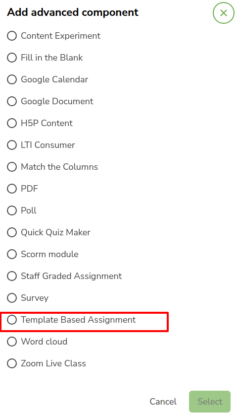

Click **Select**.

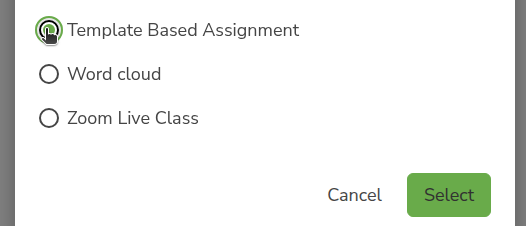

The **Template Based Assignment** block is on the unit. It says **No template selected** until you edit it. See [How to edit Template Based Assignment](#edit-template-based-assignment).

On the component, click the three-dot **Actions** menu: **Manage Access**, **Move**, **Manage tags**, **Copy to Clipboard**, **Duplicate**, or **Delete**. **Delete this component?** is permanent and cannot be undone. Click **Publish** on the unit or learners will not see the assignment in the course.

---

## How to edit Template Based Assignment {: #edit-template-based-assignment }

edit template based assignment pencil icon display name template type template rubric student instructions save

On the **Template Based Assignment** block, click the pencil icon.

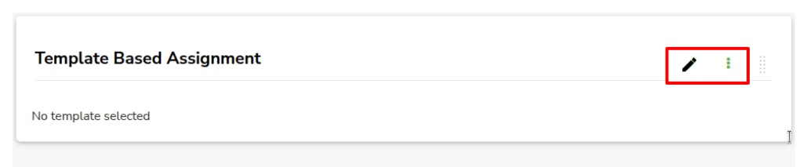

The **Editing: Template Based Assignment** box opens.

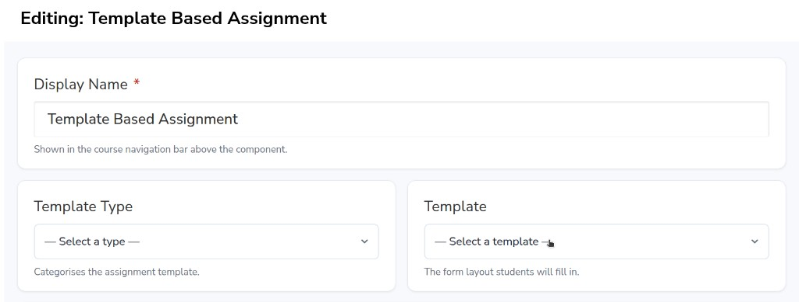

**Display Name \*** is required. It is shown in the course navigation bar above the component.

Click **Template Type** and pick a type. This categorises the assignment template.

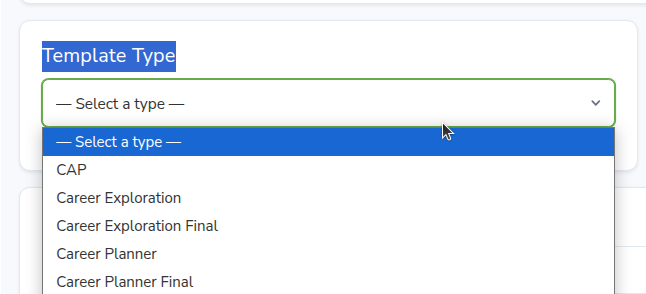

Click **Template** and pick the template you want. This is the form layout students fill in.

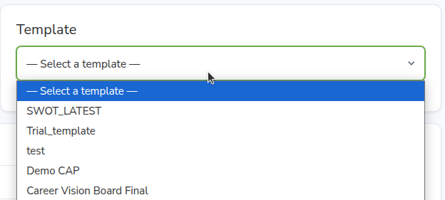

Click **Rubric** and pick a rubric, or leave **— No rubric —**.

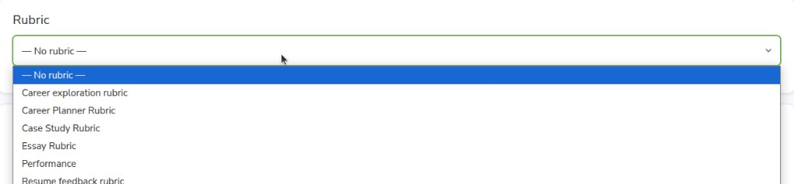

Under **Student Instructions**, type the text learners see before they open the submission form.

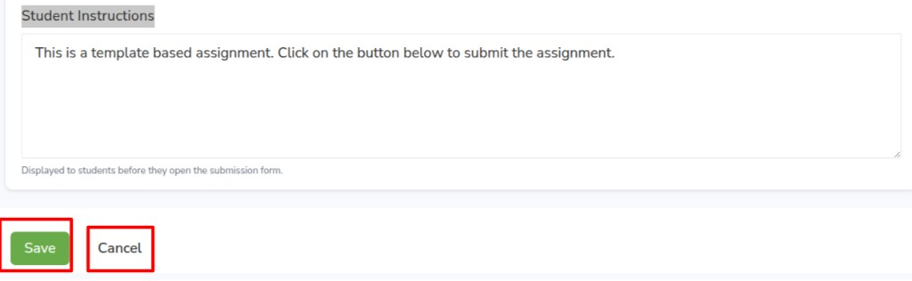

Click **Save**. **Cancel** closes without saving.
