---
hide:
  - navigation
  - toc
---

# User Management

**User Management** is where admins create, find, edit, enroll, export, block, and delete users. Open it from the sidebar **User Management**, or from Dashboard **Manage Users**. The page title is **Manage Users**. The breadcrumb is **Home / Users**.

## Users list {: #users-list }

manage users list search role add users all roles student mentor admin sr no email name phone account activated date joined last login

The top cards show **Total Users**, **Last 24h Active Users**, **Last Week Active Users**, and **Last Month Active Users**.

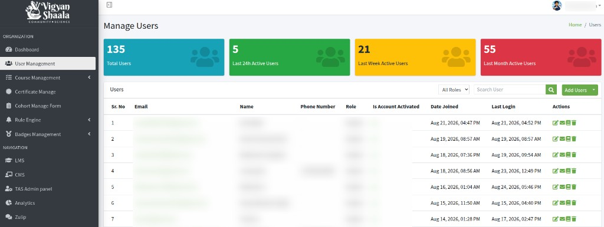

Above the Users table:

- **All Roles** — show everyone, or only **Student**, **Mentor**, or **Admin**
- **Search User** — type email, name, or username, then click the search button

The table updates to matching users.

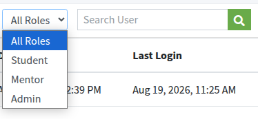

**Add Users** (top right) opens:

- **Add New User**
- **Send Activation Emails**
- **Import User**
- **Download CSV Templates**
- **Export Users CSV**

Each row is one user:

- **Sr. No** — row number
- **Email** — login email (click it to open the same page as **Edit User**)
- **Name** — full name
- **Phone Number** — WhatsApp / mobile number, if saved
- **Role** — **Student**, **Mentor**, or **Admin**
- **Is Account Activated** — whether the account can log in
- **Date Joined** — when the account was created
- **Last Login** — last successful sign-in
- **Actions** — **Edit User**, **Manage Enrollments**, **Enrolled Courses**, **Delete User**

---

## Actions {: #actions }

edit user manage enrollments enrolled courses delete user

In **Actions**, hover an icon to see its name:

1. **Edit User** — pencil icon. Opens that user’s details. See [Edit User](#edit-user).
2. **Manage Enrollments** — envelope icon. Enroll or unenroll this user in courses by course ID. See [Manage Enrollments](#manage-enrollments).
3. **Enrolled Courses** — book icon. Lists the courses the user is already in. You can **Unenroll**. See [Enrolled Courses](#enrolled-courses).
4. **Delete User** — trash icon. Permanently removes the account. See [Delete User](#delete-user).

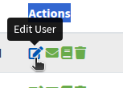

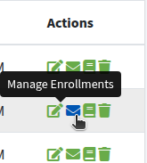

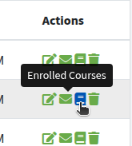

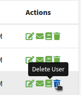

---

## Edit User {: #edit-user }

basic information additional information save user details

Click **Edit User** (or the email).

Breadcrumb: **Home / Users / (name)**.

At the top:

- **Enrolled Courses**
- **Manage Enrollments** — see [Manage Enrollments](#manage-enrollments)

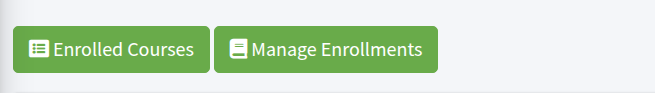

**Basic Information** (left) — **Full Name**, **Email**, **Phone Number** (include country code, for example `+9198XXXXXXXX`), **Gender**, **Role**. Click **Save**.

**Additional information** (right) — **Email verified**, **Signed up**, **Latest login**, **Active this month**.

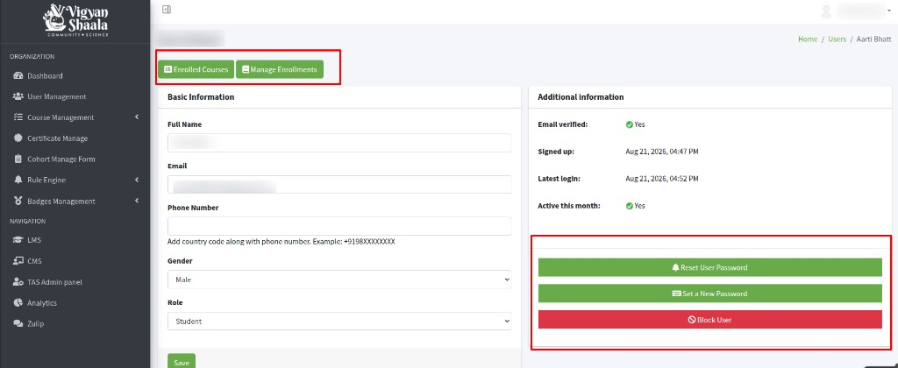

---

## Reset User Password {: #reset-password }

reset user password email

On the user details page (same as **Edit User**), click **Reset User Password**.

The user receives an email with instructions to set a new password, then can log in.

---

## Set a New Password {: #set-password }

set a new password confirm password save

On the same user details page, click **Set a New Password**.

Enter **New Password** and **Confirm Password**, then **Save**.

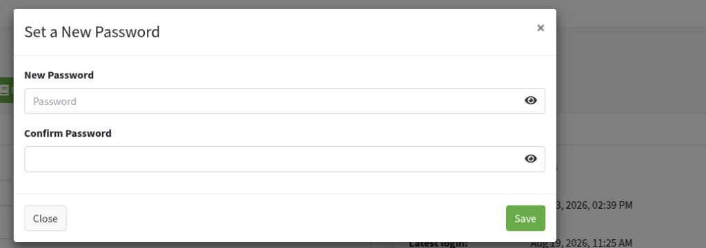

The user also receives an email with the new password and a login link. They can log in with that password, then change it later from **Account**.

Click **Close** or **x** to cancel without saving.

---

## Block User {: #block-user }

block user unblock confirm user block

On the same user details page, click **Block User** if the account must not access the platform.

A **Confirm User Block** box asks: **Are you sure you want to block this user?** Blocking prevents login to the LMS until an administrator unblocks them.

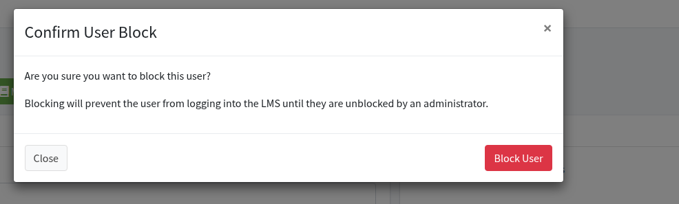

- **Block User** — lock the account
- **Close** or **x** — cancel

If the user is already blocked, the button is **Unblock User**.

---

## Additional Profile Information {: #additional-profile }

additional profile information save additional information

Further down the same user page, **Additional Profile Information** shows extra fields for that person.

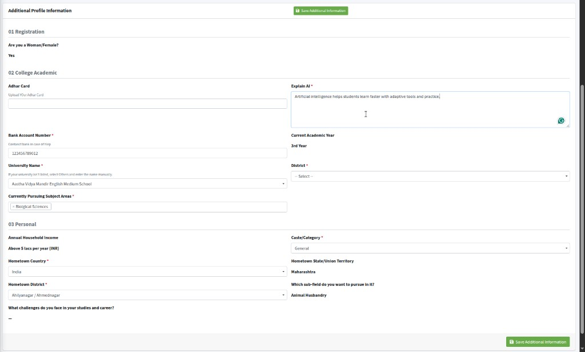

Change what you need, then click **Save Additional Information**. The fields you see depend on the forms linked to this user. They are not the same for every account.

---

## Enrolled Courses {: #enrolled-courses }

enrolled courses unenroll total enrollments

Click **Enrolled Courses** (from **Actions**, or from the user details page).

Title: **Enrolled Courses for (name)**. Breadcrumb: **Home / Users / Enrolled Courses**.

Cards show **Total Enrollments**, **Last 24h Enrollments**, **Last Week Enrollments**, and **Certificates Issued**.

The table lists each course: **Course Name**, **Course ID**, **Enrollment Date**, and **Actions**.

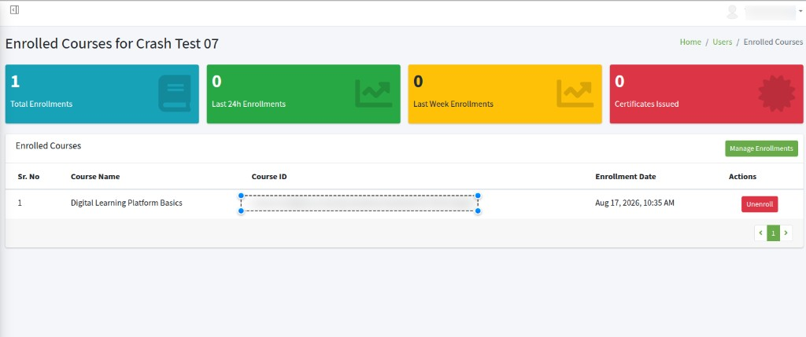

Click **Unenroll** to remove that user’s access to that course.

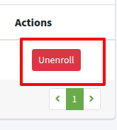

**Manage Enrollments** on this page opens batch enroll / unenroll for this user. See [Manage Enrollments](#manage-enrollments).

---

## Manage Enrollments — Batch Enrollments for (name) {: #manage-enrollments }

manage enrollments batch enrollment course id send email notification enroll unenroll

Click **Manage Enrollments** for one user.

You can also open it from the user details page or from **Enrolled Courses**.

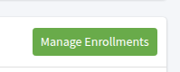

The page title is **Batch Enrollments for (name)**. Breadcrumb: **Home / Users / Enrolled Courses / Manage Enrollments**. Use it to add or remove that person from courses by course ID.

**View Enrolled Courses** (with the user’s email) goes back to that user’s course list.

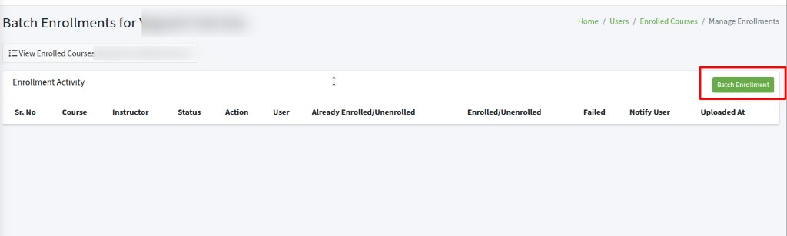

**Enrollment Activity** lists past batch jobs for this user. Click **Batch Enrollment** (top right).

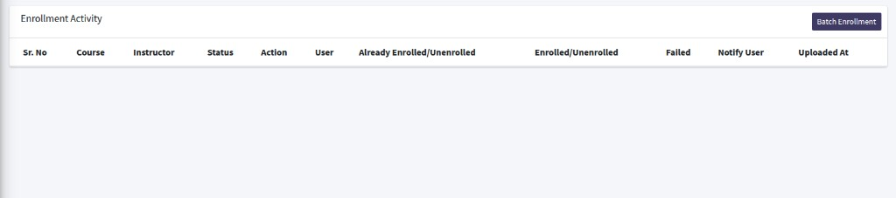

The box is **Batch Enrollment — (name)**.

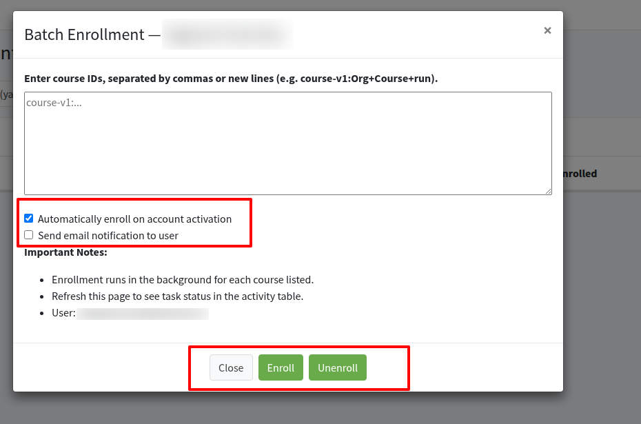

1. Enter course IDs, separated by commas or new lines (for example `course-v1:Org+Course+run`). Each ID you add enrolls this user in that course.
2. **Automatically enroll on account activation** — leave checked so enrollment happens when the account is activated.
3. **Send email notification to user** — check this if the user should get an email about the enrollment (or unenrollment).
4. Click **Enroll** to add the user to those courses, or **Unenroll** to remove them.

**Important Notes**

- Enrollment runs in the background for each course listed.
- Refresh this page to see task status in the activity table.
- **User** shows which account the job is for.

**Close** or **x** cancels without starting a job.

---

## Delete User {: #delete-user }

delete user yes delete it

In **Actions**, click **Delete User**.

The box says **Are you sure you want to delete user?** and **Deleting this user is permanent and cannot be undone.**

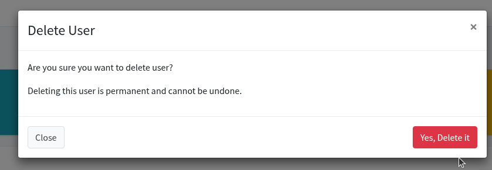

- **Yes, Delete it** — remove the account
- **Close** or **x** — cancel

---

## Add New User {: #add-new-user }

add users create new user automatically activate set password student mentor admin

Click **Add Users** → **Add New User**.

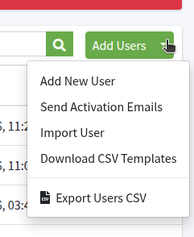

Fill **Create New User**:

- **Full Name**
- **Email address**
- **Mobile Number** (country code, for example `+9198XXXXXXXX`)
- **Select Gender** — **Male**, **Female**, or **Other/Prefer Not to Say**
- **Select Role** — **Student**, **Mentor**, or **Admin**

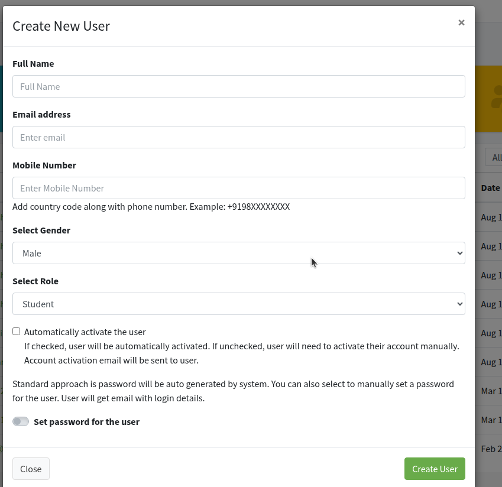

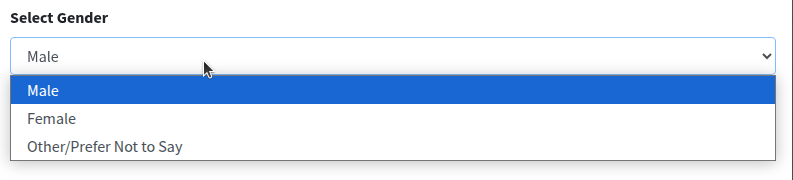

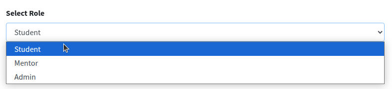

**Automatically activate the user**

- Checked: the account is activated at once.
- Unchecked: the user must activate from email. An activation email is sent.

Password: the system generates one unless you turn on **Set password for the user** and type a password. The user gets an email with login details.

If you do not set a password, the email includes a generated password. The user can log in with it, then set their own password.

Click **Create User**. Click **Close** or **x** to cancel.

---

## Send Activation Emails {: #send-activation-emails }

send activation emails bulk inactive users

Click **Add Users** → **Send Activation Emails**.

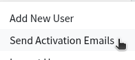

**Bulk Account Activation Email** asks: **Are you sure you want to send account activation emails to all inactive users?**

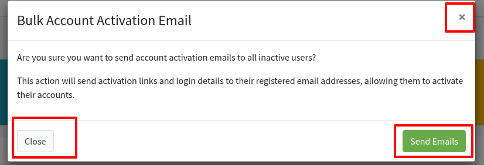

This action will send activation links and login details to their registered email addresses, allowing them to activate their accounts.

- **Send Emails** — send to all inactive users
- **Close** or **x** — cancel

---

## Download CSV Templates {: #download-csv }

download csv templates import format full name email

Click **Add Users** → **Download CSV Templates**. The file downloads. Open it in a spreadsheet.

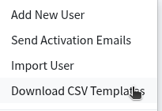

Use this header row (do not change the column names):

**Full Name**, **Email**, **Mobile Number**, **Gender**, **Role**, **Password**

Add one row per person:

- **Full Name** — the person’s name
- **Email** — login email
- **Mobile Number** — WhatsApp number with country code (for example `919988776655`)
- **Gender** — `m` (Male), `f` (Female), or `o` (Other/Prefer Not to Say)
- **Role** — `student`, `mentor`, or `admin`
- **Password** — optional. If you leave it blank, the system creates a password.

Keep the example rows or replace them. Save the file as CSV, then use [Import User](#import-user).

---

## Import User {: #import-user }

import user csv automatically activate enroll in course save

Click **Add Users** → **Import User**.

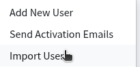

The box is **Import Users Using CSV File**.

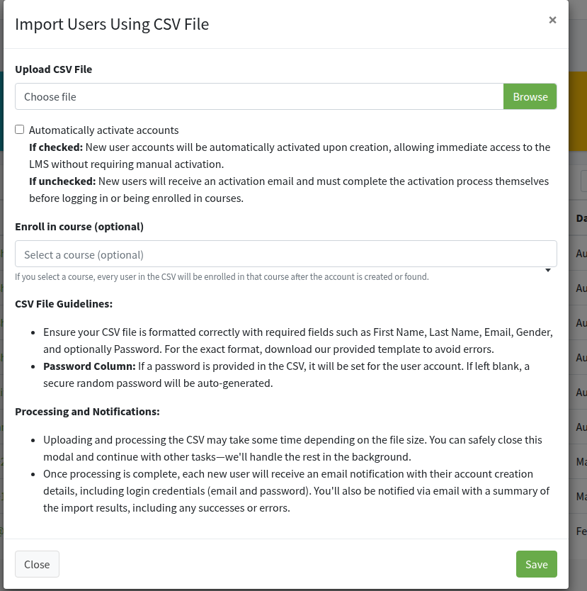

Under **Upload CSV File**, click **Browse** (or **Choose file**) and pick the CSV you filled from the [template](#download-csv). If you click **Save** with no file, the page shows **Please select a file.**

**Automatically activate accounts**

- **If checked:** New user accounts will be automatically activated upon creation, allowing immediate access to the LMS without requiring manual activation.
- **If unchecked:** New users will receive an activation email and must complete the activation process themselves before logging in or being enrolled in courses.

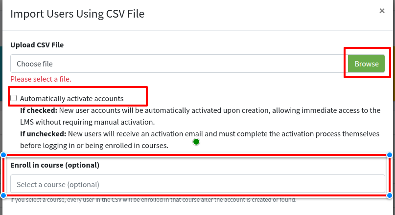

**Enroll in course (optional)** — click **Select a course (optional)** and search (placeholder **Search courses...**). If you select a course, every user in the CSV will be enrolled in that course after the account is created or found.

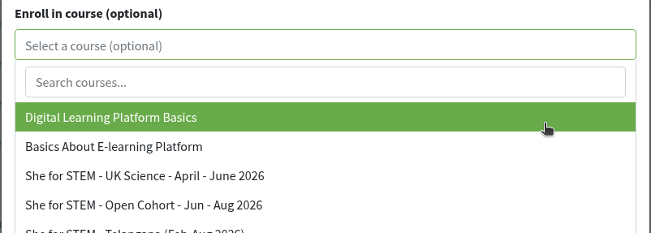

Click **Save**.

**CSV File Guidelines**

Ensure your CSV file is formatted correctly. The on-screen text mentions First Name and Last Name; the downloaded template and import use **Full Name**, **Email**, **Mobile Number**, **Gender**, **Role**, and optionally **Password**. Download the template to avoid errors.

**Password Column:** If a password is provided in the CSV, it will be set for the user account. If left blank, a secure random password will be auto-generated.

**Processing and Notifications**

Uploading and processing the CSV may take some time depending on the file size. You can safely close this modal and continue with other tasks—we'll handle the rest in the background.

Once processing is complete, each new user will receive an email notification with their account creation details, including login credentials (email and password). You'll also be notified via email with a summary of the import results, including any successes or errors.

If you checked **Automatically activate accounts**, those users can log in at once. If you also chose a course, they are enrolled in that course.

**Close** or **x** cancels without importing.

---

## Export Users CSV {: #export-users-csv }

export users csv download all roles search

Click **Add Users** → **Export Users CSV**.

A CSV file downloads. Use **Search User** or **All Roles** first if you only want matching users. If both are empty, the file includes all users (system accounts are left out).

The file always has these columns: **ID**, **Email**, **Name**, **Phone Number**, **Role**, **Is Account Activated**, **Is Account Blocked**, **Date Joined**, **Last Login**. Extra profile columns may appear if they are set up for your site.
