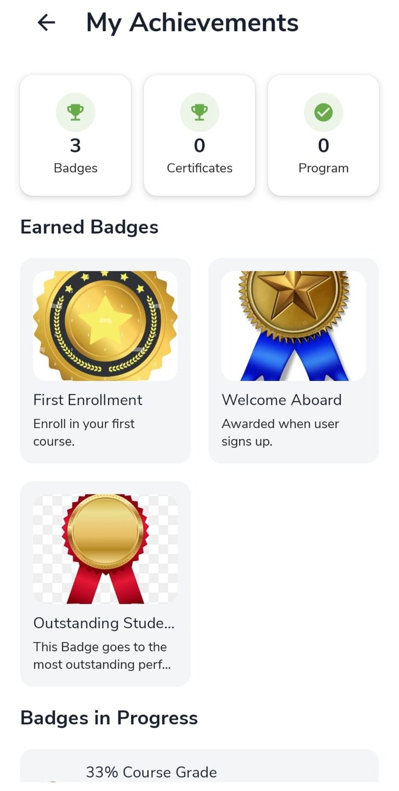
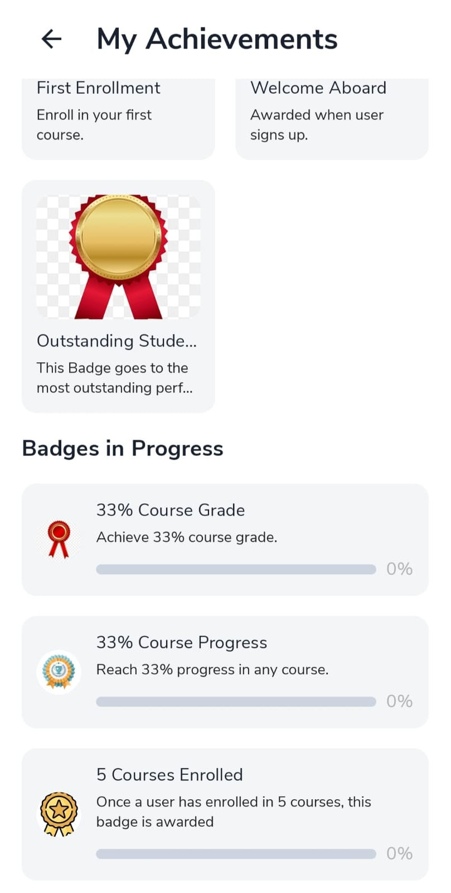

# Achievements

Badges and certificates show what you have completed. Open from [My Learning](my-learning.md) → **My Achievements** → **View All >**.

## My Achievements {: #my-achievements }

- Read counts for **Badges**, **Certificates**, and **Program**.
- Tap a badge under **Earned Badges** or check **Badges in Progress** for goals still open.

When a certificate is ready, it appears in the **Certificates** count. Finish all program requirements to earn one.
