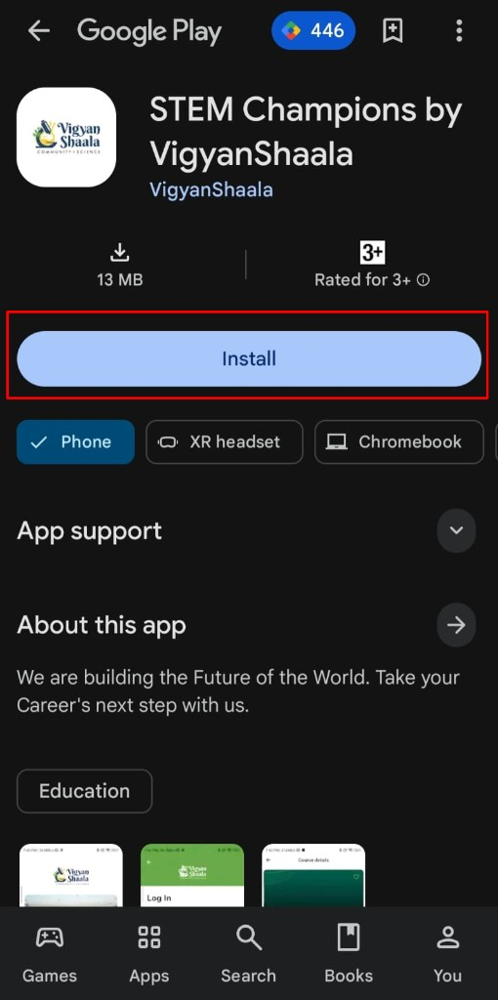
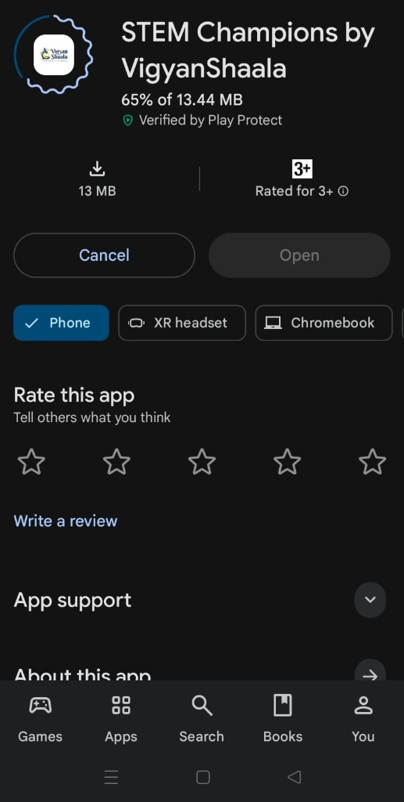
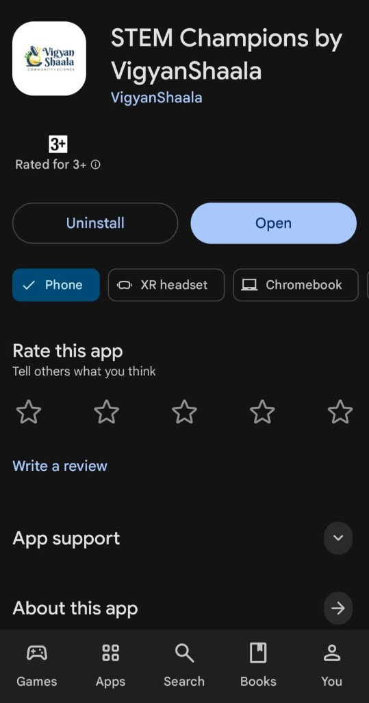

# App Install & Updates

## Install the app {: #install-app }

install the app play store stem champions google download android

Install **STEM Champions by VigyanShaala** from the Google Play Store on your Android phone. You need a Google account on the phone and a stable internet connection for the download.

- Open the Play Store page: [STEM Champions by VigyanShaala](https://play.google.com/store/apps/details?id=org.app.vigyanshaala.stemchampions){ target="_blank" }.
- Tap **Install**.

- Wait while the app downloads. You will see a progress percent (for example 65%). Keep a stable internet connection until it finishes.

---

## Open and sign in {: #open-and-sign-in }

open the app sign in log in welcome play store

When install is complete, open the app from Play Store or from your home screen. The welcome screen has **Log In** and **Sign Up**. Use the account steps if you need help signing in.

- When install is complete, tap **Open**.
- On the welcome screen, use **Log In** or **Sign Up**.
- See [Account & registration](logging-in.md) for email, Google, or create-account steps.

---

## Update the app {: #update-app }

update the app play store new version

Keep the app up to date so you get fixes and new features. When a new version is ready, Play Store may show **Update** instead of **Open**.

- When a new version is ready, you may get a Play Store or app notification.
- Open the Play Store page: [STEM Champions by VigyanShaala](https://play.google.com/store/apps/details?id=org.app.vigyanshaala.stemchampions){ target="_blank" }.
- If an update is waiting, tap **Update** (instead of **Open**).
- Wait until it finishes, then tap **Open**.
- If the update fails, free some storage, check your internet, and try again.
