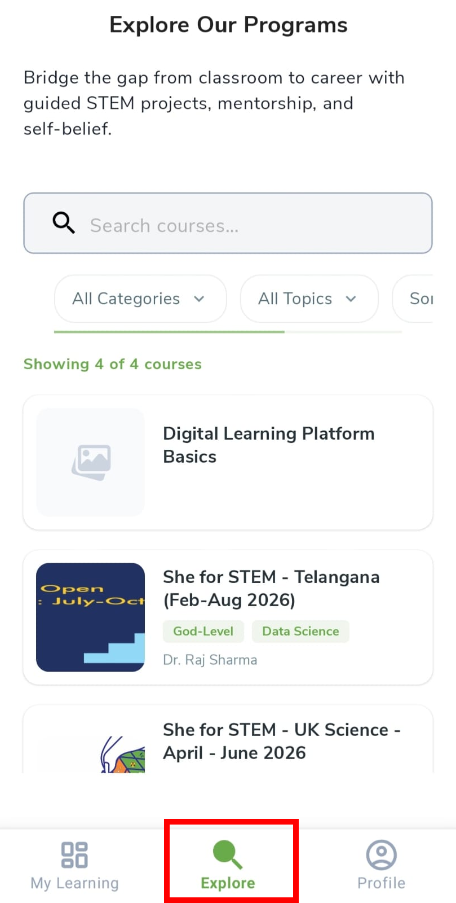
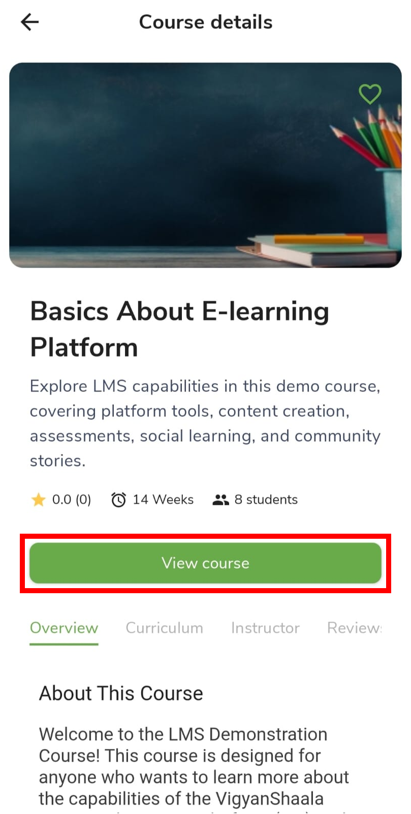

# Explore Programs

## Browse and open a program {: #explore }

After you [log in](logging-in.md), use the **Explore** tab at the bottom to find **programs**. Search or filter, then tap a card to open the details.

- Tap **Explore** in the bottom navigation.
- Use **Search courses…**, **Categories**, **Topics**, and **Sort** to filter.
- Tap a program card to open its details.

!!! note "Programs and courses"
    In this guide we say **program**. In the app you may still see **Course** — both mean the same offering.

---

## Read program details {: #course-details }

The details screen explains what you will learn, who teaches, and what other learners said. Read it before you tap **Apply Now**.

| Tab | What it is for |
|-----|----------------|
| **Overview** | What the program is about |
| **Curriculum** | Lessons and topics |
| **Instructor** | Who teaches or mentors |
| **Review** | Ratings and comments |

- Tap the **heart** to save to your wishlist on [My Learning](my-learning.md).
- Tap **Apply Now** or **Enroll** to join — see [Apply to a Program](enroll-in-a-program.md).
- Tap **View course** when you have already joined.

