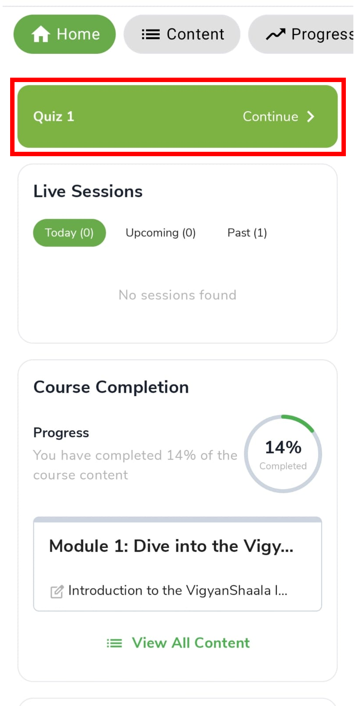
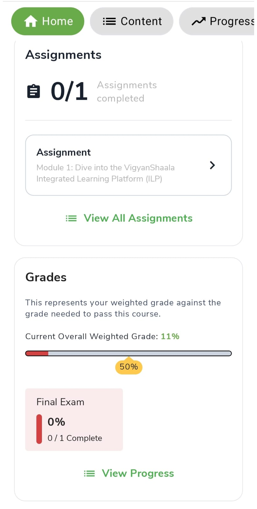
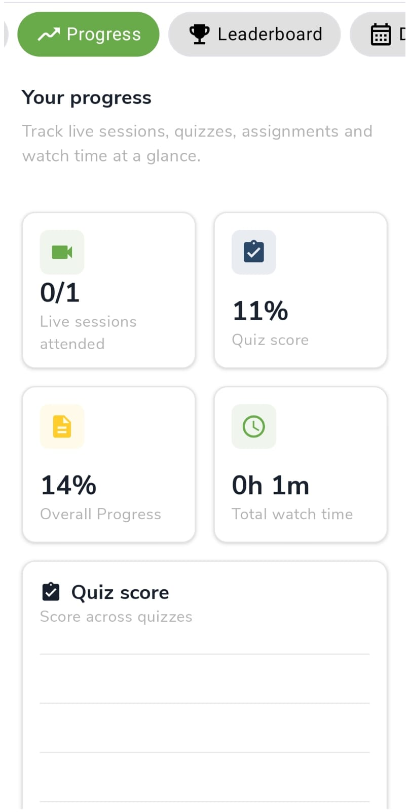
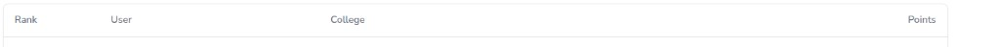
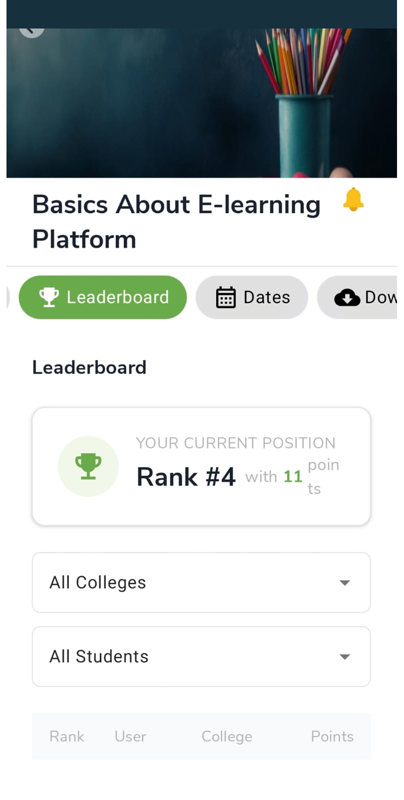
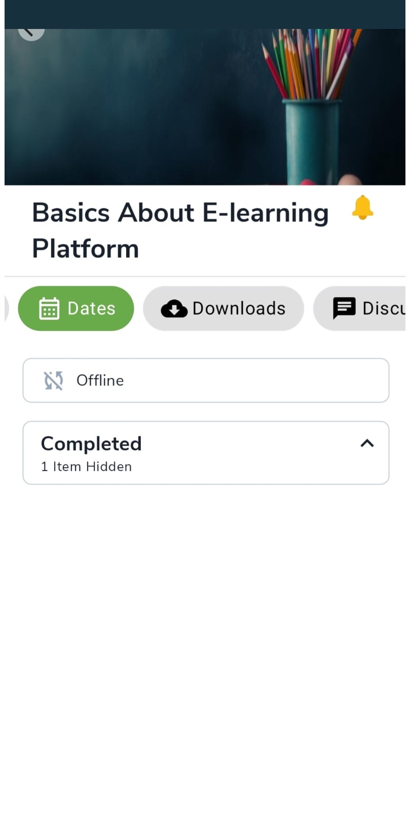
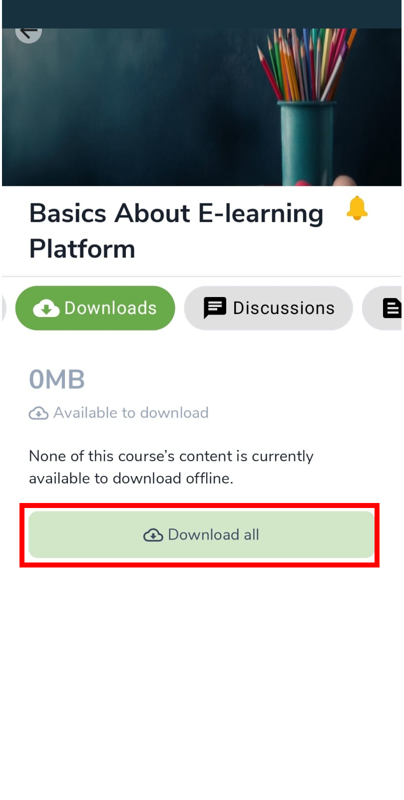
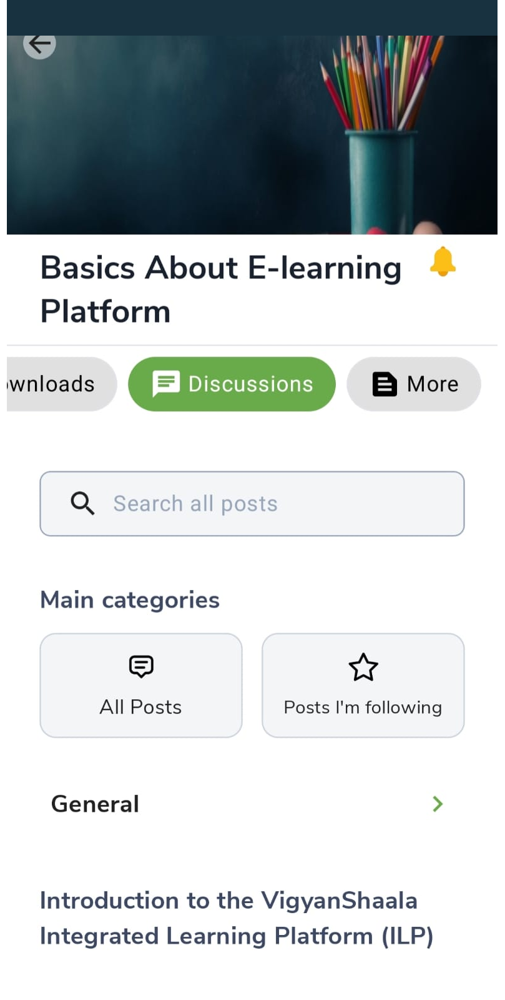
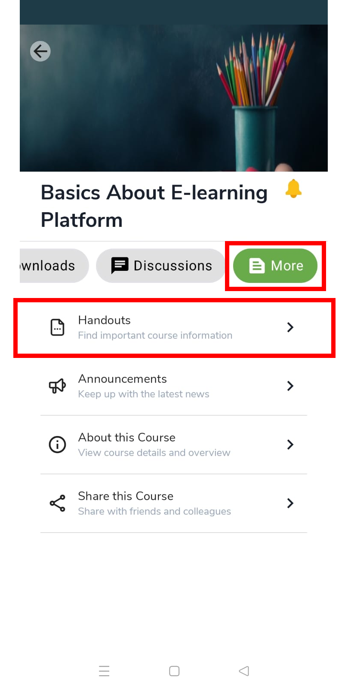

# Inside a Program

## Home {: #home }

Open a program from [My Learning](my-learning.md) or [Explore](explore-programs.md). **Home** is the first tab. It shows where you left off, live sessions, announcements, videos, assignments, and grades.

Swipe across the top tabs: **Home** · **Content** · **Progress** · **Leaderboard** · **Dates** · **Downloads** · **Discussions** · **More**

- Tap the green **Continue** banner to pick up where you left off.
- Check **Live Sessions** (Today / Upcoming / Past), **Course Completion**, **Announcements**, **Videos**, **Assignments**, and **Grades**.

!!! note "Programs and courses"
    In this guide we say **program**. In the app you may still see **Course** — both mean the same offering.

---

## Progress {: #progress }

The **Progress** tab shows how much of the program you have finished. Check it when you want to see attendance, quiz scores, and what is still left to do.

- Four cards: live sessions attended, quiz score, overall progress, total watch time.
- Use this tab to see what you still need to finish.

---

## Leaderboard {: #leaderboard }

The **Leaderboard** shows how you compare with other learners in the program. Points come from lessons, quizzes, and live sessions. Rank **1** is the top of the list.

- See **Your Current Position** and the list of other learners.
- The table columns mean:

| Column | What it means |
|--------|----------------|
| **Rank** | Your place in the list (1 is the top) |
| **User** | The learner's name |
| **College** | The college the learner belongs to |
| **Points** | Score earned from lessons, quizzes, and live sessions |

- Filter by college or students. Keep learning to earn more points.

---

## Dates {: #dates }

The **Dates** tab lists schedule items and milestones for this program. Expand **Completed** if older items are hidden. You can also sync dates to your phone calendar.

- Review schedule items and milestones. Expand **Completed** if items are hidden.
- To sync to your phone calendar: [Dates & Calendar in Settings](profile-and-support.md#calendar).

---

## Downloads {: #downloads }

**Downloads** lets you save program content on your phone for offline use. You can download all listed items, and you can limit downloads to Wi‑Fi in Video settings.

- Tap **Download all** when content is listed for offline use.
- Control Wi‑fi-only downloads under [Video settings](profile-and-support.md#video).

---

## Discussions {: #discussions }

**Discussions** is where you read and post messages about the program. Search, open a topic, or follow posts you want to come back to.

- Search posts, open **All Posts** or **Posts I'm following**, and tap a topic.

---

## More {: #more }

The **More** tab holds extra program tools that do not have their own top tab — files, news, program info, and sharing.

| Option | What it is for |
|--------|----------------|
| **Handouts** | Program files and information |
| **Announcements** | Latest news |
| **About this Course** | Program overview |
| **Share this Course** | Share with others |

