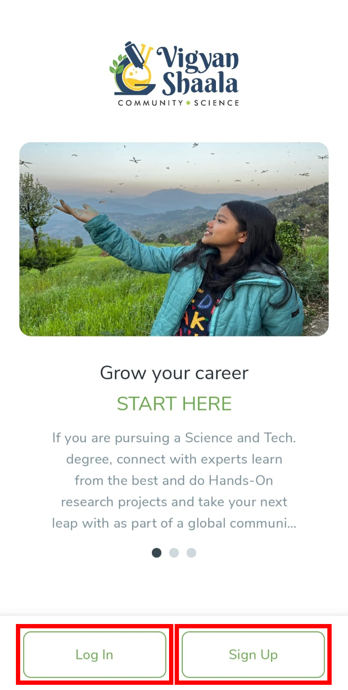
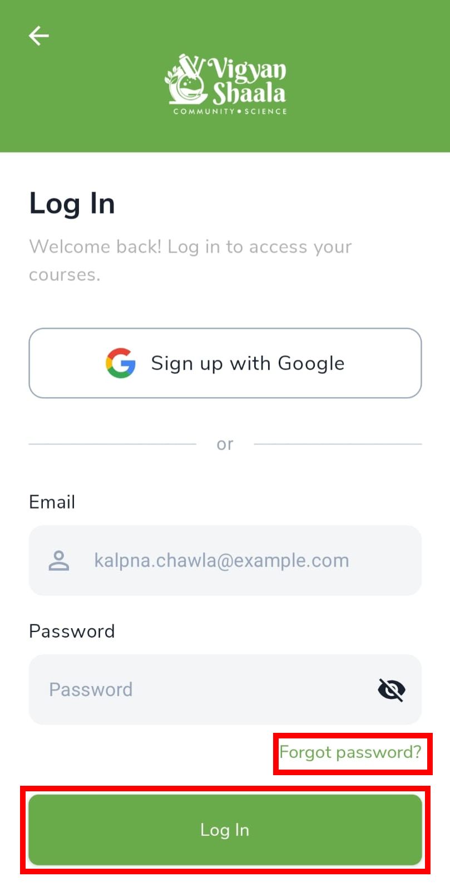
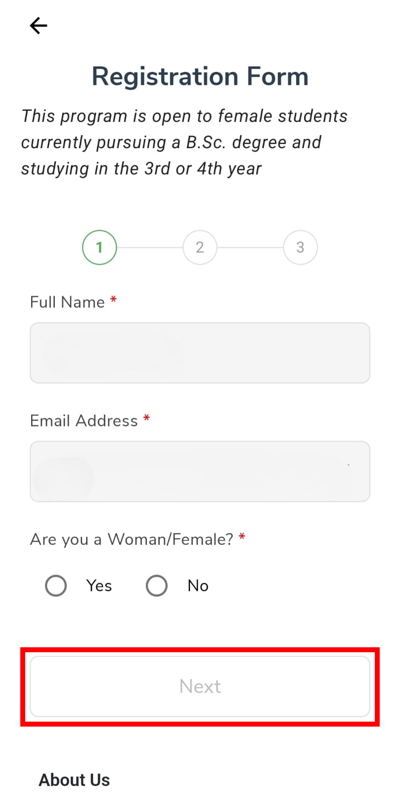
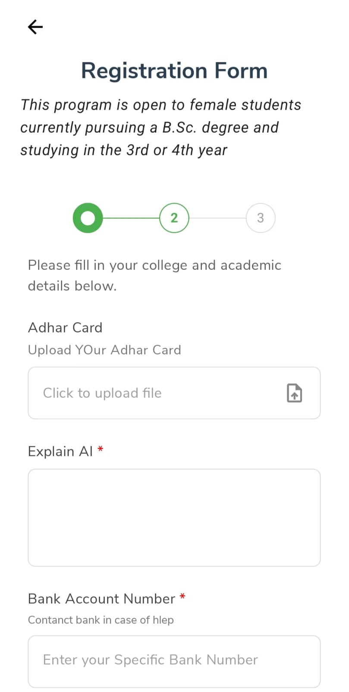
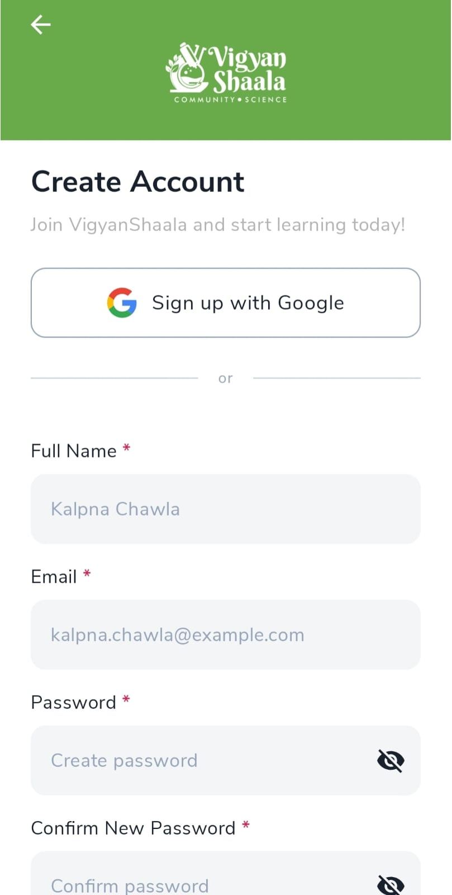
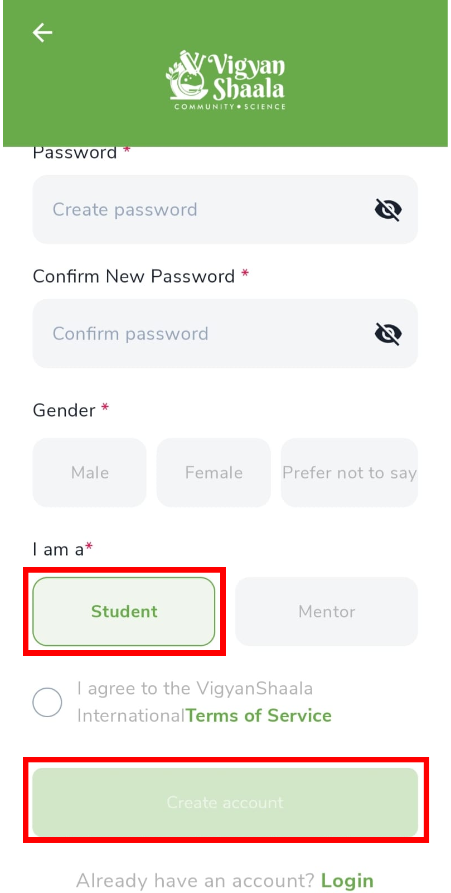

# Logging In

Open the VigyanShaala Android app. On the welcome screen you see **Log In** and **Sign Up**. After you sign in, you go to **My Learning**.

Use one of these ways:

| Way | What it means |
|-----|----------------|
| [Log in](#log-in) | You already have an account |
| [Open Cohort (QR Code)](#cohort-registration) | Scan a QR code and fill the form |
| [Public Signup](#create-account) | Create your account in the app |
| [Curriculum Cohort (pre-registration through partners)](#curriculum-cohort) | A partner created your account and sent you an email ID and password |

## Log in {: #log-in }

- Tap **Log In**, enter **Email** and **Password**, then tap **Log In**.

If you forgot your password, tap **Forgot password?**, follow the email link, then come back and log in.

## Open Cohort (QR Code) {: #cohort-registration }

Your teacher shows a **QR code**. Scan it to open the **Registration Form**. This can create your account and enroll you, or ask you to sign in first.

- Fill every required field. Tap **Next**, then submit.
- Wait for confirmation — you may join straight away, or a teacher may need to approve you first.
- Then [log in](#log-in). The program appears on **My Learning**.

!!! note "Fields can change"
    Teachers can change the questions. Complete every required field shown for your program.

## Public Signup {: #create-account }

- On the welcome screen, tap **Sign Up** (or **Sign up with Google**).
- Fill in **Full Name**, **Email**, **Password**, **Gender**, and choose **Student** (not Mentor).
- Tick **I agree to the Terms of Service**, then tap **Create account**.

!!! warning "Check your email"
    If asked to activate your account, open your inbox and follow the link.

## Curriculum Cohort (pre-registration through partners) {: #curriculum-cohort }

A partner sends you an **email ID** and **password**. Tap **Log In** on the welcome screen, enter those details, and tap **Log In**.
