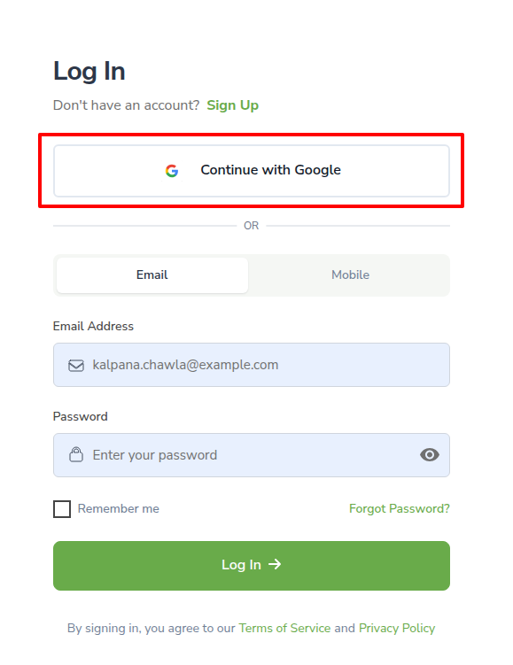
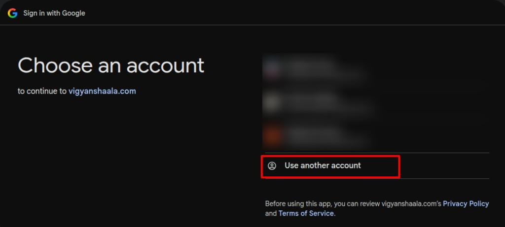

# Account & registration

## Log in with your email id and password {: #log-in-email }

login sign-in signin email password

Use **Log In** when you already have an account. You need the same **email** and **password** you used when you signed up. After a successful sign-in you go to **My Learning**.

Open the VigyanShaala Android app. On the welcome screen, tap **Log In**.

- Enter **Email** and **Password**, then tap **Log In**.
- After a successful login you go to **My Learning**.

---

## Log in with Google SSO {: #log-in-google }

gmail sso google login continue with google

**Continue with Google** lets you sign in with a Google account (such as Gmail) instead of typing a password. Use the same Google account every time so you return to the same programs.

- On the Log In or Sign Up screen, tap **Continue with Google** (or **Sign in with Google**).

- If your Google account is already listed, tap it.
- If it is not listed, tap **Use another account** and add your Google account.

- Allow access. You go to **My Learning** after Google confirms your sign-in.

---

## Forgot password {: #reset-password }

forgot password recover reset

If you cannot sign in, use **Forgot password?** on the Log In screen. A reset link is sent to your email. Set a new password, then come back to the app and log in with it.

- On the Log In screen, tap **Forgot password?**.
- Follow the email link, set a new password, then come back and log in.

---

## Register with a QR code/link {: #cohort-registration }

qr qrcode qr-code scan cohort enrollment

Your teacher shares a **QR code** or a **link**. Scan or open it to start the **Registration Form**. If you are new, this can create your account and enroll you. If you already have an account, sign in first, then submit the form.

- Fill every required field. Tap **Next**, then submit.
- Wait for confirmation — you may join straight away, or a teacher may need to approve you first.
- Then [log in](#log-in-email). The program appears on **My Learning**.

!!! note "Fields can change"
    Teachers can change the questions. Complete every required field shown for your program.

---

## Create your account {: #create-account }

signup sign-up register create account

Create an account if you are new. You need your **full name**, **email**, and a **password**. Choose **Student** (not Mentor). After you create the account, check your email if the app asks you to activate it.

On the welcome screen, tap **Sign Up**.

- Fill in **Full Name**, **Email**, **Password**, **Gender**, and choose **Student** (not Mentor).
- Tick **I agree to the Terms of Service**, then tap **Create account**.

!!! warning "Check your email"
    If asked to activate your account, open your inbox and follow the link.
