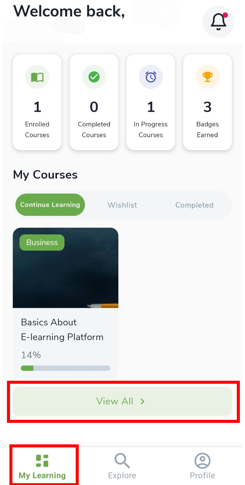
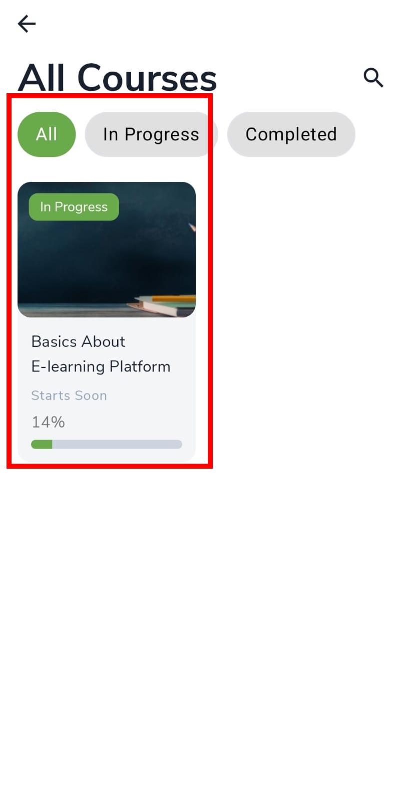
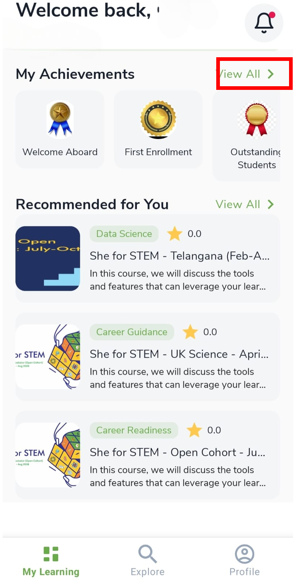
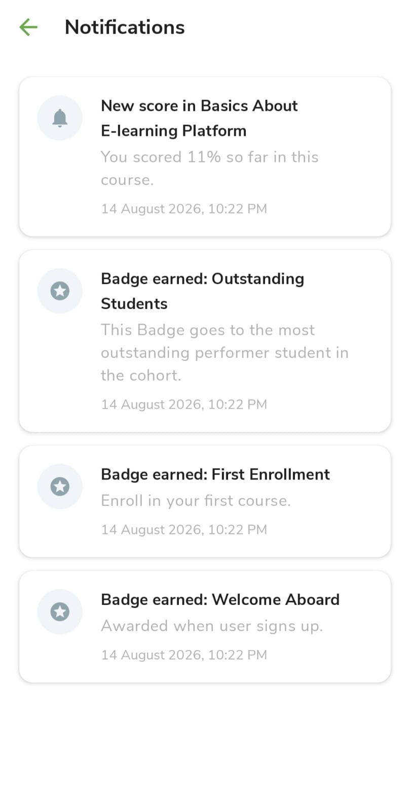

# My Learning

## My Learning overview {: #open-my-learning }

After you [log in](logging-in.md), **My Learning** is your home screen — your programs, progress, badges, and suggestions. Tap **My Learning** in the bottom navigation any time.

Four summary cards at the top:

| Card | What it means |
|------|----------------|
| **Enrolled Courses** | Programs you joined |
| **Completed Courses** | Programs you finished |
| **In Progress Courses** | Programs you started but have not finished |
| **Badges Earned** | Achievement badges |

!!! note "Programs and courses"
    In this guide we say **program**. In the app you may still see **Course** — both mean the same offering.

---

## My Courses tabs {: #my-courses }

**My Courses** groups your programs into tabs. Use **Continue Learning** for active work, **Wishlist** for programs you saved with the heart icon, and **Completed** when you have finished.

| Tab | What you see |
|-----|----------------|
| **Continue Learning** | Active programs with a progress bar |
| **Wishlist** | Programs saved with the heart icon |
| **Completed** | Finished programs |

Tap a card to open it. Tap **View All >** for the full list with **All**, **In Progress**, and **Completed** filters.

---

## Achievements and recommendations {: #lower-sections }

Lower on **My Learning** you see badges you have earned and programs suggested for you. Open **View All >** on achievements for the full list. Recommended programs are only suggestions — you still apply if you want to join.

- **My Achievements** — tap **View All >** (see [Achievements](achievements.md))
- **Recommended for You** — suggested programs

---

## Notifications {: #notifications }

The **bell** (top right) stores messages about scores, badges, reminders, and program updates. Open it when you want to catch up without leaving My Learning.

- Tap the **bell** (top right) for scores, badges, reminders, and program updates.
- Tap a notification to open the related program or page when a link is shown.

