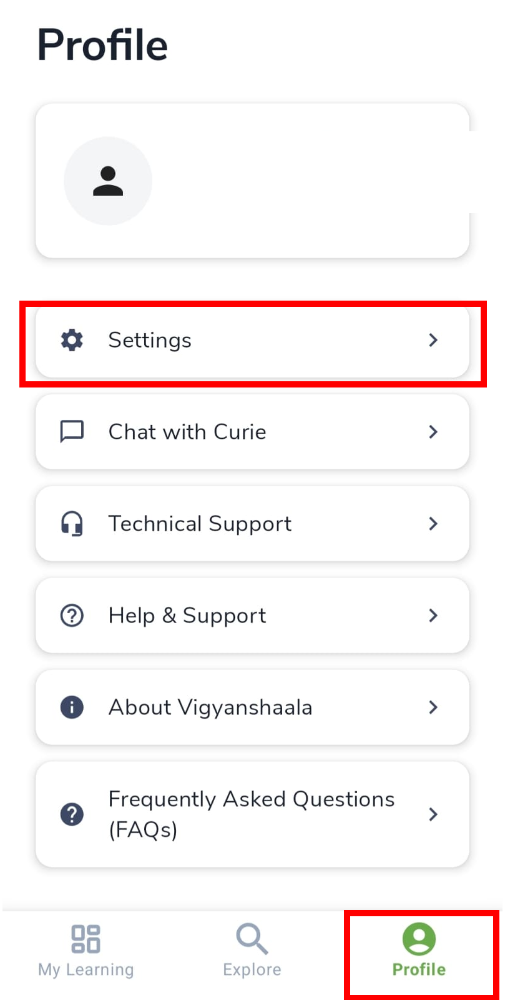
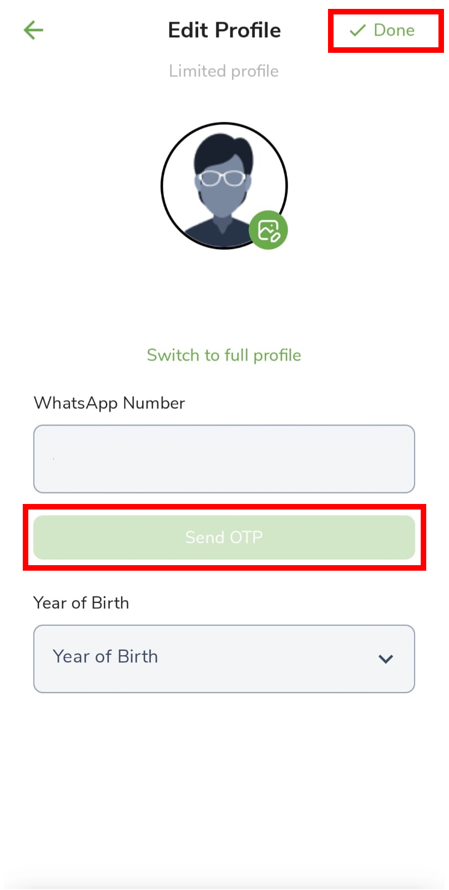
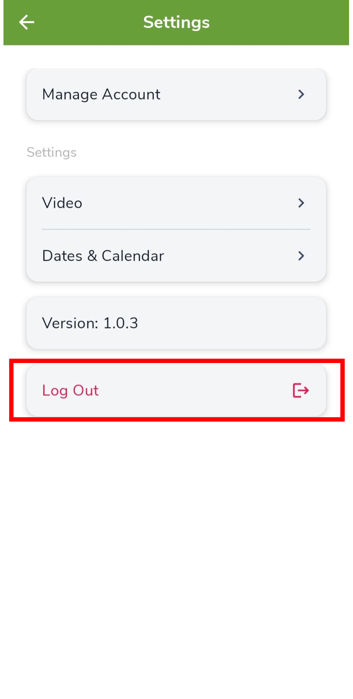
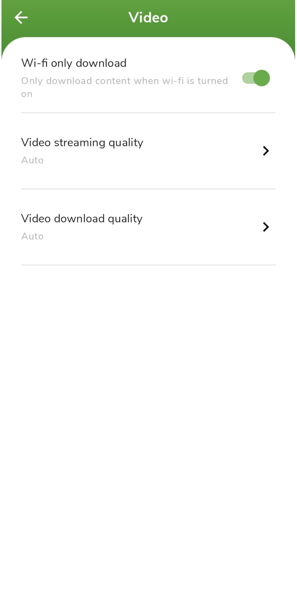
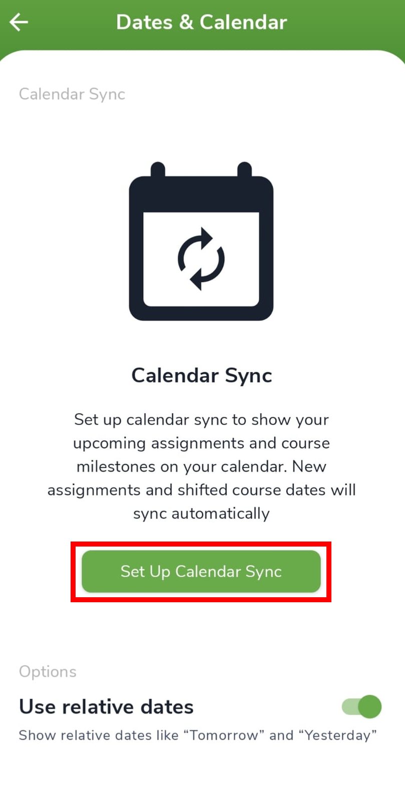
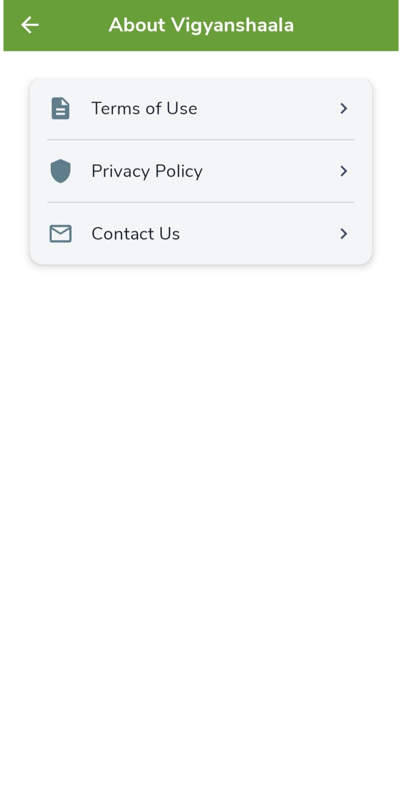

# Profile & Support

## Profile menu {: #profile }

Tap **Profile** in the bottom navigation to manage your account, settings, and help. This menu is the starting point for editing your details, getting support, or logging out.

| Option | What it is for |
|--------|----------------|
| **Settings** | Account, video, calendar, log out |
| **Chat with Curie** | In-app chat help |
| **Technical Support** / **Help & Support** | Get help |
| **About VigyanShaala** | Terms, privacy, contact |
| **FAQs** | Common questions |
| **Log Out** | Sign out |

---

## Edit profile {: #edit-profile }

**Edit Profile** is where you change your photo, name, and WhatsApp number. Save with **Done**. Verifying WhatsApp helps you get reminders.

- Tap the green **pencil** on Profile (or **Settings** → **Manage Account** → **Edit Profile**).
- Change your photo, verify WhatsApp (enter number → **Send OTP** → enter code), and tap **Done** to save.

---

## Settings {: #settings }

**Settings** groups account, video, and calendar options in one place. Open it from the Profile menu.

- **Manage Account** — edit profile or delete account
- **Video** — [streaming and download quality](#video)
- **Dates & Calendar** — [calendar sync](#calendar)
- **Log Out**

---

## Video settings {: #video }

**Video** settings control how lessons stream and download. Use **Wi-fi only download** if you want to avoid using mobile data. **Auto** quality is a good default.

- **Settings** → **Video** → set **Wi-fi only download**, **streaming quality**, and **download quality** (Auto recommended).

---

## Dates & Calendar {: #calendar }

**Dates & Calendar** can add program dates (such as live sessions) to the calendar app on your phone so you get reminders outside this app.

- **Settings** → **Dates & Calendar** → **Set Up Calendar Sync**.

---

## About VigyanShaala {: #about }

**About VigyanShaala** has the legal pages and contact details for the app. Open **Terms of Use**, **Privacy Policy**, or **Contact Us** when you need them.

- **Terms of Use**, **Privacy Policy**, or **Contact Us**.

---

## Log out {: #log-out }

**Log Out** ends your session on this phone. Your account stays active. You can log in again any time with the same email and password (or Google).

- **Profile** → **Log Out**, or **Settings** → **Log Out**.
