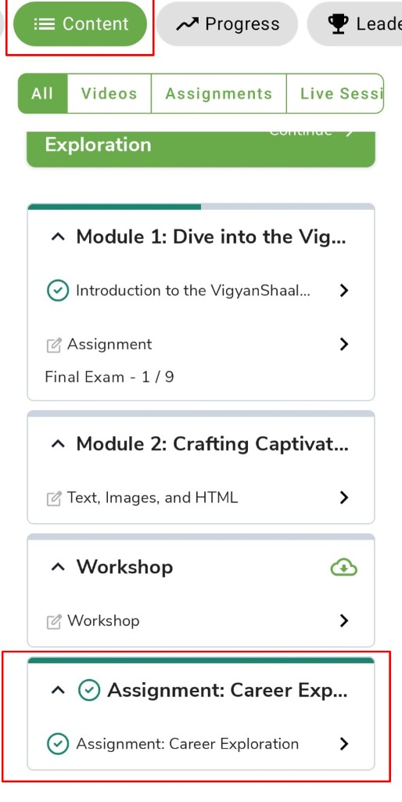
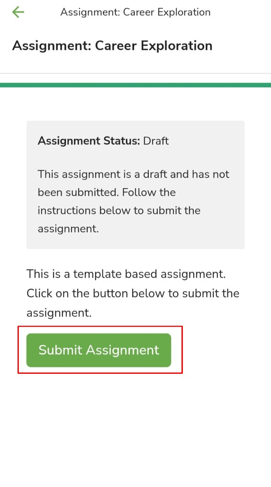
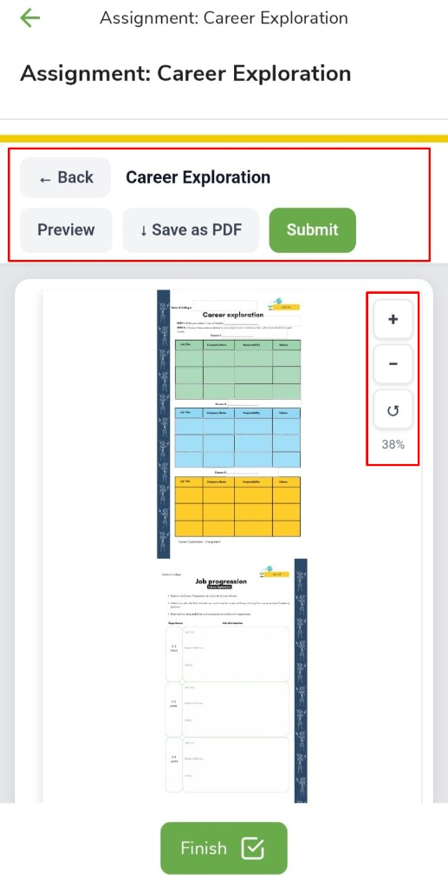
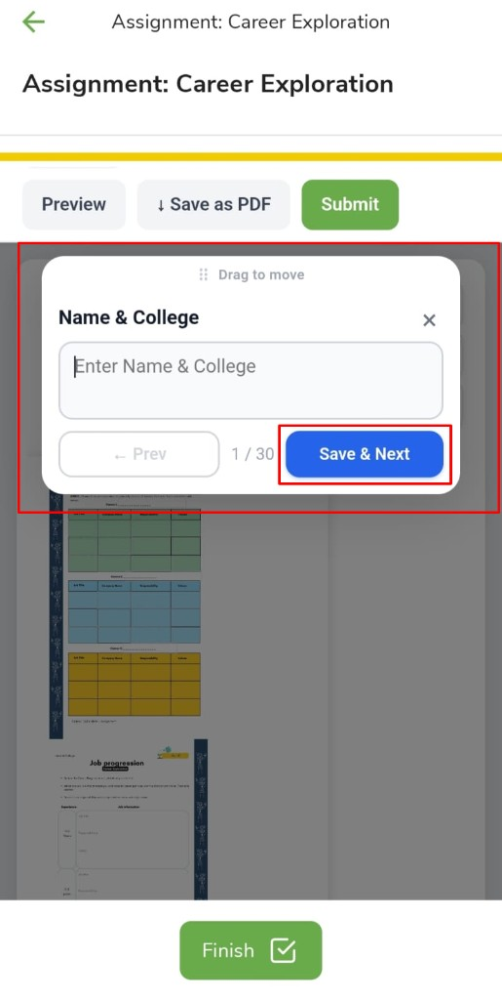
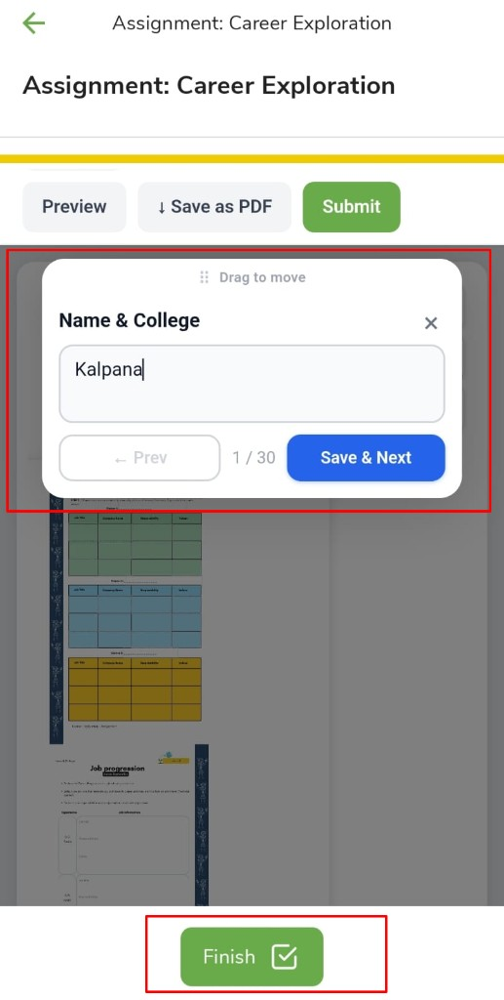
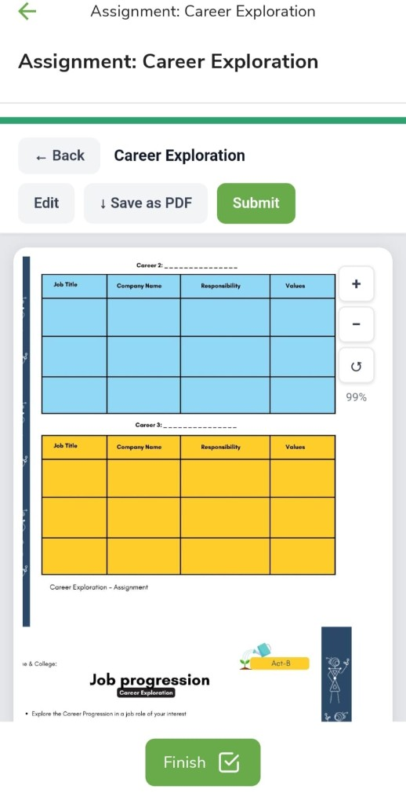
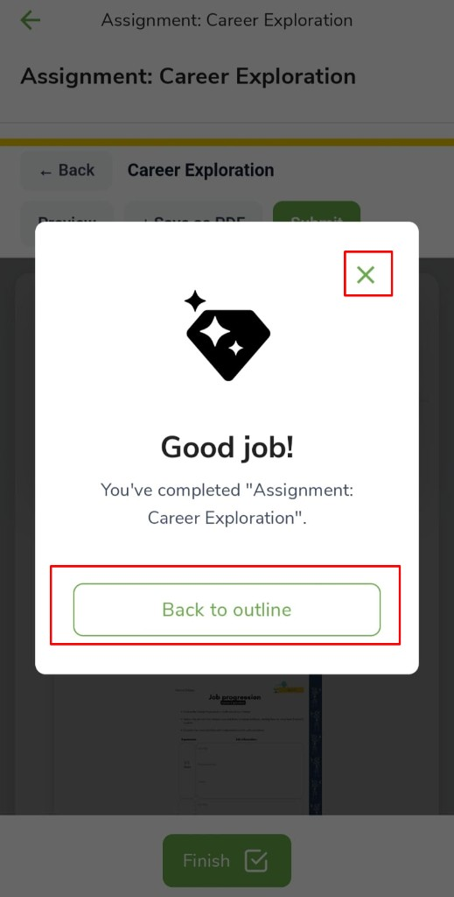

# How to Submit a Template based assignment

assignment submit template based worksheet career exploration save next finish

Some programs include a **template based assignment** (for example **Career Exploration**). Open the program, tap the assignment, fill it in, then submit.

- Open your program from [My Learning](my-learning.md).
- Tap **Content**.
- Tap the **assignment** (for example **Assignment: Career Exploration**).

- When the status is **Draft**, tap **Submit Assignment**.

The assignment opens in edit mode.

- **← Back** returns to the program.
- **Preview** shows how the assignment looks.
- **Save as PDF** downloads a copy.
- **Submit** sends the assignment when you are finished.
- Use **+** and **−** on the right to zoom in or out.
- **Finish** at the bottom when you have filled the boxes.

Tap a box (for example **Name & College**). A window opens so you can type. Add your details, then tap **Save & Next**. The counter (for example **1 / 30**) shows how many boxes you have done. Use **← Prev** to go back one box.

After you add details, tap **Save & Next** again until you are done, then tap **Finish**.

If you need to change answers, tap **Edit**. You can still use **+** and **−** to zoom, and **Save as PDF** or **Submit**.

When you finish, you see **Good job!** Close with **X** to stay on the assignment, or tap **Back to outline** to return to **Content**.

