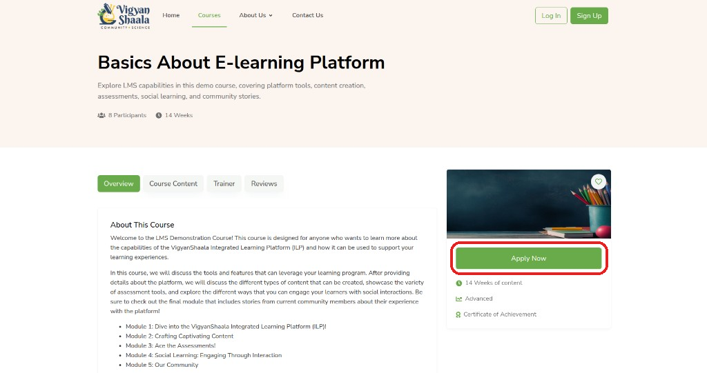
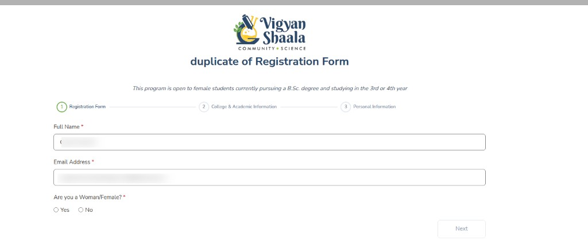
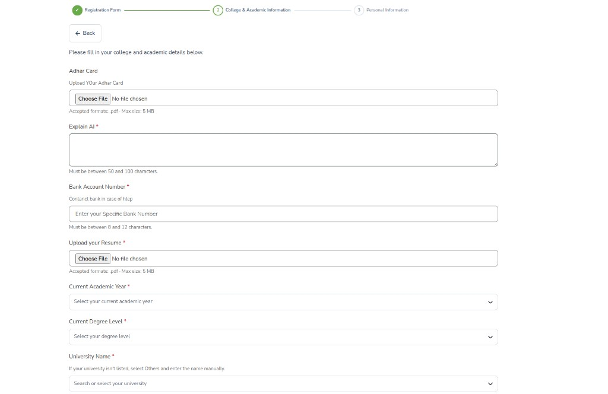
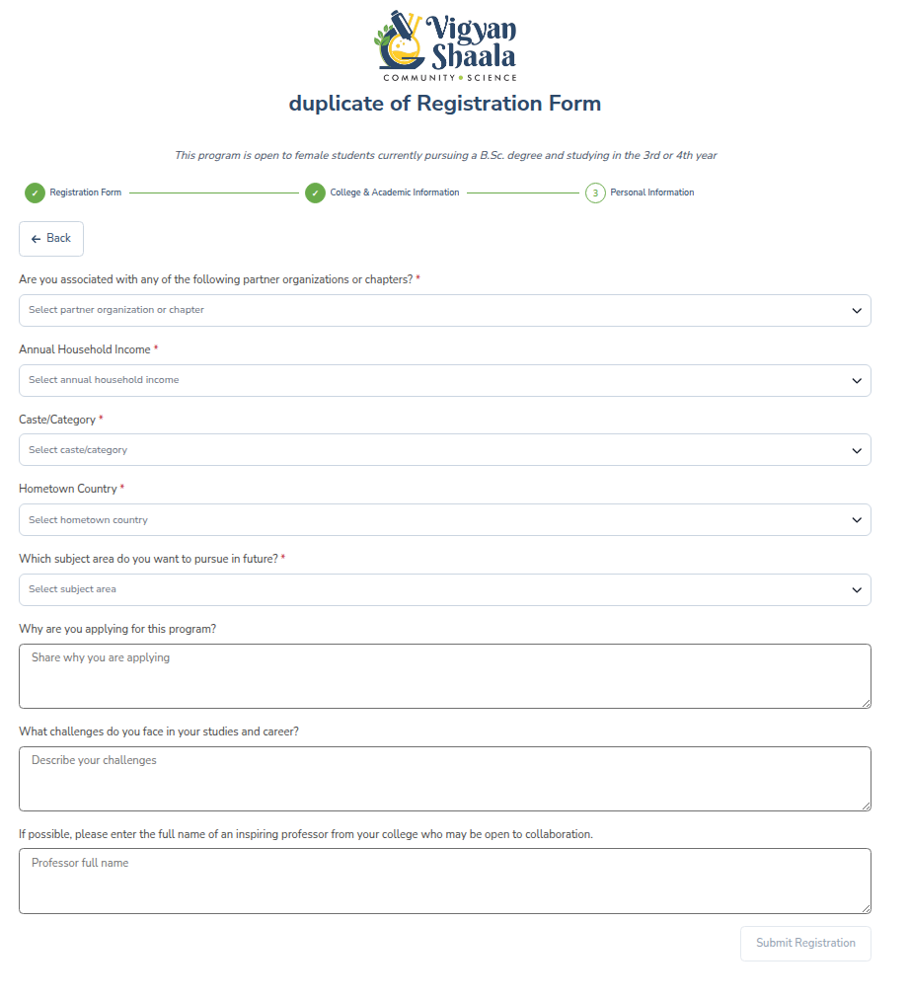

# Apply to a Program

## Apply now {: #self-enroll }

**Apply Now** is how you join a program from its details page. Read the overview first. You may be asked to log in or sign up. After you apply, the program appears on **My Dashboard**.

- Open the program ([browse programs](explore-courses.md#browse-courses)).
- Read **Overview**, **Course Content**, **Trainer**, and **Reviews**.
- Click **Apply Now** on the right.

- [Log in](logging-in.md#log-in) or [sign up](logging-in.md#create-account) if asked.
- On some programs, a **Register with a QR code/link** form opens — see [Register with a QR code/link](#cohort-enroll).
- You are taken to [My Dashboard](my-dashboard.md) or into the program.

!!! note "Programs and courses"
    In this guide we say **program**. On the site you may still see **Course** — both mean the same offering. The button to join is **Apply Now**.

---

## Register with a QR code/link {: #cohort-enroll }

qr qrcode qr-code scan cohort enrollment

Your teacher shares a **QR code** or a **link**. Scanning or opening it starts a registration form. If you are new, this can create your account and enroll you. If you already have an account, sign in first, then submit the form.

Your teacher shows a **QR code**. Scan it with your phone to open the **Cohort Management Form**.

| When | What happens |
|------|----------------|
| **You are new** | Scan and fill the form — this can create your account and enroll you |
| **You already have an account** | Scan the QR code or click **Apply Now**, sign in if asked, then submit |

- **Step 1:** Scan the QR code and open the registration form.
- **Step 2:** Fill the required details and move to the next step.
- **Step 3:** Complete the final section and click **Submit Registration**.

After you submit, you are redirected to **My Dashboard**. The program appears in your enrolled list once enrollment is confirmed.

!!! note "Fields can change"
    Teachers can change the questions. Complete every required field shown for your program.

---

## Join with a registration code {: #registration-code }

Sometimes a teacher sends you a **link** or **code** instead of a QR code. Open that link, confirm you want to join, then find the program on your dashboard.

- Open the link your teacher sent you, read the details, and confirm to join.
- Find the program on your [Dashboard](my-dashboard.md) under **In Progress**.

---

## Already joined — open the program {: #already-enrolled }

If you already applied, the details page shows **View Course** instead of **Apply Now**. Use that button to go straight into the program.

- Open the program details page and click **View Course** (instead of **Apply Now**).
- See [Inside a Program](inside-a-course.md).

---

## If you cannot join {: #enrollment-blocked }

Some programs cannot be joined right now. The page shows a message. Use the table below to see what to do next.

| Message | What to do |
|---------|------------|
| **Course is full** | [Contact Us](https://apps.mycommunity.vigyanshaala.com/public/contact){ target="_blank" } |
| **Enrollment closed** | Watch for a later offering |
| **Invitation only** | Ask your teacher |
| **Prerequisite required** | Complete the required program first |
