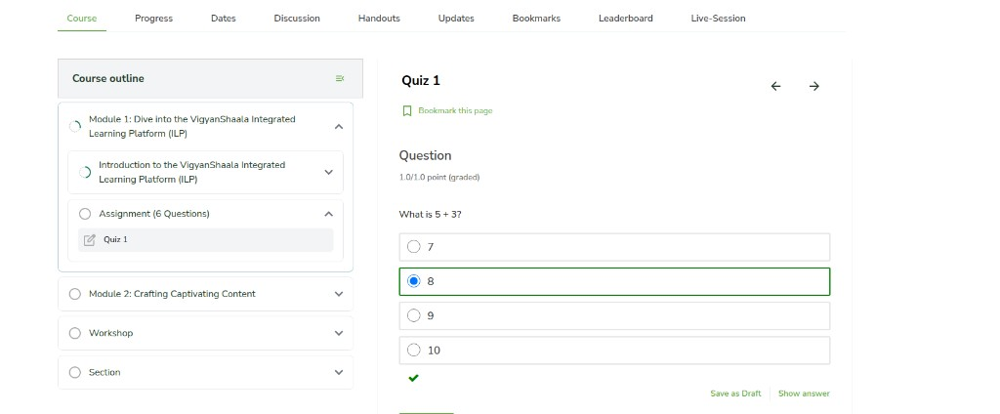
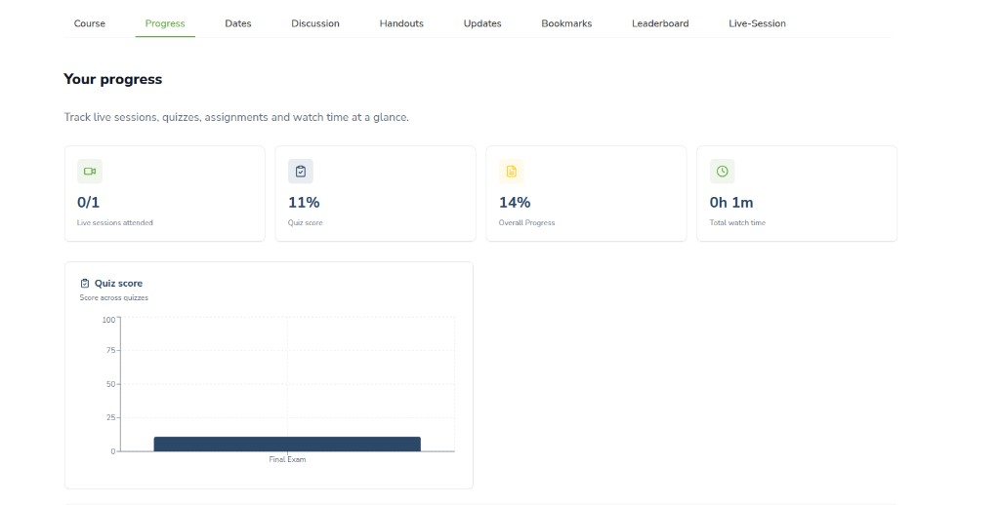
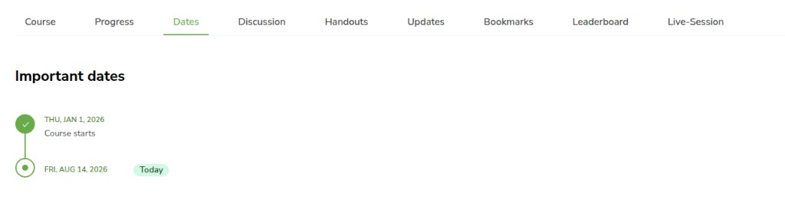
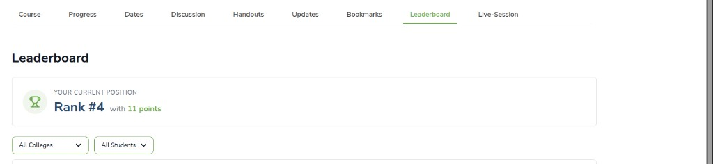
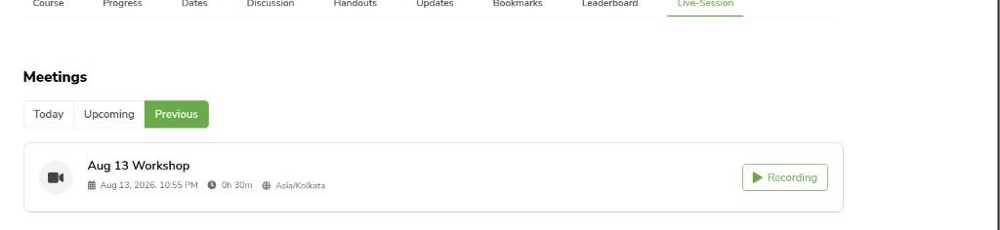
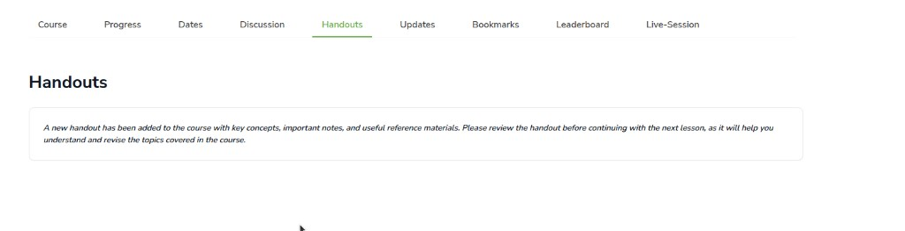
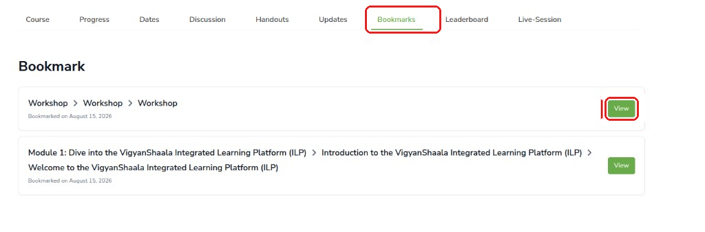

# Inside a Program

## Open a program {: #enter-course }

After you join a **program**, open it from [My Dashboard](my-dashboard.md). Tabs across the top let you learn, track progress, join live sessions, and more. The learning screen may still say **Course** — that is the program you joined.

- On [My Dashboard](https://apps.mycommunity.vigyanshaala.com/learner-dashboard/){ target="_blank" }, click **Start**, **Continue**, or **View Progress**.
- Use the tabs: **Course**, **Progress**, **Dates**, **Discussion**, **Handouts**, **Updates**, **Bookmarks**, **Leaderboard**, **Live-Session**.

---

## Course — learn and submit work {: #course-tab }

The **Course** tab is where you watch lessons, open the outline, and submit quizzes or assignments. Use the left outline to jump to a topic, and the arrows to move page by page.

- Click **Course**. Use the **outline** on the left to open lessons, quizzes, and assignments.
- Use the **arrows** to move between pages. Click **Bookmark this page** to save for later.
- For quizzes: choose your answer, then **Save as Draft** or submit. A green tick shows a correct answer.

---

## Progress {: #progress-tab }

The **Progress** tab shows how much of the program you have finished. Check it when you want to see attendance, quiz scores, and what is still left to do.

Four cards show **live sessions attended**, **quiz score**, **overall progress**, and **total watch time**. Below that, a bar chart breaks down quiz scores.

---

## Dates {: #dates-tab }

The **Dates** tab is a timeline of important days for this program — such as live sessions or due dates. A green check means that date has already passed.

- Click **Dates** for the **Important dates** timeline. A green check means a date has passed; **Today** marks today.

---

## Leaderboard {: #leaderboard-tab }

The **Leaderboard** shows how you compare with other learners in the program. Points come from lessons, quizzes, and live sessions. Rank **1** is the top of the list.

- Click **Leaderboard** to see how you compare with other learners.
- The table columns mean:

| Column | What it means |
|--------|----------------|
| **Rank** | Your place in the list (1 is the top) |
| **User** | The learner's name |
| **College** | The college the learner belongs to |
| **Points** | Score earned from lessons, quizzes, and live sessions |

- Filter by **All Colleges** or **All Students**. Keep learning to earn more points.

---

## Live sessions {: #live-session-tab }

The **Live-Session** tab lists live classes. Join when a session is running, or watch a recording if you missed it. You may also get an email or WhatsApp reminder before a session starts.

- Click **Live-Session** for **Today**, **Upcoming**, and **Previous** meetings.
- Click **Join** when a session is live. Use **Recording** to watch a session you missed.

!!! note "Reminders"
    You may get an email or WhatsApp reminder before a live session.

---

## Discussion, Handouts, Updates, and Bookmarks {: #other-tabs }

These tabs sit next to the main learning tabs. Use them to talk to others, download files, read teacher messages, and reopen pages you saved.

| Tab | What to do |
|-----|------------|
| **Discussion** | Browse topics and post or reply |
| **Handouts** | Open files and notes your teacher shared |
| **Updates** | Read teacher announcements |
| **Bookmarks** | Click **Bookmark this page** while learning, then open saved pages here |

