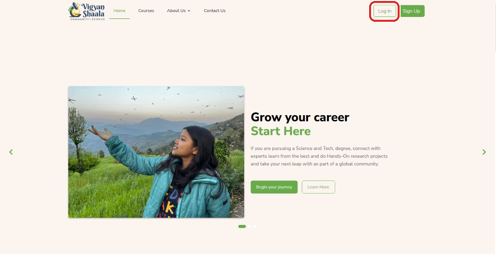
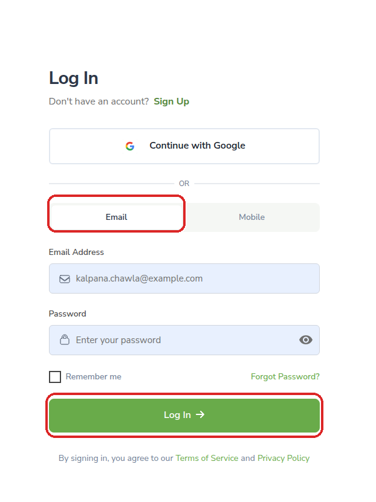
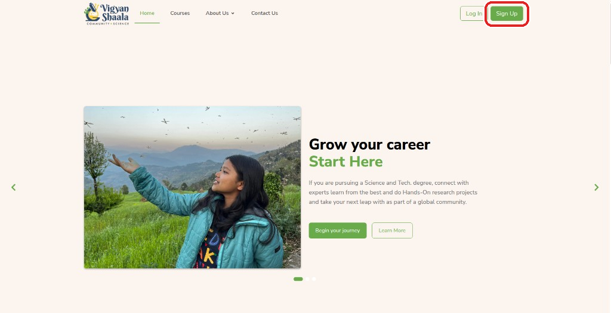
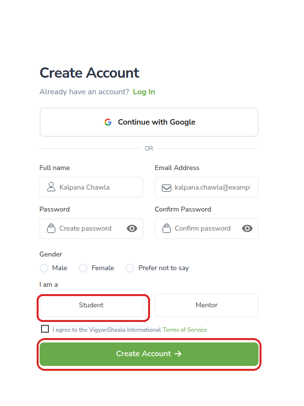
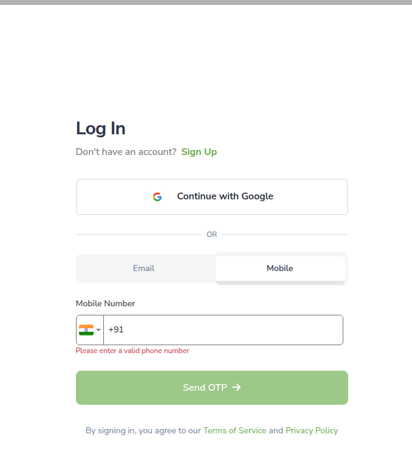
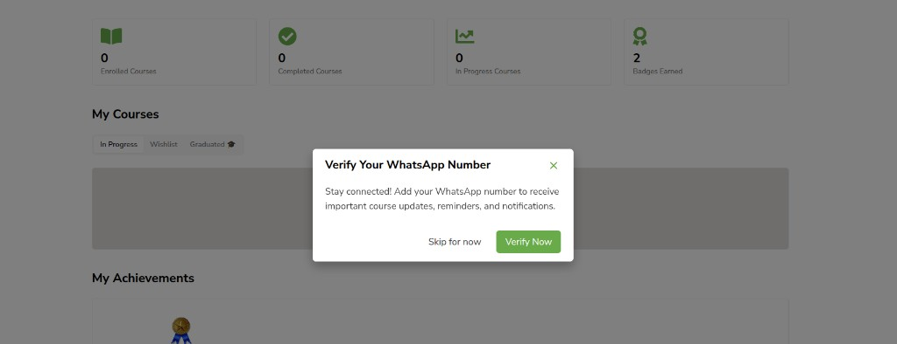
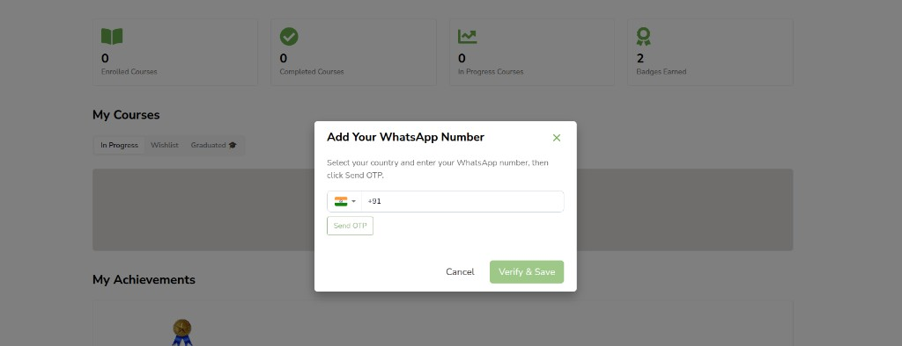
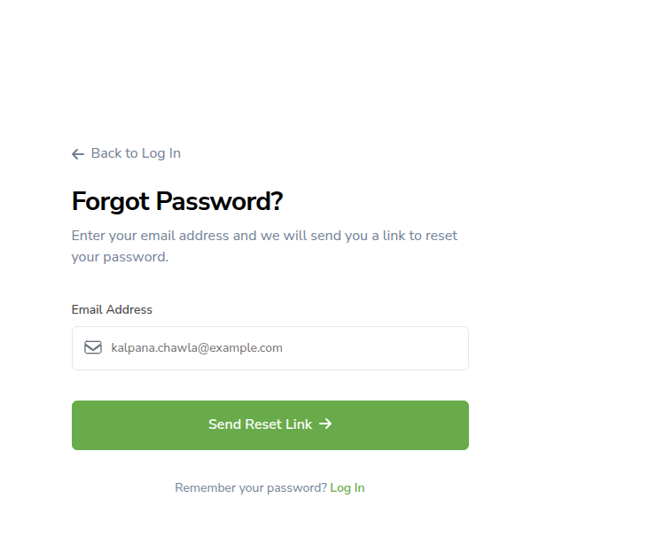
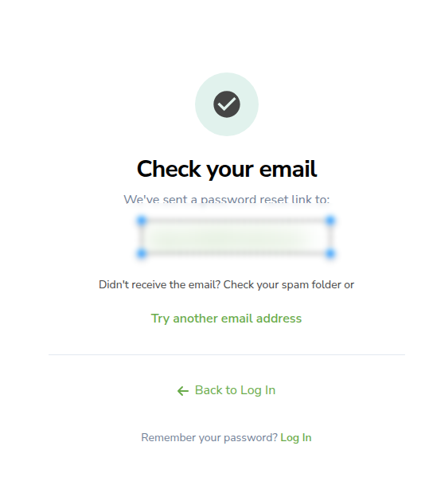
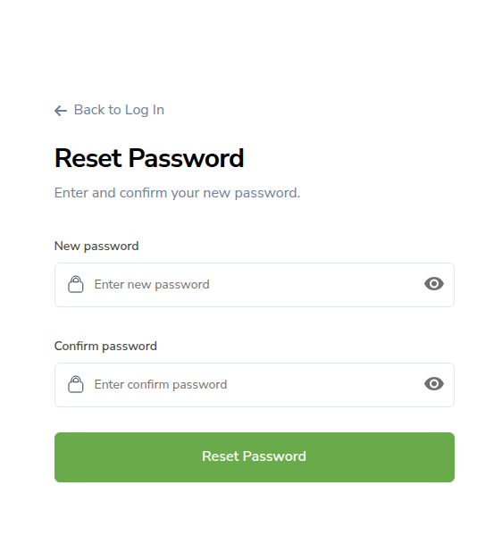

# Logging In

Start from the [home page](https://mycommunity.vigyanshaala.com/){ target="_blank" }. Click **Log In**. Enter your **email** and **password**. You go to **My Dashboard**.

| Way | What it means |
|-----|----------------|
| [Open Cohort (QR Code)](#cohort-registration) | Scan a QR code and fill the form |
| [Public Signup](#create-account) | Create your account on the register page |
| [Curriculum Cohort (pre-registration through partners)](#curriculum-cohort) | A partner created your account and sent you an email ID and password |

## Public Signup {: #create-account }

- Open [https://mycommunity.vigyanshaala.com/](https://mycommunity.vigyanshaala.com/){ target="_blank" } and click **Sign Up**, or go to [register](https://mycommunity.vigyanshaala.com/register){ target="_blank" }.
- Optionally click **Continue with Google**.
- Or fill in **Full name**, **Email**, **Password**, **Gender**, and choose **Student** (not Mentor).
- Tick **I agree to the Terms of Service**, then click **Create Account →**.

!!! note "No mobile number on sign-up"
    Phone and OTP are used on the Log In **Mobile** tab, not during sign-up.

!!! warning "Check your email"
    If asked to activate your account, open your inbox and follow the link.

After your first sign-in you may be prompted to [verify your WhatsApp number](#whatsapp-verify).

---

## Log in with mobile {: #log-in-mobile }

Open the Log In page, choose the **Mobile** tab, enter your number, and tap **Send OTP**.

---

## Verify your WhatsApp number {: #whatsapp-verify }

After sign-in, **My Dashboard** may show **Verify Your WhatsApp Number**. Click **Verify Now** or **Skip for now**.

- Select your country code, enter your number, tap **Send OTP**, then enter the code and click **Verify & Save**.
- You can also update WhatsApp later from [Profile](profile-and-support.md#profile).

---

## Reset a forgotten password {: #reset-password }

- On the [Log In](https://mycommunity.vigyanshaala.com/login){ target="_blank" } page (**Email** tab), click **Forgot Password?**.
- Enter your email and click **Send Reset Link →**.
- Open the email, click the reset link, enter a new password (at least 8 characters with 1 letter and 1 number), and click **Reset Password**.
- Return to Log In and sign in.

!!! note "Already logged in?"
    You can also reset from [Account](profile-and-support.md#account) → **Reset Password**.

---

## Open Cohort (QR Code) {: #cohort-registration }

Your teacher shows a **QR code**. Scan it to open the enrollment form — this can create your account and enroll you, or ask you to sign in first if you already have one.

---

## Curriculum Cohort (pre-registration through partners) {: #curriculum-cohort }

A partner sends you an **email ID** and **password**. Open the [home page](https://mycommunity.vigyanshaala.com/){ target="_blank" }, click **Log In**, enter those details, and click **Log In →**.
