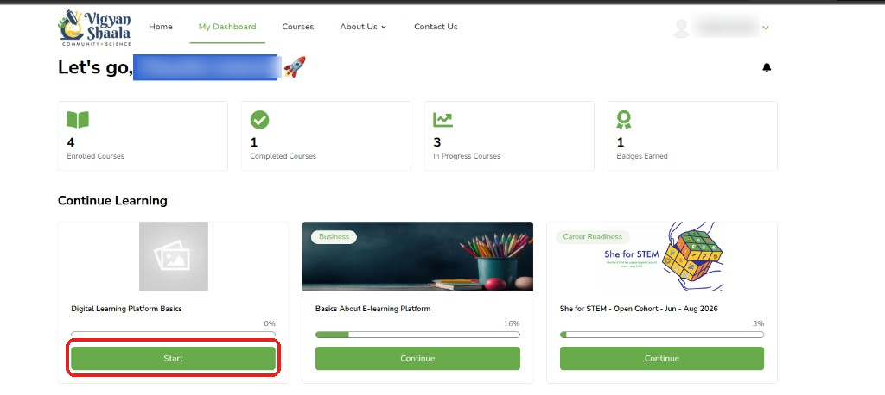
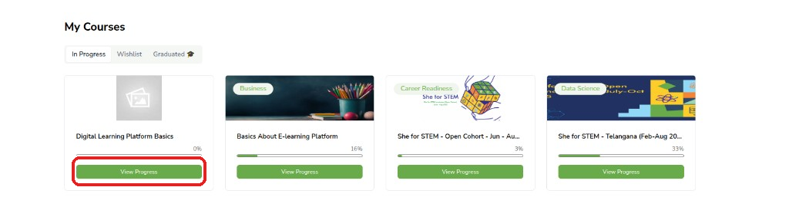
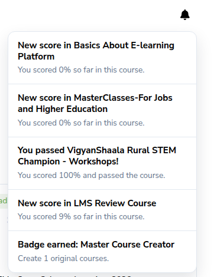
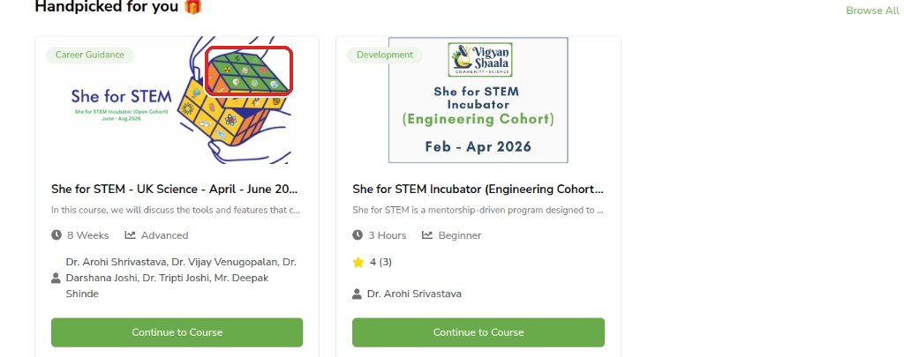

# My Dashboard

## Dashboard overview {: #open-dashboard }

**My Dashboard** is your home screen after you [log in](logging-in.md). It shows the programs you joined, how far you have got, badges, and suggestions.

Open it any time from **My Dashboard** in the top menu.

**Link:** [https://apps.mycommunity.vigyanshaala.com/learner-dashboard/](https://apps.mycommunity.vigyanshaala.com/learner-dashboard/){ target="_blank" }

- Click **My Dashboard** in the top menu. Your name opens **Profile** and **Account**; the **bell** opens notifications.

Four summary cards at the top:

| Card | What it means |
|------|----------------|
| **Enrolled Courses** | Programs you joined |
| **Completed Courses** | Programs you finished |
| **In Progress Courses** | Programs you started but have not finished |
| **Badges Earned** | Achievement badges |

!!! note "Programs and courses"
    In this guide we say **program**. On the site you may still see **Course** — both mean the same offering.

---

## Continue learning {: #continue-learning }

**Continue Learning** is the fastest way back into a program you already started. Use **Start** if you have not opened it yet, or **Continue** to pick up the next lesson, quiz, or live session.

- Under **Continue Learning**, click **Start** or **Continue** on a program card.
- This opens the program so you can pick up where you left off.

---

## In Progress, Wishlist, and Graduated {: #my-programs }

**My Courses** groups your programs into three tabs. Use **In Progress** for active work, **Wishlist** for programs you saved, and **Graduated** when you have finished and need a certificate.

Under **My Courses**:

| Tab | What you see |
|-----|----------------|
| **In Progress** | Active programs with progress %. Click **View Progress** to open. |
| **Wishlist** | Programs saved with the heart icon |
| **Graduated** | Finished programs — look here for certificates |

---

## Notifications {: #notifications }

The **bell** (top right) stores messages about scores, badges, reminders, and program updates. Open it when you want to catch up without leaving the dashboard.

- Click the **bell** (top right) to read scores, badges, reminders, and program updates.
- Click a notification to open the related program or page when a link is shown.

---

## My Achievements {: #dashboard-achievements }

**My Achievements** on the dashboard is a short list of badges you have earned. Open **View All >** for the full list, including badges still in progress and certificates.

- Scroll to **My Achievements** and click **View All >** for the full list.
- See [Achievements & Certificates](achievements-and-certificates.md).

---

## Handpicked for you {: #handpicked }

**Handpicked for you** suggests other programs based on what you already joined. These are only suggestions — you still click **Apply Now** if you want to join one.

- Scroll to **Handpicked for you** for suggested programs based on what you joined.
- Click **Continue to Course** or **Browse All** for the full list.

