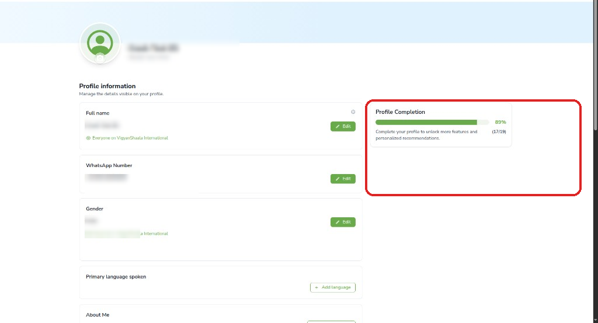
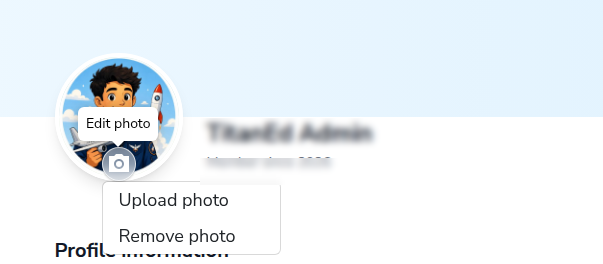
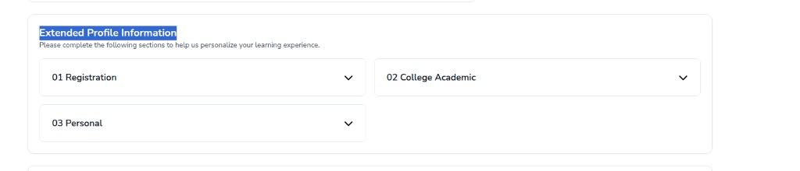
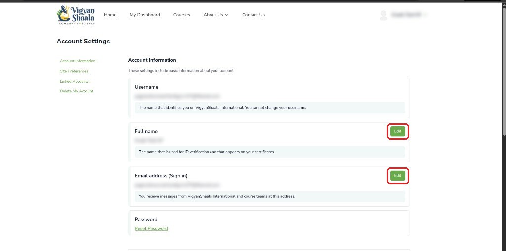
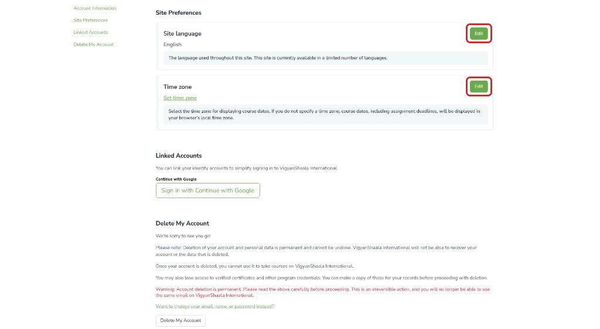
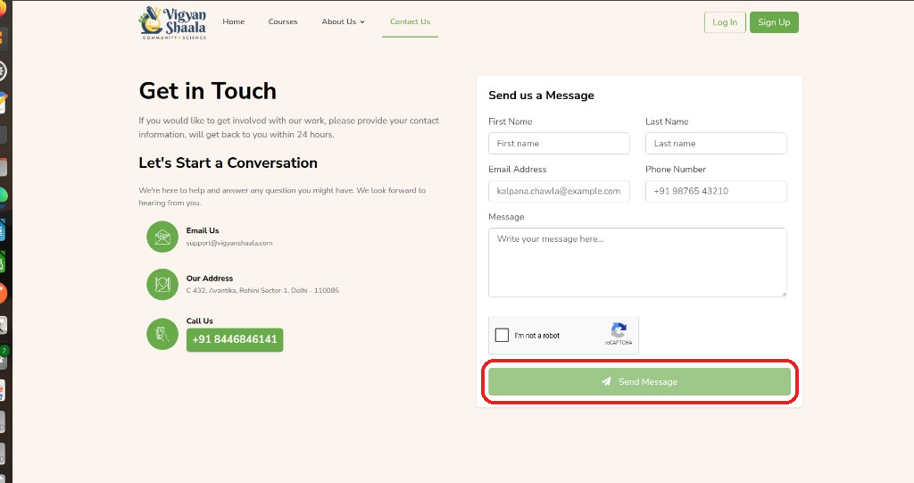
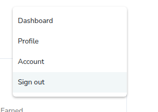

# Profile & Support

Manage your profile, account, and how to get help.

## Update your profile {: #profile }

- Click your name (top right) → **Profile**.
- Use **Edit** next to each field: name, WhatsApp, gender, language, About Me, social links.
- Fill missing fields to increase **Profile Completion**.

---

## Change your profile photo {: #profile-photo }

- On **Profile**, click the **camera** icon → **Upload photo** or **Remove photo**.

---

## Extended Profile Information {: #extended-profile }

- Scroll to **Extended Profile Information** and complete each section shown (for example Registration, College Academic, Personal).
- Sections vary by program.

---

## Account settings {: #account }

- Click your name → **Account**.

**Link:** [https://apps.mycommunity.vigyanshaala.com/account/](https://apps.mycommunity.vigyanshaala.com/account/){ target="_blank" }

| Section | What you can do |
|---------|-----------------|
| **Account Information** | Edit name or email; **Reset Password** |
| **Site Preferences** | Change language or time zone |
| **Linked Accounts** | Link Google sign-in |
| **Delete My Account** | Permanent deletion — see below |

---

## Delete your account {: #delete-account }

- On the Account page, scroll to **Delete My Account** and read the warning carefully.
- Deletion is **permanent** — you lose programs, progress, and certificates. Download certificates first.
- Prefer **Edit** or **Reset Password** if you only need to change details.

---

## Contact support {: #contact-support }

- Open [Contact Us](https://apps.mycommunity.vigyanshaala.com/public/contact){ target="_blank" } or email **support@vigyanshaala.com** / call **+91 8446846141**.

---

## FAQs and policies {: #faqs }

- [Our Vision](https://apps.mycommunity.vigyanshaala.com/public/story){ target="_blank" } · [Success Stories](https://apps.mycommunity.vigyanshaala.com/public/team){ target="_blank" } · [Our Supporters](https://apps.mycommunity.vigyanshaala.com/public/supporter){ target="_blank" } · [FAQs](https://apps.mycommunity.vigyanshaala.com/public/faq){ target="_blank" }
- **Privacy Policy** and **Terms of Service** are linked in the site footer.

---

## Sign out {: #sign-out }

- Click your name → **Sign out**.

