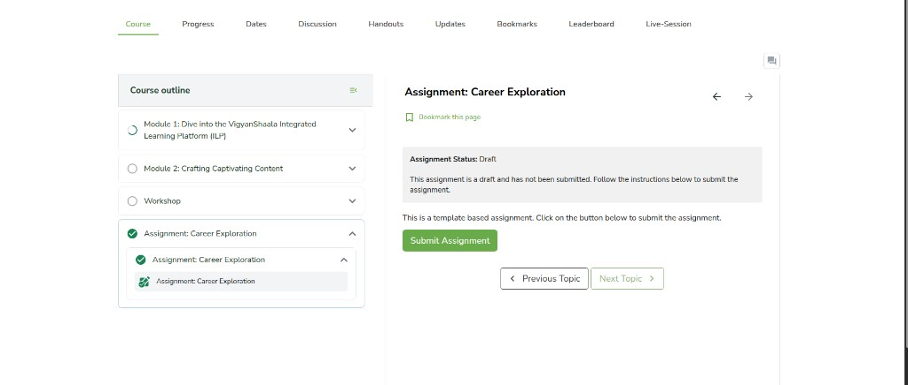
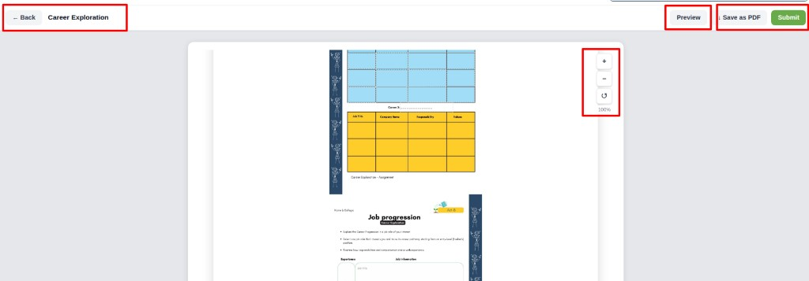
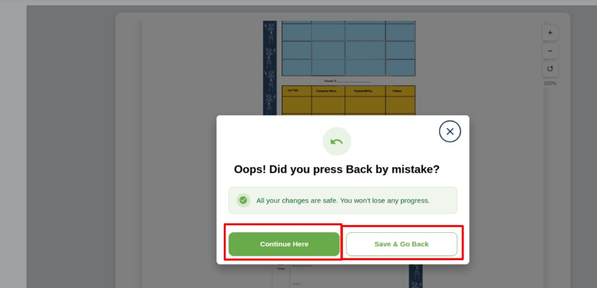
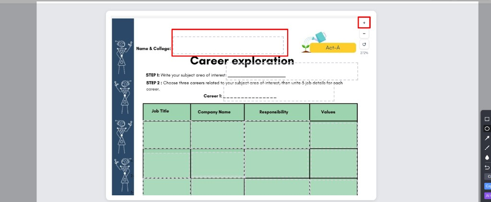
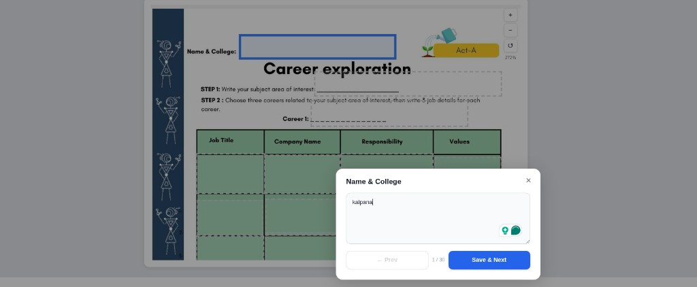
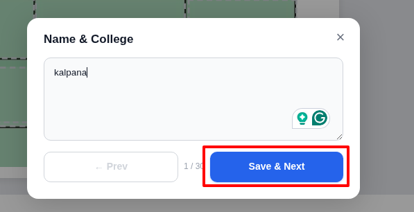
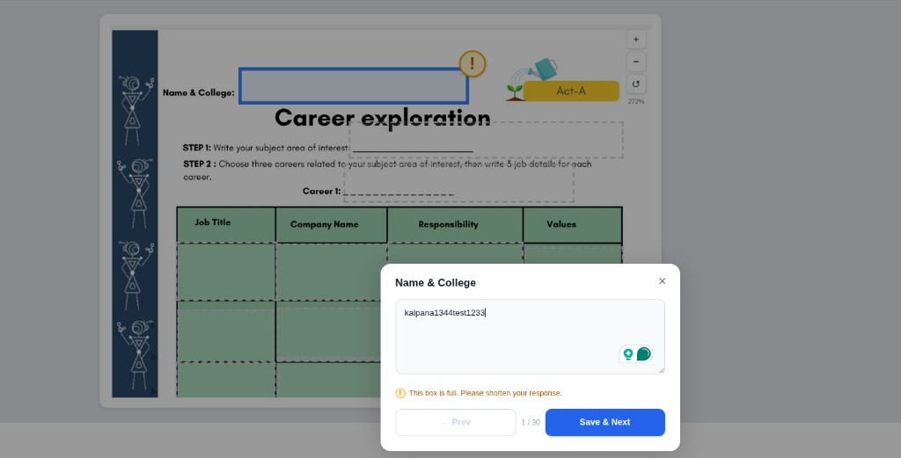
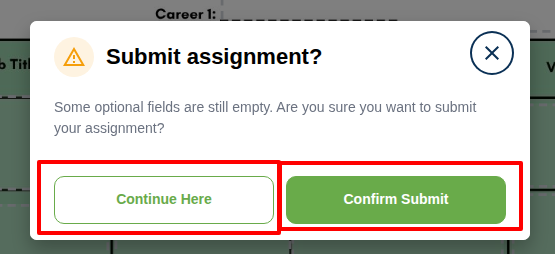
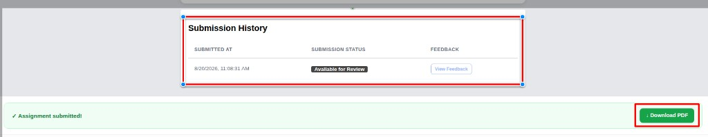
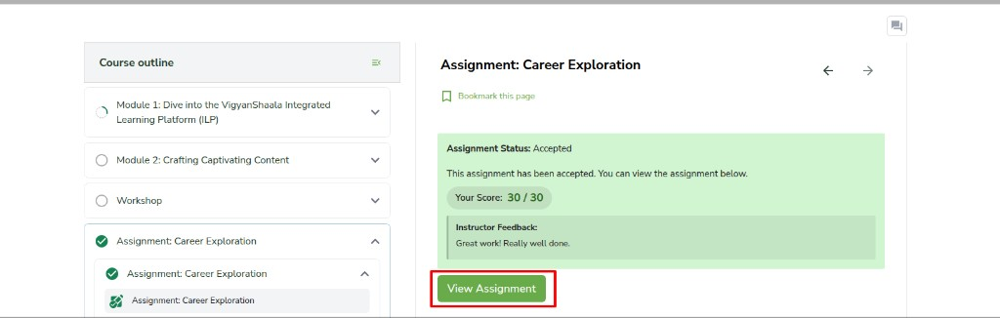

# How to Submit a Template based assignment

assignment submit template based worksheet career exploration save next pdf score

Some programs include a **template based assignment** (for example **Career Exploration**). Open the program, click the assignment in the **Course** outline, fill it in, then submit. Your teacher can later give a score and feedback.

- Open your program from [My Dashboard](my-dashboard.md). Stay on the **Course** tab.
- In the left **Course outline**, click the **assignment** (for example **Assignment: Career Exploration**).
- When the status is **Draft**, click **Submit Assignment**.

The assignment opens in edit mode. The title (for example **Career Exploration**) is at the top.

- **← Back** returns to the program. Your work is saved.
- **Preview** shows how the assignment looks.
- **Save as PDF** downloads a copy.
- **Submit** sends the assignment when you are finished.
- Use **+** and **−** on the right to zoom in or out. The reset icon returns the zoom to **100%**.

If you click **← Back**, a popup asks **Oops! Did you press Back by mistake?** Your changes are safe.

- **Continue Here** stays on the assignment.
- **Save & Go Back** saves and returns to the program.

To fill a box (for example **Name & College**), zoom with **+** if the text is small, then click the box.

A window opens so you can type. Add your details, then click **Save & Next**. The counter (for example **1 / 30**) shows how many boxes you have done. Use **← Prev** to go back one box.

If your text is too long, you see **This box is full. Please shorten your response.** Shorten the text, then click **Save & Next** again.

When every box you need is done, click **Submit**. If some optional boxes are empty, you see **Submit assignment?**

- **Continue Here** keeps editing.
- **Confirm Submit** sends the assignment.

After you confirm, you see **Assignment submitted!** and **Submission History**. Click **Download PDF** if you want a copy. **View Feedback** is there when the teacher has left comments.

When the teacher accepts the assignment, the status is **Accepted**. Your score (for example **30 / 30**) and instructor feedback appear on the assignment page. Click **View Assignment** to open it again.

